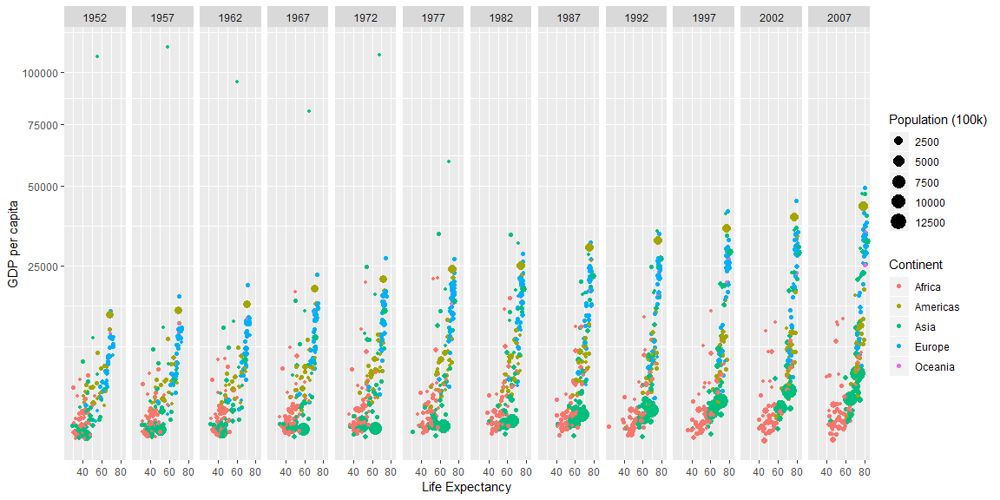
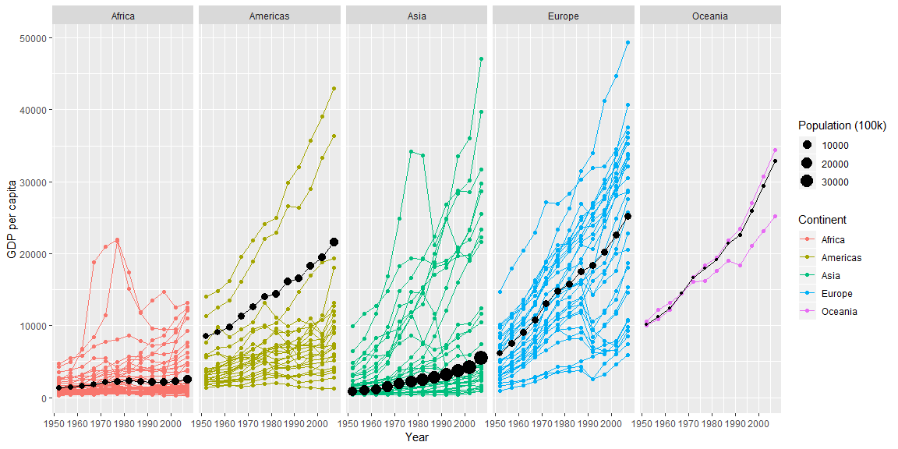

```r
gap <- as.tibble(gapminder)
```

## Background

Hans Rosling, a Swedish statistician that TED seems to love has created a dataset from data from multiple organizations that we will be visualizing to better understand. In this exercise I better understood how to use ggplot arguments and add layers with info from different datasets.


## Data Wrangling


```r
cont <- gap %>%
  group_by(continent, year) %>%
  summarise(wtavg = weighted.mean(gdpPercap, pop),
            pop = sum(as.numeric(pop)))
```

## Data Visualization


```r
gap %>%
  ggplot(aes(x = lifeExp, y = gdpPercap)) +
  geom_point(aes(color = continent, size = pop/100000)) +
  facet_grid(~year) +
  scale_y_continuous(trans = 'sqrt') +
  labs(x = 'Life Expectancy', y = 'GDP per capita', size = 'Population (100k)', color = 'Continent')
```

<!-- -->

```r
gap %>%
  filter(country != "Kuwait") %>%
  ggplot(aes(x = year, y = gdpPercap)) +
  geom_point(aes(color = continent)) +
  geom_line(aes(group = country, color = continent)) +
  geom_point(data = cont, aes(x = year, y = wtavg, size = pop/100000), color = 'grey0') +
  geom_line(data = cont, aes(x = year, y = wtavg), color = 'grey0') +
  facet_grid(~continent) +
  labs(x = 'Year', y = 'GDP per capita', size = 'Population (100k)', color = 'Continent')
```

<!-- -->

