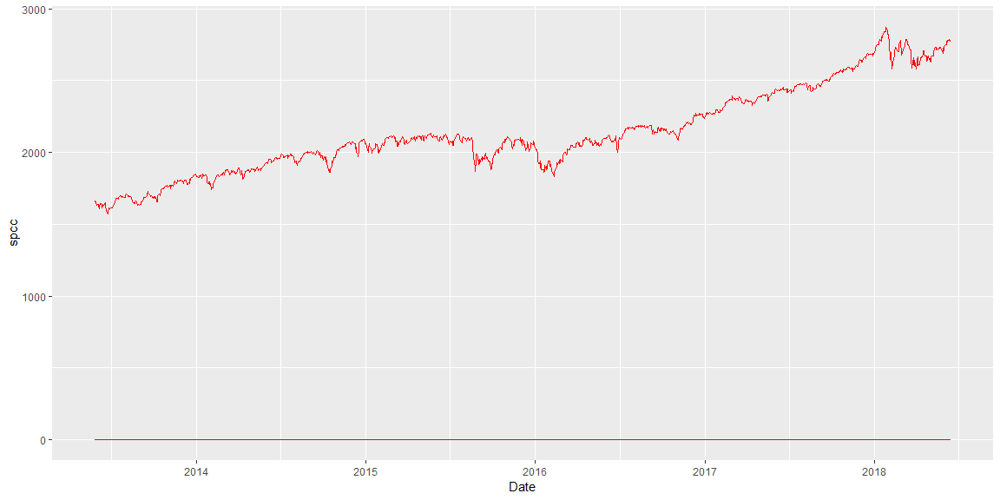
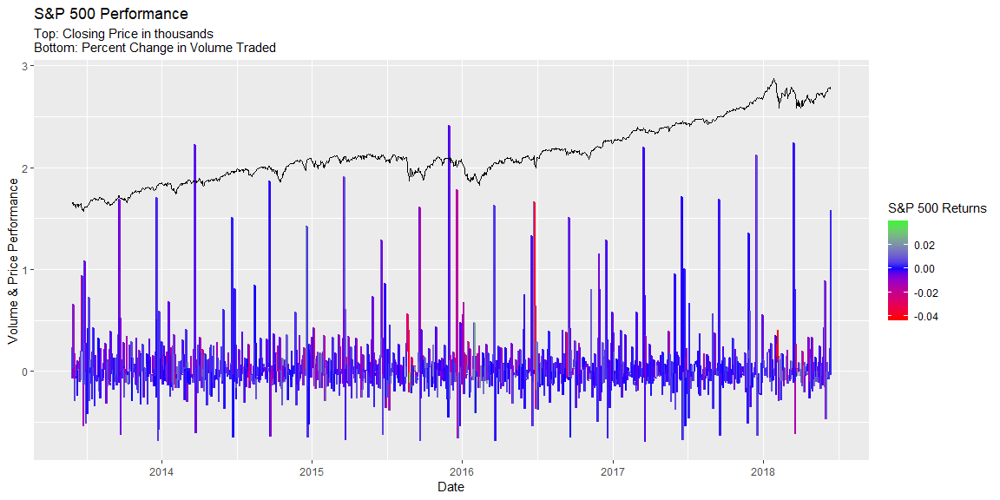

This exercise will examine some of the principles of effectively communicating data through graphics. The data set will be the one currently used on my econometrics project which examines stock performance and volatility on the S&P 500.


##Poor Graph

```r
data %>%
  ggplot() +
  geom_line(aes(x = Date, y = spcc), color = 'red') +
  geom_line(aes(x = Date, y = sp), color = 'red') +
  geom_line(aes(x = Date, y = splp), color = 'red')
```

<!-- -->

This first graphic has several weaknesses, it does not take advantage of the power color has for communicating data by relying for the same color on each line. The scaling issue also makes it so that each line is hard to interpret.

##Better Graph

```r
data %>%
  ggplot(aes(x = Date, y = sp, col = spcc)) +
  geom_line(size = .8) +
  scale_color_gradient2(low = 'red', high = 'green', mid = 'blue')+
  geom_line(data = data, mapping = aes(x = Date, y = splp/1000), color = 'black') +
  labs(y = 'Volume & Price Performance', col = "S&P 500 Returns", title = "S&P 500 Performance", subtitle = "Top: Closing Price in thousands \nBottom: Percent Change in Volume Traded")
```

<!-- -->

This graphic commuincates the exact same data as the previous one, but in a much more effective manner. Color is used to indicate different variables being analyzed, and allows for us to display three independent variables across two line layers. Interpreting the layers could provide for some confusion as well but labels have been used to ensure that each layer is clearly explained. The scaling issue is taken care of as one of the variables is scaled down by a factor of 1000, which is clearly explained and allows the lines to more easily share a y-axis.
