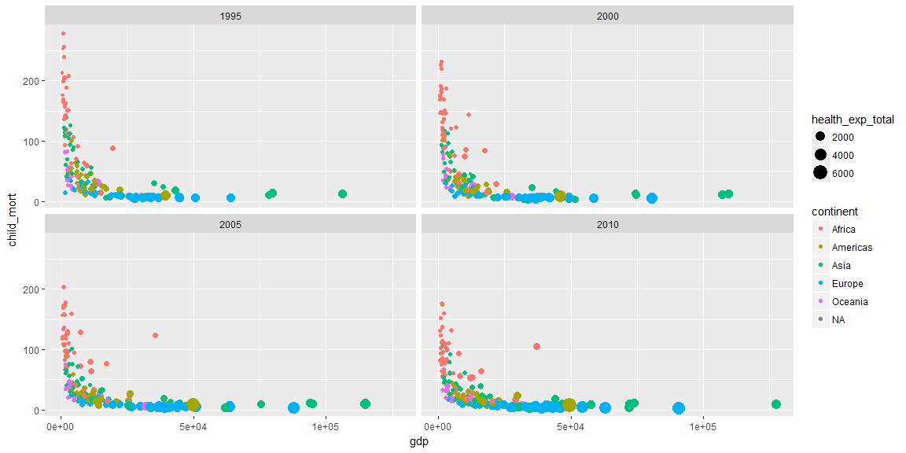

```r
library(ourworldindata)
library(dplyr)
library(ggplot2)

health1 <- subset(financing_healthcare, country != "Abkhazia" & year == 1995 | year == 2000 | year == 2005 | year == 2010)

ggplot(health1, aes(gdp, child_mort)) +
    geom_point(aes(size = health_exp_total, color = continent)) +
     facet_wrap(~year)
```

<!-- -->
