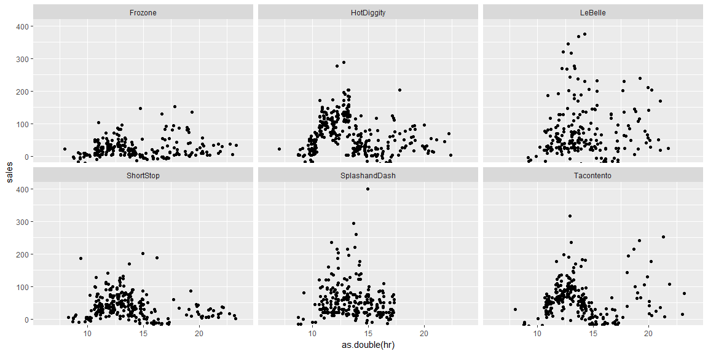

```r
data <- read_csv("https://byuistats.github.io/M335/data/sales.csv")
```

## Background

We have been tasked with finding the best business to invest in out of six different options presented to us.

## Data Wrangling
Here we will adjust the time zone and then create new columns for time variables that will make analyzing time in different periods easier.

```r
tz_fix <- data %>%
  mutate(Time = with_tz(Time, tzone = "America/Denver"))%>%
  mutate(Time = round_date(Time, unit = "hours")) %>%
  separate(Time, into = c("yr", "mnth", "day"), sep = "-") %>%
  separate(day, into = c("hr", "min", "sec"), sep = ":") %>%
  separate(hr, into = c("day", "hr"), sep = " ") %>%
  mutate(Time = ymd_hms(paste(yr, mnth, day, hr, min, sec)))

hrs <- tz_fix %>%
  group_by(Name, Time, hr) %>%
  summarise(sales = sum(Amount))

daily <-  tz_fix %>%
  mutate(days = ymd(paste(yr, mnth, day))) %>%
  group_by(Name, days) %>%
  summarise(sales = sum(Amount))


monthly <- tz_fix %>%
  group_by(Name, mnth) %>%
  summarise(sales = sum(Amount))
```

## Data Visualization


```r
hrs %>%
  filter(Name != "Missing") %>%
  ggplot(aes(x = as.double(hr), y = sales)) +
  geom_jitter() +
  facet_wrap(~Name) +
  coord_cartesian(ylim = 0:400, xlim = 06:24)
```

<!-- -->

```r
daily %>%
  filter(Name != "Missing") %>%
  ggplot(aes(x = days, y = sales)) +
  geom_point(aes(color = Name)) +
  geom_smooth(aes(color = Name)) +
  facet_wrap(~Name) +
  labs(x = "Days of ")
```

<!-- -->

```r
monthly %>%
  filter(Name != "Missing") %>%
  ggplot(aes(x = mnth, y = sales, fill = sales)) +
  geom_bar(stat="identity") +
  facet_wrap(~Name)
```

<!-- -->

## Conclusions
The visualizations convey some interesting information, the business that generates the most consistent revenue would be Hot Diggity, the only other contender would be Le Belle. The second visualization shows the smoothed line stay consistently 500 dollars of daily sales and the line is a relaively tight fit as well. Hot Diggity also has the record highest selling month. In terms of staffing needs, it is clear that hot diggity will need to be adequately staffed at lunch time, after which theres is a significant drop in sales. Le Belle on the other hand does have fewer sales as the day progresses, but the drop off is much more significant with Hot Diggity, its combination of consistently strong sales with lower staffing needs means it will be both a profitable, and low cost business.
