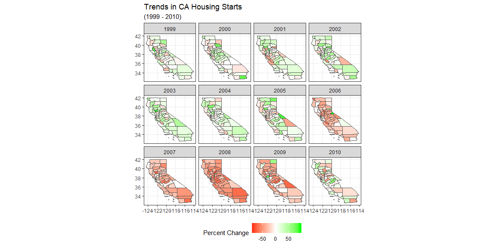
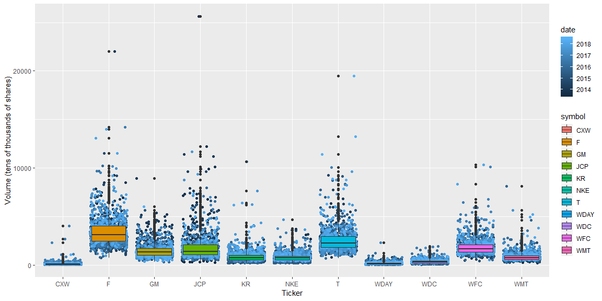

```r
tickers_today <- c("CXW", "F", "GM", "JCP", "KR", "WDC", "NKE","T", "WDAY", "WFC", "WMT")

quote <- tq_get(tickers_today, get = "stock.prices", from = "2013-06-26")
```

## Background

Here we will be taking advantage of the ggplot and dygraphs packages to analyze stock performance as well as introduce interactivity to the graphics.

## Data Wrangling
Here we will get the data into format useable in the dygraph package, and then some small tranformations for the data in tidy format as well.

```r
dyCXW <- quote %>%
  filter(symbol == "CXW") %>%
  select(date, adjusted)

dyF <- quote %>%
  filter(symbol == "F") %>%
  select(date, adjusted)

dyGM <- quote %>%
  filter(symbol == "GM") %>%
  select(date, adjusted)

dyJCP <- quote %>%
  filter(symbol == "JCP") %>%
  select(date, adjusted)


dyKR <- quote %>%
  filter(symbol == "KR") %>%
  select(date, adjusted)


dyWDC <- quote %>%
  filter(symbol == "WDC") %>%
  select(date, adjusted)


dyNKE <- quote %>%
  filter(symbol == "NKE") %>%
  select(date, adjusted)


dyT <- quote %>%
  filter(symbol == "T") %>%
  select(date, adjusted)


dyWDAY <- quote %>%
  filter(symbol == "WDAY") %>%
  select(date, adjusted)


dyWFC <- quote %>%
  filter(symbol == "WFC") %>%
  select(date, adjusted)


dyWMT <- quote %>%
  filter(symbol == "WMT") %>%
  select(date, adjusted)

CXW <- xts(dyCXW$adjusted, order.by = as.Date(dyCXW$date))

F <- xts(dyF$adjusted, order.by = as.Date(dyF$date))

GM <- xts(dyGM$adjusted, order.by = as.Date(dyGM$date))

JCP <- xts(dyJCP$adjusted, order.by = as.Date(dyJCP$date))

KR <- xts(dyKR$adjusted, order.by = as.Date(dyKR$date))

WDC <- xts(dyWDC$adjusted, order.by = as.Date(dyWDC$date))

NKE <- xts(dyNKE$adjusted, order.by = as.Date(dyNKE$date))

T <- xts(dyT$adjusted, order.by = as.Date(dyT$date))

WDAY <- xts(dyWDAY$adjusted, order.by = as.Date(dyWDAY$date))

WFC <- xts(dyWFC$adjusted, order.by = as.Date(dyWFC$date))

WMT <- xts(dyWMT$adjusted, order.by = as.Date(dyWMT$date))


dyquote <- cbind(CXW, F, GM, JCP, KR, WDC, NKE, T, WDAY, WFC, WMT)


tidyquote <- quote %>%
  mutate(vol = volume/10000) %>%
  select(symbol, date, vol, adjusted)
```

## Data Visualization
Our first plot is an interactive graph incorporating the adjusted close prices for each security.

```r
dygraph(dyquote) %>%
  dySeries("..1", label = "CXW") %>%
  dySeries("..2", label = "F") %>%
  dySeries("..3", label = "GM") %>%
  dySeries("..4", label = "JCP") %>% 
  dySeries("..5", label = "KR") %>%
  dySeries("..6", label = "WDC") %>%
  dySeries("..7", label = "NKE") %>%
  dySeries("..8", label = "T") %>%
  dySeries("..9", label = "WDAY") %>%
  dySeries("..10", label = "WFC") %>%
  dySeries("..11", label = "WMT")
```

<!--html_preserve--><div id="htmlwidget-e718a0aed13cd9ecaf2d" style="width:1152px;height:576px;" class="dygraphs html-widget"></div>
<script type="application/json" data-for="htmlwidget-e718a0aed13cd9ecaf2d">{"x":{"attrs":{"labels":["day","CXW","F","GM","JCP","KR","WDC","NKE","T","WDAY","WFC","WMT"],"legend":"auto","retainDateWindow":false,"axes":{"x":{"pixelsPerLabel":60}},"series":{"CXW":{"axis":"y"},"F":{"axis":"y"},"GM":{"axis":"y"},"JCP":{"axis":"y"},"KR":{"axis":"y"},"WDC":{"axis":"y"},"NKE":{"axis":"y"},"T":{"axis":"y"},"WDAY":{"axis":"y"},"WFC":{"axis":"y"},"WMT":{"axis":"y"}}},"scale":"daily","annotations":[],"shadings":[],"events":[],"format":"date","data":[["2013-06-26T00:00:00.000Z","2013-06-27T00:00:00.000Z","2013-06-28T00:00:00.000Z","2013-07-01T00:00:00.000Z","2013-07-02T00:00:00.000Z","2013-07-03T00:00:00.000Z","2013-07-05T00:00:00.000Z","2013-07-08T00:00:00.000Z","2013-07-09T00:00:00.000Z","2013-07-10T00:00:00.000Z","2013-07-11T00:00:00.000Z","2013-07-12T00:00:00.000Z","2013-07-15T00:00:00.000Z","2013-07-16T00:00:00.000Z","2013-07-17T00:00:00.000Z","2013-07-18T00:00:00.000Z","2013-07-19T00:00:00.000Z","2013-07-22T00:00:00.000Z","2013-07-23T00:00:00.000Z","2013-07-24T00:00:00.000Z","2013-07-25T00:00:00.000Z","2013-07-26T00:00:00.000Z","2013-07-29T00:00:00.000Z","2013-07-30T00:00:00.000Z","2013-07-31T00:00:00.000Z","2013-08-01T00:00:00.000Z","2013-08-02T00:00:00.000Z","2013-08-05T00:00:00.000Z","2013-08-06T00:00:00.000Z","2013-08-07T00:00:00.000Z","2013-08-08T00:00:00.000Z","2013-08-09T00:00:00.000Z","2013-08-12T00:00:00.000Z","2013-08-13T00:00:00.000Z","2013-08-14T00:00:00.000Z","2013-08-15T00:00:00.000Z","2013-08-16T00:00:00.000Z","2013-08-19T00:00:00.000Z","2013-08-20T00:00:00.000Z","2013-08-21T00:00:00.000Z","2013-08-22T00:00:00.000Z","2013-08-23T00:00:00.000Z","2013-08-26T00:00:00.000Z","2013-08-27T00:00:00.000Z","2013-08-28T00:00:00.000Z","2013-08-29T00:00:00.000Z","2013-08-30T00:00:00.000Z","2013-09-03T00:00:00.000Z","2013-09-04T00:00:00.000Z","2013-09-05T00:00:00.000Z","2013-09-06T00:00:00.000Z","2013-09-09T00:00:00.000Z","2013-09-10T00:00:00.000Z","2013-09-11T00:00:00.000Z","2013-09-12T00:00:00.000Z","2013-09-13T00:00:00.000Z","2013-09-16T00:00:00.000Z","2013-09-17T00:00:00.000Z","2013-09-18T00:00:00.000Z","2013-09-19T00:00:00.000Z","2013-09-20T00:00:00.000Z","2013-09-23T00:00:00.000Z","2013-09-24T00:00:00.000Z","2013-09-25T00:00:00.000Z","2013-09-26T00:00:00.000Z","2013-09-27T00:00:00.000Z","2013-09-30T00:00:00.000Z","2013-10-01T00:00:00.000Z","2013-10-02T00:00:00.000Z","2013-10-03T00:00:00.000Z","2013-10-04T00:00:00.000Z","2013-10-07T00:00:00.000Z","2013-10-08T00:00:00.000Z","2013-10-09T00:00:00.000Z","2013-10-10T00:00:00.000Z","2013-10-11T00:00:00.000Z","2013-10-14T00:00:00.000Z","2013-10-15T00:00:00.000Z","2013-10-16T00:00:00.000Z","2013-10-17T00:00:00.000Z","2013-10-18T00:00:00.000Z","2013-10-21T00:00:00.000Z","2013-10-22T00:00:00.000Z","2013-10-23T00:00:00.000Z","2013-10-24T00:00:00.000Z","2013-10-25T00:00:00.000Z","2013-10-28T00:00:00.000Z","2013-10-29T00:00:00.000Z","2013-10-30T00:00:00.000Z","2013-10-31T00:00:00.000Z","2013-11-01T00:00:00.000Z","2013-11-04T00:00:00.000Z","2013-11-05T00:00:00.000Z","2013-11-06T00:00:00.000Z","2013-11-07T00:00:00.000Z","2013-11-08T00:00:00.000Z","2013-11-11T00:00:00.000Z","2013-11-12T00:00:00.000Z","2013-11-13T00:00:00.000Z","2013-11-14T00:00:00.000Z","2013-11-15T00:00:00.000Z","2013-11-18T00:00:00.000Z","2013-11-19T00:00:00.000Z","2013-11-20T00:00:00.000Z","2013-11-21T00:00:00.000Z","2013-11-22T00:00:00.000Z","2013-11-25T00:00:00.000Z","2013-11-26T00:00:00.000Z","2013-11-27T00:00:00.000Z","2013-11-29T00:00:00.000Z","2013-12-02T00:00:00.000Z","2013-12-03T00:00:00.000Z","2013-12-04T00:00:00.000Z","2013-12-05T00:00:00.000Z","2013-12-06T00:00:00.000Z","2013-12-09T00:00:00.000Z","2013-12-10T00:00:00.000Z","2013-12-11T00:00:00.000Z","2013-12-12T00:00:00.000Z","2013-12-13T00:00:00.000Z","2013-12-16T00:00:00.000Z","2013-12-17T00:00:00.000Z","2013-12-18T00:00:00.000Z","2013-12-19T00:00:00.000Z","2013-12-20T00:00:00.000Z","2013-12-23T00:00:00.000Z","2013-12-24T00:00:00.000Z","2013-12-26T00:00:00.000Z","2013-12-27T00:00:00.000Z","2013-12-30T00:00:00.000Z","2013-12-31T00:00:00.000Z","2014-01-02T00:00:00.000Z","2014-01-03T00:00:00.000Z","2014-01-06T00:00:00.000Z","2014-01-07T00:00:00.000Z","2014-01-08T00:00:00.000Z","2014-01-09T00:00:00.000Z","2014-01-10T00:00:00.000Z","2014-01-13T00:00:00.000Z","2014-01-14T00:00:00.000Z","2014-01-15T00:00:00.000Z","2014-01-16T00:00:00.000Z","2014-01-17T00:00:00.000Z","2014-01-21T00:00:00.000Z","2014-01-22T00:00:00.000Z","2014-01-23T00:00:00.000Z","2014-01-24T00:00:00.000Z","2014-01-27T00:00:00.000Z","2014-01-28T00:00:00.000Z","2014-01-29T00:00:00.000Z","2014-01-30T00:00:00.000Z","2014-01-31T00:00:00.000Z","2014-02-03T00:00:00.000Z","2014-02-04T00:00:00.000Z","2014-02-05T00:00:00.000Z","2014-02-06T00:00:00.000Z","2014-02-07T00:00:00.000Z","2014-02-10T00:00:00.000Z","2014-02-11T00:00:00.000Z","2014-02-12T00:00:00.000Z","2014-02-13T00:00:00.000Z","2014-02-14T00:00:00.000Z","2014-02-18T00:00:00.000Z","2014-02-19T00:00:00.000Z","2014-02-20T00:00:00.000Z","2014-02-21T00:00:00.000Z","2014-02-24T00:00:00.000Z","2014-02-25T00:00:00.000Z","2014-02-26T00:00:00.000Z","2014-02-27T00:00:00.000Z","2014-02-28T00:00:00.000Z","2014-03-03T00:00:00.000Z","2014-03-04T00:00:00.000Z","2014-03-05T00:00:00.000Z","2014-03-06T00:00:00.000Z","2014-03-07T00:00:00.000Z","2014-03-10T00:00:00.000Z","2014-03-11T00:00:00.000Z","2014-03-12T00:00:00.000Z","2014-03-13T00:00:00.000Z","2014-03-14T00:00:00.000Z","2014-03-17T00:00:00.000Z","2014-03-18T00:00:00.000Z","2014-03-19T00:00:00.000Z","2014-03-20T00:00:00.000Z","2014-03-21T00:00:00.000Z","2014-03-24T00:00:00.000Z","2014-03-25T00:00:00.000Z","2014-03-26T00:00:00.000Z","2014-03-27T00:00:00.000Z","2014-03-28T00:00:00.000Z","2014-03-31T00:00:00.000Z","2014-04-01T00:00:00.000Z","2014-04-02T00:00:00.000Z","2014-04-03T00:00:00.000Z","2014-04-04T00:00:00.000Z","2014-04-07T00:00:00.000Z","2014-04-08T00:00:00.000Z","2014-04-09T00:00:00.000Z","2014-04-10T00:00:00.000Z","2014-04-11T00:00:00.000Z","2014-04-14T00:00:00.000Z","2014-04-15T00:00:00.000Z","2014-04-16T00:00:00.000Z","2014-04-17T00:00:00.000Z","2014-04-21T00:00:00.000Z","2014-04-22T00:00:00.000Z","2014-04-23T00:00:00.000Z","2014-04-24T00:00:00.000Z","2014-04-25T00:00:00.000Z","2014-04-28T00:00:00.000Z","2014-04-29T00:00:00.000Z","2014-04-30T00:00:00.000Z","2014-05-01T00:00:00.000Z","2014-05-02T00:00:00.000Z","2014-05-05T00:00:00.000Z","2014-05-06T00:00:00.000Z","2014-05-07T00:00:00.000Z","2014-05-08T00:00:00.000Z","2014-05-09T00:00:00.000Z","2014-05-12T00:00:00.000Z","2014-05-13T00:00:00.000Z","2014-05-14T00:00:00.000Z","2014-05-15T00:00:00.000Z","2014-05-16T00:00:00.000Z","2014-05-19T00:00:00.000Z","2014-05-20T00:00:00.000Z","2014-05-21T00:00:00.000Z","2014-05-22T00:00:00.000Z","2014-05-23T00:00:00.000Z","2014-05-27T00:00:00.000Z","2014-05-28T00:00:00.000Z","2014-05-29T00:00:00.000Z","2014-05-30T00:00:00.000Z","2014-06-02T00:00:00.000Z","2014-06-03T00:00:00.000Z","2014-06-04T00:00:00.000Z","2014-06-05T00:00:00.000Z","2014-06-06T00:00:00.000Z","2014-06-09T00:00:00.000Z","2014-06-10T00:00:00.000Z","2014-06-11T00:00:00.000Z","2014-06-12T00:00:00.000Z","2014-06-13T00:00:00.000Z","2014-06-16T00:00:00.000Z","2014-06-17T00:00:00.000Z","2014-06-18T00:00:00.000Z","2014-06-19T00:00:00.000Z","2014-06-20T00:00:00.000Z","2014-06-23T00:00:00.000Z","2014-06-24T00:00:00.000Z","2014-06-25T00:00:00.000Z","2014-06-26T00:00:00.000Z","2014-06-27T00:00:00.000Z","2014-06-30T00:00:00.000Z","2014-07-01T00:00:00.000Z","2014-07-02T00:00:00.000Z","2014-07-03T00:00:00.000Z","2014-07-07T00:00:00.000Z","2014-07-08T00:00:00.000Z","2014-07-09T00:00:00.000Z","2014-07-10T00:00:00.000Z","2014-07-11T00:00:00.000Z","2014-07-14T00:00:00.000Z","2014-07-15T00:00:00.000Z","2014-07-16T00:00:00.000Z","2014-07-17T00:00:00.000Z","2014-07-18T00:00:00.000Z","2014-07-21T00:00:00.000Z","2014-07-22T00:00:00.000Z","2014-07-23T00:00:00.000Z","2014-07-24T00:00:00.000Z","2014-07-25T00:00:00.000Z","2014-07-28T00:00:00.000Z","2014-07-29T00:00:00.000Z","2014-07-30T00:00:00.000Z","2014-07-31T00:00:00.000Z","2014-08-01T00:00:00.000Z","2014-08-04T00:00:00.000Z","2014-08-05T00:00:00.000Z","2014-08-06T00:00:00.000Z","2014-08-07T00:00:00.000Z","2014-08-08T00:00:00.000Z","2014-08-11T00:00:00.000Z","2014-08-12T00:00:00.000Z","2014-08-13T00:00:00.000Z","2014-08-14T00:00:00.000Z","2014-08-15T00:00:00.000Z","2014-08-18T00:00:00.000Z","2014-08-19T00:00:00.000Z","2014-08-20T00:00:00.000Z","2014-08-21T00:00:00.000Z","2014-08-22T00:00:00.000Z","2014-08-25T00:00:00.000Z","2014-08-26T00:00:00.000Z","2014-08-27T00:00:00.000Z","2014-08-28T00:00:00.000Z","2014-08-29T00:00:00.000Z","2014-09-02T00:00:00.000Z","2014-09-03T00:00:00.000Z","2014-09-04T00:00:00.000Z","2014-09-05T00:00:00.000Z","2014-09-08T00:00:00.000Z","2014-09-09T00:00:00.000Z","2014-09-10T00:00:00.000Z","2014-09-11T00:00:00.000Z","2014-09-12T00:00:00.000Z","2014-09-15T00:00:00.000Z","2014-09-16T00:00:00.000Z","2014-09-17T00:00:00.000Z","2014-09-18T00:00:00.000Z","2014-09-19T00:00:00.000Z","2014-09-22T00:00:00.000Z","2014-09-23T00:00:00.000Z","2014-09-24T00:00:00.000Z","2014-09-25T00:00:00.000Z","2014-09-26T00:00:00.000Z","2014-09-29T00:00:00.000Z","2014-09-30T00:00:00.000Z","2014-10-01T00:00:00.000Z","2014-10-02T00:00:00.000Z","2014-10-03T00:00:00.000Z","2014-10-06T00:00:00.000Z","2014-10-07T00:00:00.000Z","2014-10-08T00:00:00.000Z","2014-10-09T00:00:00.000Z","2014-10-10T00:00:00.000Z","2014-10-13T00:00:00.000Z","2014-10-14T00:00:00.000Z","2014-10-15T00:00:00.000Z","2014-10-16T00:00:00.000Z","2014-10-17T00:00:00.000Z","2014-10-20T00:00:00.000Z","2014-10-21T00:00:00.000Z","2014-10-22T00:00:00.000Z","2014-10-23T00:00:00.000Z","2014-10-24T00:00:00.000Z","2014-10-27T00:00:00.000Z","2014-10-28T00:00:00.000Z","2014-10-29T00:00:00.000Z","2014-10-30T00:00:00.000Z","2014-10-31T00:00:00.000Z","2014-11-03T00:00:00.000Z","2014-11-04T00:00:00.000Z","2014-11-05T00:00:00.000Z","2014-11-06T00:00:00.000Z","2014-11-07T00:00:00.000Z","2014-11-10T00:00:00.000Z","2014-11-11T00:00:00.000Z","2014-11-12T00:00:00.000Z","2014-11-13T00:00:00.000Z","2014-11-14T00:00:00.000Z","2014-11-17T00:00:00.000Z","2014-11-18T00:00:00.000Z","2014-11-19T00:00:00.000Z","2014-11-20T00:00:00.000Z","2014-11-21T00:00:00.000Z","2014-11-24T00:00:00.000Z","2014-11-25T00:00:00.000Z","2014-11-26T00:00:00.000Z","2014-11-28T00:00:00.000Z","2014-12-01T00:00:00.000Z","2014-12-02T00:00:00.000Z","2014-12-03T00:00:00.000Z","2014-12-04T00:00:00.000Z","2014-12-05T00:00:00.000Z","2014-12-08T00:00:00.000Z","2014-12-09T00:00:00.000Z","2014-12-10T00:00:00.000Z","2014-12-11T00:00:00.000Z","2014-12-12T00:00:00.000Z","2014-12-15T00:00:00.000Z","2014-12-16T00:00:00.000Z","2014-12-17T00:00:00.000Z","2014-12-18T00:00:00.000Z","2014-12-19T00:00:00.000Z","2014-12-22T00:00:00.000Z","2014-12-23T00:00:00.000Z","2014-12-24T00:00:00.000Z","2014-12-26T00:00:00.000Z","2014-12-29T00:00:00.000Z","2014-12-30T00:00:00.000Z","2014-12-31T00:00:00.000Z","2015-01-02T00:00:00.000Z","2015-01-05T00:00:00.000Z","2015-01-06T00:00:00.000Z","2015-01-07T00:00:00.000Z","2015-01-08T00:00:00.000Z","2015-01-09T00:00:00.000Z","2015-01-12T00:00:00.000Z","2015-01-13T00:00:00.000Z","2015-01-14T00:00:00.000Z","2015-01-15T00:00:00.000Z","2015-01-16T00:00:00.000Z","2015-01-20T00:00:00.000Z","2015-01-21T00:00:00.000Z","2015-01-22T00:00:00.000Z","2015-01-23T00:00:00.000Z","2015-01-26T00:00:00.000Z","2015-01-27T00:00:00.000Z","2015-01-28T00:00:00.000Z","2015-01-29T00:00:00.000Z","2015-01-30T00:00:00.000Z","2015-02-02T00:00:00.000Z","2015-02-03T00:00:00.000Z","2015-02-04T00:00:00.000Z","2015-02-05T00:00:00.000Z","2015-02-06T00:00:00.000Z","2015-02-09T00:00:00.000Z","2015-02-10T00:00:00.000Z","2015-02-11T00:00:00.000Z","2015-02-12T00:00:00.000Z","2015-02-13T00:00:00.000Z","2015-02-17T00:00:00.000Z","2015-02-18T00:00:00.000Z","2015-02-19T00:00:00.000Z","2015-02-20T00:00:00.000Z","2015-02-23T00:00:00.000Z","2015-02-24T00:00:00.000Z","2015-02-25T00:00:00.000Z","2015-02-26T00:00:00.000Z","2015-02-27T00:00:00.000Z","2015-03-02T00:00:00.000Z","2015-03-03T00:00:00.000Z","2015-03-04T00:00:00.000Z","2015-03-05T00:00:00.000Z","2015-03-06T00:00:00.000Z","2015-03-09T00:00:00.000Z","2015-03-10T00:00:00.000Z","2015-03-11T00:00:00.000Z","2015-03-12T00:00:00.000Z","2015-03-13T00:00:00.000Z","2015-03-16T00:00:00.000Z","2015-03-17T00:00:00.000Z","2015-03-18T00:00:00.000Z","2015-03-19T00:00:00.000Z","2015-03-20T00:00:00.000Z","2015-03-23T00:00:00.000Z","2015-03-24T00:00:00.000Z","2015-03-25T00:00:00.000Z","2015-03-26T00:00:00.000Z","2015-03-27T00:00:00.000Z","2015-03-30T00:00:00.000Z","2015-03-31T00:00:00.000Z","2015-04-01T00:00:00.000Z","2015-04-02T00:00:00.000Z","2015-04-06T00:00:00.000Z","2015-04-07T00:00:00.000Z","2015-04-08T00:00:00.000Z","2015-04-09T00:00:00.000Z","2015-04-10T00:00:00.000Z","2015-04-13T00:00:00.000Z","2015-04-14T00:00:00.000Z","2015-04-15T00:00:00.000Z","2015-04-16T00:00:00.000Z","2015-04-17T00:00:00.000Z","2015-04-20T00:00:00.000Z","2015-04-21T00:00:00.000Z","2015-04-22T00:00:00.000Z","2015-04-23T00:00:00.000Z","2015-04-24T00:00:00.000Z","2015-04-27T00:00:00.000Z","2015-04-28T00:00:00.000Z","2015-04-29T00:00:00.000Z","2015-04-30T00:00:00.000Z","2015-05-01T00:00:00.000Z","2015-05-04T00:00:00.000Z","2015-05-05T00:00:00.000Z","2015-05-06T00:00:00.000Z","2015-05-07T00:00:00.000Z","2015-05-08T00:00:00.000Z","2015-05-11T00:00:00.000Z","2015-05-12T00:00:00.000Z","2015-05-13T00:00:00.000Z","2015-05-14T00:00:00.000Z","2015-05-15T00:00:00.000Z","2015-05-18T00:00:00.000Z","2015-05-19T00:00:00.000Z","2015-05-20T00:00:00.000Z","2015-05-21T00:00:00.000Z","2015-05-22T00:00:00.000Z","2015-05-26T00:00:00.000Z","2015-05-27T00:00:00.000Z","2015-05-28T00:00:00.000Z","2015-05-29T00:00:00.000Z","2015-06-01T00:00:00.000Z","2015-06-02T00:00:00.000Z","2015-06-03T00:00:00.000Z","2015-06-04T00:00:00.000Z","2015-06-05T00:00:00.000Z","2015-06-08T00:00:00.000Z","2015-06-09T00:00:00.000Z","2015-06-10T00:00:00.000Z","2015-06-11T00:00:00.000Z","2015-06-12T00:00:00.000Z","2015-06-15T00:00:00.000Z","2015-06-16T00:00:00.000Z","2015-06-17T00:00:00.000Z","2015-06-18T00:00:00.000Z","2015-06-19T00:00:00.000Z","2015-06-22T00:00:00.000Z","2015-06-23T00:00:00.000Z","2015-06-24T00:00:00.000Z","2015-06-25T00:00:00.000Z","2015-06-26T00:00:00.000Z","2015-06-29T00:00:00.000Z","2015-06-30T00:00:00.000Z","2015-07-01T00:00:00.000Z","2015-07-02T00:00:00.000Z","2015-07-06T00:00:00.000Z","2015-07-07T00:00:00.000Z","2015-07-08T00:00:00.000Z","2015-07-09T00:00:00.000Z","2015-07-10T00:00:00.000Z","2015-07-13T00:00:00.000Z","2015-07-14T00:00:00.000Z","2015-07-15T00:00:00.000Z","2015-07-16T00:00:00.000Z","2015-07-17T00:00:00.000Z","2015-07-20T00:00:00.000Z","2015-07-21T00:00:00.000Z","2015-07-22T00:00:00.000Z","2015-07-23T00:00:00.000Z","2015-07-24T00:00:00.000Z","2015-07-27T00:00:00.000Z","2015-07-28T00:00:00.000Z","2015-07-29T00:00:00.000Z","2015-07-30T00:00:00.000Z","2015-07-31T00:00:00.000Z","2015-08-03T00:00:00.000Z","2015-08-04T00:00:00.000Z","2015-08-05T00:00:00.000Z","2015-08-06T00:00:00.000Z","2015-08-07T00:00:00.000Z","2015-08-10T00:00:00.000Z","2015-08-11T00:00:00.000Z","2015-08-12T00:00:00.000Z","2015-08-13T00:00:00.000Z","2015-08-14T00:00:00.000Z","2015-08-17T00:00:00.000Z","2015-08-18T00:00:00.000Z","2015-08-19T00:00:00.000Z","2015-08-20T00:00:00.000Z","2015-08-21T00:00:00.000Z","2015-08-24T00:00:00.000Z","2015-08-25T00:00:00.000Z","2015-08-26T00:00:00.000Z","2015-08-27T00:00:00.000Z","2015-08-28T00:00:00.000Z","2015-08-31T00:00:00.000Z","2015-09-01T00:00:00.000Z","2015-09-02T00:00:00.000Z","2015-09-03T00:00:00.000Z","2015-09-04T00:00:00.000Z","2015-09-08T00:00:00.000Z","2015-09-09T00:00:00.000Z","2015-09-10T00:00:00.000Z","2015-09-11T00:00:00.000Z","2015-09-14T00:00:00.000Z","2015-09-15T00:00:00.000Z","2015-09-16T00:00:00.000Z","2015-09-17T00:00:00.000Z","2015-09-18T00:00:00.000Z","2015-09-21T00:00:00.000Z","2015-09-22T00:00:00.000Z","2015-09-23T00:00:00.000Z","2015-09-24T00:00:00.000Z","2015-09-25T00:00:00.000Z","2015-09-28T00:00:00.000Z","2015-09-29T00:00:00.000Z","2015-09-30T00:00:00.000Z","2015-10-01T00:00:00.000Z","2015-10-02T00:00:00.000Z","2015-10-05T00:00:00.000Z","2015-10-06T00:00:00.000Z","2015-10-07T00:00:00.000Z","2015-10-08T00:00:00.000Z","2015-10-09T00:00:00.000Z","2015-10-12T00:00:00.000Z","2015-10-13T00:00:00.000Z","2015-10-14T00:00:00.000Z","2015-10-15T00:00:00.000Z","2015-10-16T00:00:00.000Z","2015-10-19T00:00:00.000Z","2015-10-20T00:00:00.000Z","2015-10-21T00:00:00.000Z","2015-10-22T00:00:00.000Z","2015-10-23T00:00:00.000Z","2015-10-26T00:00:00.000Z","2015-10-27T00:00:00.000Z","2015-10-28T00:00:00.000Z","2015-10-29T00:00:00.000Z","2015-10-30T00:00:00.000Z","2015-11-02T00:00:00.000Z","2015-11-03T00:00:00.000Z","2015-11-04T00:00:00.000Z","2015-11-05T00:00:00.000Z","2015-11-06T00:00:00.000Z","2015-11-09T00:00:00.000Z","2015-11-10T00:00:00.000Z","2015-11-11T00:00:00.000Z","2015-11-12T00:00:00.000Z","2015-11-13T00:00:00.000Z","2015-11-16T00:00:00.000Z","2015-11-17T00:00:00.000Z","2015-11-18T00:00:00.000Z","2015-11-19T00:00:00.000Z","2015-11-20T00:00:00.000Z","2015-11-23T00:00:00.000Z","2015-11-24T00:00:00.000Z","2015-11-25T00:00:00.000Z","2015-11-27T00:00:00.000Z","2015-11-30T00:00:00.000Z","2015-12-01T00:00:00.000Z","2015-12-02T00:00:00.000Z","2015-12-03T00:00:00.000Z","2015-12-04T00:00:00.000Z","2015-12-07T00:00:00.000Z","2015-12-08T00:00:00.000Z","2015-12-09T00:00:00.000Z","2015-12-10T00:00:00.000Z","2015-12-11T00:00:00.000Z","2015-12-14T00:00:00.000Z","2015-12-15T00:00:00.000Z","2015-12-16T00:00:00.000Z","2015-12-17T00:00:00.000Z","2015-12-18T00:00:00.000Z","2015-12-21T00:00:00.000Z","2015-12-22T00:00:00.000Z","2015-12-23T00:00:00.000Z","2015-12-24T00:00:00.000Z","2015-12-28T00:00:00.000Z","2015-12-29T00:00:00.000Z","2015-12-30T00:00:00.000Z","2015-12-31T00:00:00.000Z","2016-01-04T00:00:00.000Z","2016-01-05T00:00:00.000Z","2016-01-06T00:00:00.000Z","2016-01-07T00:00:00.000Z","2016-01-08T00:00:00.000Z","2016-01-11T00:00:00.000Z","2016-01-12T00:00:00.000Z","2016-01-13T00:00:00.000Z","2016-01-14T00:00:00.000Z","2016-01-15T00:00:00.000Z","2016-01-19T00:00:00.000Z","2016-01-20T00:00:00.000Z","2016-01-21T00:00:00.000Z","2016-01-22T00:00:00.000Z","2016-01-25T00:00:00.000Z","2016-01-26T00:00:00.000Z","2016-01-27T00:00:00.000Z","2016-01-28T00:00:00.000Z","2016-01-29T00:00:00.000Z","2016-02-01T00:00:00.000Z","2016-02-02T00:00:00.000Z","2016-02-03T00:00:00.000Z","2016-02-04T00:00:00.000Z","2016-02-05T00:00:00.000Z","2016-02-08T00:00:00.000Z","2016-02-09T00:00:00.000Z","2016-02-10T00:00:00.000Z","2016-02-11T00:00:00.000Z","2016-02-12T00:00:00.000Z","2016-02-16T00:00:00.000Z","2016-02-17T00:00:00.000Z","2016-02-18T00:00:00.000Z","2016-02-19T00:00:00.000Z","2016-02-22T00:00:00.000Z","2016-02-23T00:00:00.000Z","2016-02-24T00:00:00.000Z","2016-02-25T00:00:00.000Z","2016-02-26T00:00:00.000Z","2016-02-29T00:00:00.000Z","2016-03-01T00:00:00.000Z","2016-03-02T00:00:00.000Z","2016-03-03T00:00:00.000Z","2016-03-04T00:00:00.000Z","2016-03-07T00:00:00.000Z","2016-03-08T00:00:00.000Z","2016-03-09T00:00:00.000Z","2016-03-10T00:00:00.000Z","2016-03-11T00:00:00.000Z","2016-03-14T00:00:00.000Z","2016-03-15T00:00:00.000Z","2016-03-16T00:00:00.000Z","2016-03-17T00:00:00.000Z","2016-03-18T00:00:00.000Z","2016-03-21T00:00:00.000Z","2016-03-22T00:00:00.000Z","2016-03-23T00:00:00.000Z","2016-03-24T00:00:00.000Z","2016-03-28T00:00:00.000Z","2016-03-29T00:00:00.000Z","2016-03-30T00:00:00.000Z","2016-03-31T00:00:00.000Z","2016-04-01T00:00:00.000Z","2016-04-04T00:00:00.000Z","2016-04-05T00:00:00.000Z","2016-04-06T00:00:00.000Z","2016-04-07T00:00:00.000Z","2016-04-08T00:00:00.000Z","2016-04-11T00:00:00.000Z","2016-04-12T00:00:00.000Z","2016-04-13T00:00:00.000Z","2016-04-14T00:00:00.000Z","2016-04-15T00:00:00.000Z","2016-04-18T00:00:00.000Z","2016-04-19T00:00:00.000Z","2016-04-20T00:00:00.000Z","2016-04-21T00:00:00.000Z","2016-04-22T00:00:00.000Z","2016-04-25T00:00:00.000Z","2016-04-26T00:00:00.000Z","2016-04-27T00:00:00.000Z","2016-04-28T00:00:00.000Z","2016-04-29T00:00:00.000Z","2016-05-02T00:00:00.000Z","2016-05-03T00:00:00.000Z","2016-05-04T00:00:00.000Z","2016-05-05T00:00:00.000Z","2016-05-06T00:00:00.000Z","2016-05-09T00:00:00.000Z","2016-05-10T00:00:00.000Z","2016-05-11T00:00:00.000Z","2016-05-12T00:00:00.000Z","2016-05-13T00:00:00.000Z","2016-05-16T00:00:00.000Z","2016-05-17T00:00:00.000Z","2016-05-18T00:00:00.000Z","2016-05-19T00:00:00.000Z","2016-05-20T00:00:00.000Z","2016-05-23T00:00:00.000Z","2016-05-24T00:00:00.000Z","2016-05-25T00:00:00.000Z","2016-05-26T00:00:00.000Z","2016-05-27T00:00:00.000Z","2016-05-31T00:00:00.000Z","2016-06-01T00:00:00.000Z","2016-06-02T00:00:00.000Z","2016-06-03T00:00:00.000Z","2016-06-06T00:00:00.000Z","2016-06-07T00:00:00.000Z","2016-06-08T00:00:00.000Z","2016-06-09T00:00:00.000Z","2016-06-10T00:00:00.000Z","2016-06-13T00:00:00.000Z","2016-06-14T00:00:00.000Z","2016-06-15T00:00:00.000Z","2016-06-16T00:00:00.000Z","2016-06-17T00:00:00.000Z","2016-06-20T00:00:00.000Z","2016-06-21T00:00:00.000Z","2016-06-22T00:00:00.000Z","2016-06-23T00:00:00.000Z","2016-06-24T00:00:00.000Z","2016-06-27T00:00:00.000Z","2016-06-28T00:00:00.000Z","2016-06-29T00:00:00.000Z","2016-06-30T00:00:00.000Z","2016-07-01T00:00:00.000Z","2016-07-05T00:00:00.000Z","2016-07-06T00:00:00.000Z","2016-07-07T00:00:00.000Z","2016-07-08T00:00:00.000Z","2016-07-11T00:00:00.000Z","2016-07-12T00:00:00.000Z","2016-07-13T00:00:00.000Z","2016-07-14T00:00:00.000Z","2016-07-15T00:00:00.000Z","2016-07-18T00:00:00.000Z","2016-07-19T00:00:00.000Z","2016-07-20T00:00:00.000Z","2016-07-21T00:00:00.000Z","2016-07-22T00:00:00.000Z","2016-07-25T00:00:00.000Z","2016-07-26T00:00:00.000Z","2016-07-27T00:00:00.000Z","2016-07-28T00:00:00.000Z","2016-07-29T00:00:00.000Z","2016-08-01T00:00:00.000Z","2016-08-02T00:00:00.000Z","2016-08-03T00:00:00.000Z","2016-08-04T00:00:00.000Z","2016-08-05T00:00:00.000Z","2016-08-08T00:00:00.000Z","2016-08-09T00:00:00.000Z","2016-08-10T00:00:00.000Z","2016-08-11T00:00:00.000Z","2016-08-12T00:00:00.000Z","2016-08-15T00:00:00.000Z","2016-08-16T00:00:00.000Z","2016-08-17T00:00:00.000Z","2016-08-18T00:00:00.000Z","2016-08-19T00:00:00.000Z","2016-08-22T00:00:00.000Z","2016-08-23T00:00:00.000Z","2016-08-24T00:00:00.000Z","2016-08-25T00:00:00.000Z","2016-08-26T00:00:00.000Z","2016-08-29T00:00:00.000Z","2016-08-30T00:00:00.000Z","2016-08-31T00:00:00.000Z","2016-09-01T00:00:00.000Z","2016-09-02T00:00:00.000Z","2016-09-06T00:00:00.000Z","2016-09-07T00:00:00.000Z","2016-09-08T00:00:00.000Z","2016-09-09T00:00:00.000Z","2016-09-12T00:00:00.000Z","2016-09-13T00:00:00.000Z","2016-09-14T00:00:00.000Z","2016-09-15T00:00:00.000Z","2016-09-16T00:00:00.000Z","2016-09-19T00:00:00.000Z","2016-09-20T00:00:00.000Z","2016-09-21T00:00:00.000Z","2016-09-22T00:00:00.000Z","2016-09-23T00:00:00.000Z","2016-09-26T00:00:00.000Z","2016-09-27T00:00:00.000Z","2016-09-28T00:00:00.000Z","2016-09-29T00:00:00.000Z","2016-09-30T00:00:00.000Z","2016-10-03T00:00:00.000Z","2016-10-04T00:00:00.000Z","2016-10-05T00:00:00.000Z","2016-10-06T00:00:00.000Z","2016-10-07T00:00:00.000Z","2016-10-10T00:00:00.000Z","2016-10-11T00:00:00.000Z","2016-10-12T00:00:00.000Z","2016-10-13T00:00:00.000Z","2016-10-14T00:00:00.000Z","2016-10-17T00:00:00.000Z","2016-10-18T00:00:00.000Z","2016-10-19T00:00:00.000Z","2016-10-20T00:00:00.000Z","2016-10-21T00:00:00.000Z","2016-10-24T00:00:00.000Z","2016-10-25T00:00:00.000Z","2016-10-26T00:00:00.000Z","2016-10-27T00:00:00.000Z","2016-10-28T00:00:00.000Z","2016-10-31T00:00:00.000Z","2016-11-01T00:00:00.000Z","2016-11-02T00:00:00.000Z","2016-11-03T00:00:00.000Z","2016-11-04T00:00:00.000Z","2016-11-07T00:00:00.000Z","2016-11-08T00:00:00.000Z","2016-11-09T00:00:00.000Z","2016-11-10T00:00:00.000Z","2016-11-11T00:00:00.000Z","2016-11-14T00:00:00.000Z","2016-11-15T00:00:00.000Z","2016-11-16T00:00:00.000Z","2016-11-17T00:00:00.000Z","2016-11-18T00:00:00.000Z","2016-11-21T00:00:00.000Z","2016-11-22T00:00:00.000Z","2016-11-23T00:00:00.000Z","2016-11-25T00:00:00.000Z","2016-11-28T00:00:00.000Z","2016-11-29T00:00:00.000Z","2016-11-30T00:00:00.000Z","2016-12-01T00:00:00.000Z","2016-12-02T00:00:00.000Z","2016-12-05T00:00:00.000Z","2016-12-06T00:00:00.000Z","2016-12-07T00:00:00.000Z","2016-12-08T00:00:00.000Z","2016-12-09T00:00:00.000Z","2016-12-12T00:00:00.000Z","2016-12-13T00:00:00.000Z","2016-12-14T00:00:00.000Z","2016-12-15T00:00:00.000Z","2016-12-16T00:00:00.000Z","2016-12-19T00:00:00.000Z","2016-12-20T00:00:00.000Z","2016-12-21T00:00:00.000Z","2016-12-22T00:00:00.000Z","2016-12-23T00:00:00.000Z","2016-12-27T00:00:00.000Z","2016-12-28T00:00:00.000Z","2016-12-29T00:00:00.000Z","2016-12-30T00:00:00.000Z","2017-01-03T00:00:00.000Z","2017-01-04T00:00:00.000Z","2017-01-05T00:00:00.000Z","2017-01-06T00:00:00.000Z","2017-01-09T00:00:00.000Z","2017-01-10T00:00:00.000Z","2017-01-11T00:00:00.000Z","2017-01-12T00:00:00.000Z","2017-01-13T00:00:00.000Z","2017-01-17T00:00:00.000Z","2017-01-18T00:00:00.000Z","2017-01-19T00:00:00.000Z","2017-01-20T00:00:00.000Z","2017-01-23T00:00:00.000Z","2017-01-24T00:00:00.000Z","2017-01-25T00:00:00.000Z","2017-01-26T00:00:00.000Z","2017-01-27T00:00:00.000Z","2017-01-30T00:00:00.000Z","2017-01-31T00:00:00.000Z","2017-02-01T00:00:00.000Z","2017-02-02T00:00:00.000Z","2017-02-03T00:00:00.000Z","2017-02-06T00:00:00.000Z","2017-02-07T00:00:00.000Z","2017-02-08T00:00:00.000Z","2017-02-09T00:00:00.000Z","2017-02-10T00:00:00.000Z","2017-02-13T00:00:00.000Z","2017-02-14T00:00:00.000Z","2017-02-15T00:00:00.000Z","2017-02-16T00:00:00.000Z","2017-02-17T00:00:00.000Z","2017-02-21T00:00:00.000Z","2017-02-22T00:00:00.000Z","2017-02-23T00:00:00.000Z","2017-02-24T00:00:00.000Z","2017-02-27T00:00:00.000Z","2017-02-28T00:00:00.000Z","2017-03-01T00:00:00.000Z","2017-03-02T00:00:00.000Z","2017-03-03T00:00:00.000Z","2017-03-06T00:00:00.000Z","2017-03-07T00:00:00.000Z","2017-03-08T00:00:00.000Z","2017-03-09T00:00:00.000Z","2017-03-10T00:00:00.000Z","2017-03-13T00:00:00.000Z","2017-03-14T00:00:00.000Z","2017-03-15T00:00:00.000Z","2017-03-16T00:00:00.000Z","2017-03-17T00:00:00.000Z","2017-03-20T00:00:00.000Z","2017-03-21T00:00:00.000Z","2017-03-22T00:00:00.000Z","2017-03-23T00:00:00.000Z","2017-03-24T00:00:00.000Z","2017-03-27T00:00:00.000Z","2017-03-28T00:00:00.000Z","2017-03-29T00:00:00.000Z","2017-03-30T00:00:00.000Z","2017-03-31T00:00:00.000Z","2017-04-03T00:00:00.000Z","2017-04-04T00:00:00.000Z","2017-04-05T00:00:00.000Z","2017-04-06T00:00:00.000Z","2017-04-07T00:00:00.000Z","2017-04-10T00:00:00.000Z","2017-04-11T00:00:00.000Z","2017-04-12T00:00:00.000Z","2017-04-13T00:00:00.000Z","2017-04-17T00:00:00.000Z","2017-04-18T00:00:00.000Z","2017-04-19T00:00:00.000Z","2017-04-20T00:00:00.000Z","2017-04-21T00:00:00.000Z","2017-04-24T00:00:00.000Z","2017-04-25T00:00:00.000Z","2017-04-26T00:00:00.000Z","2017-04-27T00:00:00.000Z","2017-04-28T00:00:00.000Z","2017-05-01T00:00:00.000Z","2017-05-02T00:00:00.000Z","2017-05-03T00:00:00.000Z","2017-05-04T00:00:00.000Z","2017-05-05T00:00:00.000Z","2017-05-08T00:00:00.000Z","2017-05-09T00:00:00.000Z","2017-05-10T00:00:00.000Z","2017-05-11T00:00:00.000Z","2017-05-12T00:00:00.000Z","2017-05-15T00:00:00.000Z","2017-05-16T00:00:00.000Z","2017-05-17T00:00:00.000Z","2017-05-18T00:00:00.000Z","2017-05-19T00:00:00.000Z","2017-05-22T00:00:00.000Z","2017-05-23T00:00:00.000Z","2017-05-24T00:00:00.000Z","2017-05-25T00:00:00.000Z","2017-05-26T00:00:00.000Z","2017-05-30T00:00:00.000Z","2017-05-31T00:00:00.000Z","2017-06-01T00:00:00.000Z","2017-06-02T00:00:00.000Z","2017-06-05T00:00:00.000Z","2017-06-06T00:00:00.000Z","2017-06-07T00:00:00.000Z","2017-06-08T00:00:00.000Z","2017-06-09T00:00:00.000Z","2017-06-12T00:00:00.000Z","2017-06-13T00:00:00.000Z","2017-06-14T00:00:00.000Z","2017-06-15T00:00:00.000Z","2017-06-16T00:00:00.000Z","2017-06-19T00:00:00.000Z","2017-06-20T00:00:00.000Z","2017-06-21T00:00:00.000Z","2017-06-22T00:00:00.000Z","2017-06-23T00:00:00.000Z","2017-06-26T00:00:00.000Z","2017-06-27T00:00:00.000Z","2017-06-28T00:00:00.000Z","2017-06-29T00:00:00.000Z","2017-06-30T00:00:00.000Z","2017-07-03T00:00:00.000Z","2017-07-05T00:00:00.000Z","2017-07-06T00:00:00.000Z","2017-07-07T00:00:00.000Z","2017-07-10T00:00:00.000Z","2017-07-11T00:00:00.000Z","2017-07-12T00:00:00.000Z","2017-07-13T00:00:00.000Z","2017-07-14T00:00:00.000Z","2017-07-17T00:00:00.000Z","2017-07-18T00:00:00.000Z","2017-07-19T00:00:00.000Z","2017-07-20T00:00:00.000Z","2017-07-21T00:00:00.000Z","2017-07-24T00:00:00.000Z","2017-07-25T00:00:00.000Z","2017-07-26T00:00:00.000Z","2017-07-27T00:00:00.000Z","2017-07-28T00:00:00.000Z","2017-07-31T00:00:00.000Z","2017-08-01T00:00:00.000Z","2017-08-02T00:00:00.000Z","2017-08-03T00:00:00.000Z","2017-08-04T00:00:00.000Z","2017-08-07T00:00:00.000Z","2017-08-08T00:00:00.000Z","2017-08-09T00:00:00.000Z","2017-08-10T00:00:00.000Z","2017-08-11T00:00:00.000Z","2017-08-14T00:00:00.000Z","2017-08-15T00:00:00.000Z","2017-08-16T00:00:00.000Z","2017-08-17T00:00:00.000Z","2017-08-18T00:00:00.000Z","2017-08-21T00:00:00.000Z","2017-08-22T00:00:00.000Z","2017-08-23T00:00:00.000Z","2017-08-24T00:00:00.000Z","2017-08-25T00:00:00.000Z","2017-08-28T00:00:00.000Z","2017-08-29T00:00:00.000Z","2017-08-30T00:00:00.000Z","2017-08-31T00:00:00.000Z","2017-09-01T00:00:00.000Z","2017-09-05T00:00:00.000Z","2017-09-06T00:00:00.000Z","2017-09-07T00:00:00.000Z","2017-09-08T00:00:00.000Z","2017-09-11T00:00:00.000Z","2017-09-12T00:00:00.000Z","2017-09-13T00:00:00.000Z","2017-09-14T00:00:00.000Z","2017-09-15T00:00:00.000Z","2017-09-18T00:00:00.000Z","2017-09-19T00:00:00.000Z","2017-09-20T00:00:00.000Z","2017-09-21T00:00:00.000Z","2017-09-22T00:00:00.000Z","2017-09-25T00:00:00.000Z","2017-09-26T00:00:00.000Z","2017-09-27T00:00:00.000Z","2017-09-28T00:00:00.000Z","2017-09-29T00:00:00.000Z","2017-10-02T00:00:00.000Z","2017-10-03T00:00:00.000Z","2017-10-04T00:00:00.000Z","2017-10-05T00:00:00.000Z","2017-10-06T00:00:00.000Z","2017-10-09T00:00:00.000Z","2017-10-10T00:00:00.000Z","2017-10-11T00:00:00.000Z","2017-10-12T00:00:00.000Z","2017-10-13T00:00:00.000Z","2017-10-16T00:00:00.000Z","2017-10-17T00:00:00.000Z","2017-10-18T00:00:00.000Z","2017-10-19T00:00:00.000Z","2017-10-20T00:00:00.000Z","2017-10-23T00:00:00.000Z","2017-10-24T00:00:00.000Z","2017-10-25T00:00:00.000Z","2017-10-26T00:00:00.000Z","2017-10-27T00:00:00.000Z","2017-10-30T00:00:00.000Z","2017-10-31T00:00:00.000Z","2017-11-01T00:00:00.000Z","2017-11-02T00:00:00.000Z","2017-11-03T00:00:00.000Z","2017-11-06T00:00:00.000Z","2017-11-07T00:00:00.000Z","2017-11-08T00:00:00.000Z","2017-11-09T00:00:00.000Z","2017-11-10T00:00:00.000Z","2017-11-13T00:00:00.000Z","2017-11-14T00:00:00.000Z","2017-11-15T00:00:00.000Z","2017-11-16T00:00:00.000Z","2017-11-17T00:00:00.000Z","2017-11-20T00:00:00.000Z","2017-11-21T00:00:00.000Z","2017-11-22T00:00:00.000Z","2017-11-24T00:00:00.000Z","2017-11-27T00:00:00.000Z","2017-11-28T00:00:00.000Z","2017-11-29T00:00:00.000Z","2017-11-30T00:00:00.000Z","2017-12-01T00:00:00.000Z","2017-12-04T00:00:00.000Z","2017-12-05T00:00:00.000Z","2017-12-06T00:00:00.000Z","2017-12-07T00:00:00.000Z","2017-12-08T00:00:00.000Z","2017-12-11T00:00:00.000Z","2017-12-12T00:00:00.000Z","2017-12-13T00:00:00.000Z","2017-12-14T00:00:00.000Z","2017-12-15T00:00:00.000Z","2017-12-18T00:00:00.000Z","2017-12-19T00:00:00.000Z","2017-12-20T00:00:00.000Z","2017-12-21T00:00:00.000Z","2017-12-22T00:00:00.000Z","2017-12-26T00:00:00.000Z","2017-12-27T00:00:00.000Z","2017-12-28T00:00:00.000Z","2017-12-29T00:00:00.000Z","2018-01-02T00:00:00.000Z","2018-01-03T00:00:00.000Z","2018-01-04T00:00:00.000Z","2018-01-05T00:00:00.000Z","2018-01-08T00:00:00.000Z","2018-01-09T00:00:00.000Z","2018-01-10T00:00:00.000Z","2018-01-11T00:00:00.000Z","2018-01-12T00:00:00.000Z","2018-01-16T00:00:00.000Z","2018-01-17T00:00:00.000Z","2018-01-18T00:00:00.000Z","2018-01-19T00:00:00.000Z","2018-01-22T00:00:00.000Z","2018-01-23T00:00:00.000Z","2018-01-24T00:00:00.000Z","2018-01-25T00:00:00.000Z","2018-01-26T00:00:00.000Z","2018-01-29T00:00:00.000Z","2018-01-30T00:00:00.000Z","2018-01-31T00:00:00.000Z","2018-02-01T00:00:00.000Z","2018-02-02T00:00:00.000Z","2018-02-05T00:00:00.000Z","2018-02-06T00:00:00.000Z","2018-02-07T00:00:00.000Z","2018-02-08T00:00:00.000Z","2018-02-09T00:00:00.000Z","2018-02-12T00:00:00.000Z","2018-02-13T00:00:00.000Z","2018-02-14T00:00:00.000Z","2018-02-15T00:00:00.000Z","2018-02-16T00:00:00.000Z","2018-02-20T00:00:00.000Z","2018-02-21T00:00:00.000Z","2018-02-22T00:00:00.000Z","2018-02-23T00:00:00.000Z","2018-02-26T00:00:00.000Z","2018-02-27T00:00:00.000Z","2018-02-28T00:00:00.000Z","2018-03-01T00:00:00.000Z","2018-03-02T00:00:00.000Z","2018-03-05T00:00:00.000Z","2018-03-06T00:00:00.000Z","2018-03-07T00:00:00.000Z","2018-03-08T00:00:00.000Z","2018-03-09T00:00:00.000Z","2018-03-12T00:00:00.000Z","2018-03-13T00:00:00.000Z","2018-03-14T00:00:00.000Z","2018-03-15T00:00:00.000Z","2018-03-16T00:00:00.000Z","2018-03-19T00:00:00.000Z","2018-03-20T00:00:00.000Z","2018-03-21T00:00:00.000Z","2018-03-22T00:00:00.000Z","2018-03-23T00:00:00.000Z","2018-03-26T00:00:00.000Z","2018-03-27T00:00:00.000Z","2018-03-28T00:00:00.000Z","2018-03-29T00:00:00.000Z","2018-04-02T00:00:00.000Z","2018-04-03T00:00:00.000Z","2018-04-04T00:00:00.000Z","2018-04-05T00:00:00.000Z","2018-04-06T00:00:00.000Z","2018-04-09T00:00:00.000Z","2018-04-10T00:00:00.000Z","2018-04-11T00:00:00.000Z","2018-04-12T00:00:00.000Z","2018-04-13T00:00:00.000Z","2018-04-16T00:00:00.000Z","2018-04-17T00:00:00.000Z","2018-04-18T00:00:00.000Z","2018-04-19T00:00:00.000Z","2018-04-20T00:00:00.000Z","2018-04-23T00:00:00.000Z","2018-04-24T00:00:00.000Z","2018-04-25T00:00:00.000Z","2018-04-26T00:00:00.000Z","2018-04-27T00:00:00.000Z","2018-04-30T00:00:00.000Z","2018-05-01T00:00:00.000Z","2018-05-02T00:00:00.000Z","2018-05-03T00:00:00.000Z","2018-05-04T00:00:00.000Z","2018-05-07T00:00:00.000Z","2018-05-08T00:00:00.000Z","2018-05-09T00:00:00.000Z","2018-05-10T00:00:00.000Z","2018-05-11T00:00:00.000Z","2018-05-14T00:00:00.000Z","2018-05-15T00:00:00.000Z","2018-05-16T00:00:00.000Z","2018-05-17T00:00:00.000Z","2018-05-18T00:00:00.000Z","2018-05-21T00:00:00.000Z","2018-05-22T00:00:00.000Z","2018-05-23T00:00:00.000Z","2018-05-24T00:00:00.000Z","2018-05-25T00:00:00.000Z","2018-05-29T00:00:00.000Z","2018-05-30T00:00:00.000Z","2018-05-31T00:00:00.000Z","2018-06-01T00:00:00.000Z","2018-06-04T00:00:00.000Z","2018-06-05T00:00:00.000Z","2018-06-06T00:00:00.000Z","2018-06-07T00:00:00.000Z","2018-06-08T00:00:00.000Z","2018-06-11T00:00:00.000Z","2018-06-12T00:00:00.000Z","2018-06-13T00:00:00.000Z","2018-06-14T00:00:00.000Z","2018-06-15T00:00:00.000Z","2018-06-18T00:00:00.000Z","2018-06-19T00:00:00.000Z","2018-06-20T00:00:00.000Z","2018-06-21T00:00:00.000Z","2018-06-22T00:00:00.000Z","2018-06-25T00:00:00.000Z"],[23.381796,23.588781,23.368,22.857105,22.192251,22.738142,22.437197,22.115269,22.542175,22.899105,23.423992,23.570957,23.242023,23.018072,23.09506,23.039068,23.221033,23.193037,23.451982,23.158045,23.423992,23.395994,23.284021,23.416986,23.130051,23.165041,23.228029,23.207035,22.857105,23.032068,23.801908,24.256809,24.375788,23.948883,23.724924,23.402992,23.354006,23.270021,24.109838,24.284805,23.402992,23.850895,23.815903,23.319012,23.312012,23.542961,23.053066,22.717138,22.647156,22.598166,22.619156,22.850113,23.144045,23.598953,23.899891,23.822903,23.689928,23.794905,24.522755,24.50176,24.158829,24.480766,24.494755,24.767704,24.81669,24.655727,24.513824,25.10272,25.074339,24.811825,24.847298,24.407393,24.116489,23.995874,24.698301,24.868578,25.031763,25.315578,26.223755,26.550129,26.606899,26.578516,26.308905,26.535946,26.713324,26.85523,26.883608,26.635283,26.245045,26.25214,26.202471,26.166994,25.5781,25.571005,25.053053,25.067244,25.10272,25.180769,25.031763,25.400719,25.649046,25.492952,25.166578,24.904055,24.478348,23.903635,23.818495,23.740444,23.839779,23.662401,23.712065,23.761734,23.669497,23.953299,24.258396,24.442869,24.36482,23.49921,23.492115,23.385691,22.839363,22.981266,23.328924,22.910311,22.988356,23.059315,22.967072,23.243788,23.265072,23.315475,23.439724,23.578594,23.527435,23.651684,24.017126,24.280251,24.068291,24.397196,24.462976,24.959984,24.864967,24.894207,24.938055,24.989216,25.128086,25.303499,24.653008,24.338724,24.221781,24.170618,24.718792,24.536064,23.856333,24.236399,23.892881,24.002514,24.039055,23.147369,23.125444,23.278929,23.023117,23.790556,23.878256,23.673611,23.812483,24.039055,24.039055,24.346033,24.316799,24.28756,24.375269,24.470285,24.682245,24.762642,24.455666,24.35334,24.35334,24.42643,24.674929,24.280251,23.958658,23.944046,24.126766,23.658991,23.585901,23.666302,23.53474,23.454344,23.28624,23.081589,23.103516,23.266951,23.125801,23.645817,23.445238,23.422953,23.512094,23.682959,23.972683,23.70525,23.408096,23.571527,23.831539,23.987543,24.180689,24.277264,24.47784,24.425838,24.232691,24.069258,23.920681,24.284689,24.366409,24.47784,24.448124,24.544704,24.507555,24.886425,24.648699,24.708132,24.537271,24.240122,24.1064,23.883539,23.994972,23.913254,23.437811,23.534386,23.630957,24.054401,24.143551,24.232691,24.299551,24.165833,24.351549,24.173262,24.514986,24.968143,24.782423,24.52984,24.522413,24.522413,24.641273,24.849277,24.715563,24.29212,24.48527,24.566986,24.923567,24.708132,24.841848,24.849277,24.91614,25.012712,24.778879,25.140947,24.982542,24.937286,24.876938,25.095686,25.24655,25.223915,25.178659,25.186203,25.012712,25.012712,24.975,25.08814,24.846766,24.959913,25.178659,25.027796,24.876938,24.899569,24.922199,24.763798,24.303669,24.281038,24.499784,24.5903,24.959913,25.880161,26.476063,26.649553,26.483604,26.694813,26.679724,26.762697,26.883383,26.85321,27.011623,26.898468,26.936188,26.996534,26.973902,26.943733,26.845671,26.883383,26.898468,27.004072,26.951277,27.019159,26.868303,26.868303,26.823046,26.875845,26.438345,26.37801,26.958817,26.981445,26.400625,26.483604,26.031021,26.000851,26.113997,26.106451,26.430805,26.513779,26.299463,26.115768,26.031574,26.08515,26.046877,25.932072,26.437239,26.023916,25.970339,25.786636,25.901451,25.518747,25.7101,26.222921,26.766363,26.858213,26.90414,27.202648,27.248569,27.409307,27.73844,27.73844,27.929789,28.151754,28.243601,28.496189,28.013977,27.822626,27.784353,28.121141,27.89917,27.623625,27.669546,27.554737,27.35573,27.187338,27.103144,27.340416,27.570038,27.761389,27.623625,27.784353,27.746082,27.983368,28.159407,28.235952,28.450266,28.389034,28.281876,28.343109,27.891514,28.297182,28.082869,27.424614,27.661894,28.105833,28.54212,28.450266,29.131477,29.001358,29.039629,29.009014,29.338135,28.469322,28.587317,28.925589,29.208788,29.043581,29.46838,29.672911,29.350382,29.71225,29.633577,29.515581,29.68865,29.987576,29.940378,30.113441,30.947308,30.601179,31.033844,31.002367,30.884375,31.285578,30.93158,30.876507,31.269835,30.994507,31.191175,30.860773,30.042641,30.357307,30.302238,30.837175,31.40357,31.55304,32.135162,31.6553,31.899166,32.072239,31.820503,31.521572,31.238369,31.379969,31.891306,31.686764,31.435036,31.576633,30.357307,30.561846,30.247175,30.538244,31.159704,30.860773,31.214777,31.513702,31.891306,32.190235,33.118496,32.819565,32.418369,31.883438,31.946371,32.323967,32.685833,32.088062,32.159798,32.16777,32.367023,32.27935,32.151829,31.625793,31.944599,31.848955,31.944599,31.577972,31.291044,31.171494,31.155552,31.354807,31.370745,31.585945,31.418571,31.211342,31.171494,30.422289,29.322403,29.202847,29.178942,28.381914,28.636967,27.712421,27.704447,27.417522,27.417522,27.32188,27.927622,28.087023,28.190634,28.278309,28.365974,27.903706,28.087023,27.824003,28.238457,28.262363,28.023254,28.310184,28.24642,28.047165,27.879795,27.55302,27.385641,27.194359,27.250145,27.32188,27.178417,27.138559,27.31391,27.433462,27.73633,27.297968,26.923368,26.811787,26.827728,26.883516,27.098713,26.771938,26.79624,26.885344,26.966345,27.201258,27.411867,27.338964,27.128359,27.541475,27.606279,27.930298,27.897896,28.14901,28.019405,28.416321,28.019405,28.197613,28.035603,27.930298,27.970798,27.905993,28.440626,28.221914,28.489229,28.667435,28.140915,27.792591,27.338964,26.998749,26.601828,26.569426,26.366913,25.994293,25.702681,25.759382,25.662176,25.419161,25.111343,24.358004,23.151043,22.786522,23.580364,24.349909,24.439007,23.799074,23.304949,23.758577,23.701868,23.491257,23.782875,23.89628,23.936781,24.106895,24.366108,24.665821,24.989838,25.297657,25.735081,25.492065,25.18425,25.135647,24.609119,24.868332,24.252701,24.2041,24.369089,23.83287,24.129852,24.740316,24.591824,24.987803,25.111546,24.946556,24.897058,24.558826,24.501081,24.558826,24.723818,24.657822,24.748568,24.591824,24.509329,24.657822,24.45158,23.915365,24.393835,24.146353,23.511139,24.501081,24.699068,24.039106,23.643131,22.98317,22.248962,22.488195,21.720991,20.706303,20.351568,20.549559,20.417568,20.772295,20.722799,21.490004,21.564251,21.41576,21.374514,21.481756,21.267267,21.259022,21.028028,21.028028,20.689802,20.995037,20.467066,20.310326,20.368071,20.71455,20.475313,20.53306,21.110525,21.011532,21.539507,21.514753,21.605499,22.199467,22.290209,22.488195,22.653187,22.341831,22.291342,22.863562,23.292727,23.216993,22.661602,22.40074,22.712091,22.501717,21.845346,22.526962,22.468058,23.048691,22.543793,22.712091,23.292727,22.821486,23.696646,23.225409,23.292727,24.243624,24.369848,24.050077,24.622299,25.110369,24.630714,24.546562,24.033245,23.982756,23.200163,22.964544,24.756937,24.832672,24.891579,24.2857,24.277281,24.15106,24.193132,24.723276,24.411921,24.344603,24.933655,25.017803,25.699417,25.396477,26.036016,25.44697,25.707834,25.329159,25.73308,26.271639,26.086508,26.574579,26.894348,26.742876,26.414694,26.7008,26.423107,26.439938,27.045818,27.68536,27.411587,27.420141,27.480028,26.975258,26.513264,26.983816,26.504709,26.573153,26.915371,27.095037,27.283255,27.129255,27.086479,27.291811,27.206255,26.72715,26.051275,26.171047,26.282269,26.556046,26.675817,26.667263,26.025604,26.530378,26.598818,26.983816,28.575127,28.549454,28.566568,28.806118,28.438238,28.446791,28.463902,28.609346,27.933468,27.480028,27.300362,27.736689,27.68536,28.15591,28.292793,28.660683,28.797567,28.746233,28.660683,29.045675,29.345112,29.362226,29.499115,29.413557,29.473444,29.387884,29.216785,28.76334,28.789011,28.951563,29.002899,29.225336,29.405003,29.353666,29.687332,29.42211,29.43922,29.81566,30.171953,30.432657,29.320324,29.129147,29.129147,28.242758,28.173233,28.286207,28.685949,29.137835,28.677259,28.738091,28.694641,28.433943,28.207994,27.843014,27.999437,28.190615,27.903847,27.686592,27.512791,27.851704,28.277517,27.686592,26.965315,25.296818,24.905766,24.801485,24.332222,23.949856,23.802126,23.637016,23.454523,23.245962,23.654396,15.26847,16.580671,16.823994,15.989744,15.642141,15.763804,15.216329,14.590643,13.921507,13.843296,13.591284,13.947576,13.947576,13.912817,13.964956,13.460932,13.495692,13.34796,13.921507,14.077929,14.008409,14.425531,13.730325,13.643423,14.19959,13.817225,13.869366,12.843937,12.687514,12.470943,12.516062,12.705563,12.633372,12.4168,12.335585,12.137059,12.137059,12.091941,12.95823,12.840919,12.831897,12.949207,13.129683,12.687514,12.362658,12.624349,12.380705,12.4168,12.29949,12.046824,11.893417,13.039444,12.687514,12.525086,12.76873,13.138707,12.95823,12.804825,18.327415,17.876221,17.542341,18.769579,18.426672,18.634224,17.930365,18.255222,19.193703,19.942678,20.294611,19.852442,20.123158,20.096085,20.493134,21.485756,21.043589,20.935305,21.503803,21.90085,22.577642,22.361071,22.4874,22.9025,22.370094,22.135473,21.657209,21.774521,21.882803,21.287233,21.196991,21.521854,21.801592,21.801592,22.416885,22.462799,22.866873,22.830143,22.370968,22.719938,23.225033,24.317863,24.66684,24.510717,24.997444,25.456617,25.557636,25.263765,25.768858,26.025993,27.229029,26.815773,27.091278,26.751488,26.687204,26.668839,26.999443,26.88006,27.082096,27.026993,26.72394,27.063726,28.459616,28.275949,29.120827,29.919794,30.066727,30.020807,30.09428,31.278952,31.683018,31.223846,32.169746,31.646282,30.948341,31.545261,31.150377,31.60955,29.910608,29.276949,29.074911,29.350416,29.23103,29.304495,29.276949,29.699389,29.984077,30.351412,30.048363,29.130009,29.699389,29.883057,29.157562,28.973892,28.80859,29.01981,29.271103,29.243181,28.880201,29.01981,29.159418,29.689928,29.71785,29.829533,31.06739,30.778868,30.881248,31.355909,31.06739,31.048773,31.225615,31.653742,31.774733,32.063259,32.34248,32.519306,32.063259,31.858501,31.346605,30.583416,30.350739,31.151154,31.653742,31.421062,31.346605,30.536882,30.965012,31.495522,31.82127,28.610292,28.591677,29.168724,28.303156,27.307285,27.335209,28.265928,28.005325,27.474817,26.758163,27.204906,27.79126,27.539967,27.484123,26.953611,27.800568,29.429327,28.517218,28.154242,27.409664,27.028072,26.088047,26.339338,25.752989,25.790213,26.330034,26.40449,26.655783,25.846058,26.190424,25.935324,26.058147,26.0487,26.426628,25.850286,25.982563,25.538498,25.41567,26.436077,26.266008,26.814005,27.078554,26.832901,27.333656,27.428139,27.276968,26.927383,27.106899,26.33215,26.143185,25.727463,26.171528,26.010908,24.971605,25.510153,25.699118,24.527538,24.877123,24.111818,23.99844,24.555883,24.527538,24.527538,23.89451,23.233137,23.072517,23.053619,23.611065,23.554375,23.412653,23.478788,23.89451,24.650366,25.018847,25.321188,25.273949,24.914917,25.321188,24.962158,25.396774,24.810987,24.603127,24.508644,24.385817,24.650366,24.848778,24.177958,24.423611,24.036232,24.121267,24.36692,24.074026,24.650366,24.801537,25.704109,25.118399,24.916759,24.907158,25.147203,24.647909,24.849545,24.916759,24.945564,24.926359,24.907158,24.695917,25.540878,25.281628,24.955166,25.07999,24.695917,23.754936,23.591705,23.76454,23.956575,23.476484,23.678122,23.534096,23.639715,23.553299,23.870161,23.994984,24.974369,24.791935,23.630114,23.399672,22.007402,22.24745,22.477892,22.285856,22.285856,22.132225,22.276257,22.084217,22.189838,22.506699,22.420282,22.573912,22.285856,22.228245,21.584921,21.498507,21.661737,21.652136,21.20085,20.951202,20.912794,20.903194,21.20085,21.632933,21.316072,21.076027,21.258459,21.469702,21.508106,21.469702,21.469702,22.017696,22.066626,22.369982,22.105768,22.242767,23.045189,21.958984,21.234846,22.12534,21.841555,22.056841,21.743698,21.508842,21.861128,21.949198,21.763269,22.086197,22.291697,23.514902,22.565693,22.311266,22.712477,22.379766,21.83177,20.921705,20.275852,19.933355,19.493002,19.708284,19.78657,20.804277,21.195704,21.009775,20.853205,20.814064,21.166346,21.205488,21.636057,21.391417,20.344353,20.344353,20.862991,20.853205,20.833635,21.244631,21.29356,20.755348,21.058704,21.459915,21.283773,20.941277,20.872776,21.029346,20.334568,20.324781,20.520493,20.021425,19.072218,18.856936,18.993933,19.629999,19.52,19,19.82,20.52,20.639999,20.73,20.83,20.620001,20.450001,20.09,19.950001,20.290001,20.469999,20.440001,20.34,20.26,20.16,20.08,20.309999,20.49,20.700001,20.16,20.440001,20.49,21.07,21.48,21.620001,20.870001,20.57,20.790001,20.870001,20.690001,20.51,20.98,20.549999,20.65,21.059999,20.92,21.09,21.01,21.09,21.42,21.68,21.52,21.67,21.639999,21.549999,21.34,21.4,21.440001,21.459999,21.42,20.889999,21.190001,21.450001,21.059999,21.23,21.98,22.530001,23.42,23.82],[12.296978,12.586507,12.441742,12.658888,13.012757,13.213823,13.43097,13.519436,13.543564,13.447054,13.656157,13.760712,13.768756,13.350545,13.495314,13.615946,13.479224,13.704415,13.62399,13.969819,13.640073,13.688328,13.736586,13.736586,13.655685,13.906469,14.157257,13.906469,13.777036,13.566697,13.736582,13.768942,13.809393,13.801304,13.663773,13.291643,13.186473,13.040856,13.194563,13.146025,13.27546,13.307818,13.27546,12.846699,12.959957,13.34827,13.097487,13.218832,13.679955,13.99546,13.752765,14.003549,14.197704,14.189616,14.068268,14.035909,14.035909,14.108718,14.262425,14.286694,14.068268,13.914559,13.963099,13.906469,13.971188,13.793215,13.647598,13.906469,13.922648,13.712317,13.825575,13.599055,13.34827,13.44535,13.696134,13.841752,13.898382,13.728495,13.987371,14.124896,14.181528,14.157257,14.238154,14.173438,14.367593,14.238154,14.213884,14.246244,14.107928,13.920804,13.741807,13.831309,13.904531,13.758082,13.465181,13.709267,13.741807,13.603496,13.912667,13.904531,13.88826,13.815032,13.72554,13.766218,13.904531,13.839443,13.782492,13.72554,13.855716,13.896398,13.880123,13.473319,13.522137,13.619767,13.587225,13.473319,13.448913,13.351278,13.335006,13.497728,13.717402,13.587225,12.732937,12.448175,12.545808,12.326136,12.358675,12.472584,12.448175,12.431903,12.553944,12.56208,12.619034,12.675984,12.513264,12.643442,12.887521,13.074651,13.107194,13.343142,13.587225,13.61163,13.440775,13.351278,13.465181,13.36755,12.879385,12.781754,12.78989,12.515148,12.506946,12.26911,11.932858,12.195299,12.08048,12.178894,12.277311,12.170693,12.26911,12.301915,12.367524,12.498746,12.621764,12.506946,12.523349,12.433134,12.449538,12.424933,12.515148,12.621764,12.621764,12.465939,12.605359,12.818595,12.8514,12.810395,12.720181,12.547954,12.629965,12.449538,12.367524,12.531549,12.703775,12.695576,12.752986,12.687374,12.621764,12.572557,12.506946,12.506946,12.670973,12.793991,13.384482,13.4993,13.441891,13.22866,13.072835,13.204053,12.99082,12.818595,12.818595,12.876004,12.99082,13.17945,13.122041,13.105639,13.204053,13.310672,13.384482,12.941611,13.097439,13.220459,13.348572,13.150201,13.141934,13.009689,12.860914,12.778258,13.067549,13.034485,13.092343,13.108874,13.017954,12.968361,13.02622,13.158466,13.034485,13.150201,13.150201,13.241121,13.356835,13.480816,13.67092,13.588267,13.588267,13.679184,13.877555,13.786634,14.117252,14.051127,14.059393,13.968472,13.654388,13.687449,13.745307,13.877555,13.910614,13.869292,13.778369,13.951942,14.026332,14.216434,14.216434,14.282558,14.249496,14.224697,14.232964,14.315619,14.315619,14.142046,14.406532,14.299087,14.439597,14.50572,14.497458,14.712355,14.662764,14.646233,14.629704,14.728888,14.695824,14.745417,14.56358,14.580107,14.52225,14.534739,14.168456,13.99364,14.168456,14.043591,14.135158,14.001965,14.226732,14.293326,14.326623,14.501439,14.509762,14.409871,14.509762,14.451492,14.493115,14.484791,14.293326,14.343275,14.309975,14.451492,14.501439,14.493115,14.651282,14.543064,14.376573,14.268352,13.985315,13.843799,13.843799,13.868773,13.8105,13.710605,13.752228,13.760553,13.802174,13.860447,13.619034,13.460866,13.660656,13.485843,13.594059,12.57846,12.312073,12.145581,12.120608,12.145581,12.087311,11.737677,11.829247,11.521238,11.479616,11.2715,11.471289,11.338096,11.637781,11.671082,11.795949,11.870871,11.762651,11.987413,11.471289,11.504588,11.787623,11.682642,11.716234,11.833819,11.749831,11.716234,11.707836,11.917805,11.901007,11.758229,12.068982,12.245357,12.53931,12.715686,13.051634,13.018038,12.967645,12.984444,12.959248,13.160817,13.169217,13.110425,13.211209,13.244803,13.353987,13.446373,13.278399,13.186014,12.959248,12.959248,12.732482,12.833265,12.589703,11.993393,11.833819,12.136169,12.438526,12.623299,12.782874,12.87526,12.850063,12.976046,13.034837,13.018038,13.018038,12.900456,12.39653,12.27895,12.631697,12.950849,12.774474,12.782874,12.774474,12.690489,12.480518,12.6149,12.6065,12.572906,12.623299,12.522511,12.665292,12.47212,12.268495,12.599387,12.480607,12.955735,13.27814,13.464798,13.447831,13.456316,13.507221,13.651458,13.78721,13.880536,13.829631,13.668426,13.75327,13.939929,13.914475,13.897506,13.880536,14.007805,13.897506,13.863569,14.058711,13.719334,13.600551,13.668426,13.515705,13.600551,13.337534,13.362985,13.719334,13.744789,13.990834,13.905991,13.965381,13.863569,13.982349,14.058711,14.050225,13.727818,13.583582,13.558128,13.71085,13.693878,13.498736,13.600551,13.575098,13.490252,13.558128,13.532676,13.600551,13.464798,13.549644,13.634487,13.52419,13.371469,13.498736,13.422378,13.498736,13.371469,13.379954,13.490252,13.626003,13.720214,13.531796,13.540359,13.514667,13.300557,13.257733,13.283427,13.42046,13.403329,13.326249,13.197783,13.077881,13.257733,13.343378,13.274863,13.103573,13.283427,13.077881,13.009364,13.120703,13.095009,12.992237,13.15496,13.069317,13.017931,12.889463,12.658224,12.760997,12.74387,12.872335,13.086445,13.043622,12.889463,12.846641,12.86377,12.966544,12.940849,12.957979,13.095009,13.274863,13.223475,13.189218,12.86377,12.855206,12.838078,12.735303,12.666789,12.718175,12.307082,12.272824,12.401291,12.538322,12.683918,12.632529,12.478372,12.581143,12.478372,12.426984,12.349906,12.512629,12.324213,12.461243,12.701046,13.159597,13.064428,12.830825,12.925996,12.90004,12.80487,12.830825,12.80487,12.969256,12.718349,12.701046,12.727001,12.787565,12.701046,12.830825,12.778914,12.484748,11.991586,11.411906,11.161,11.429211,11.732029,11.887762,12.00024,11.870461,12.00024,11.974283,11.732029,11.827198,11.70607,11.879109,11.861808,11.922371,12.380925,12.666437,12.631831,12.354968,12.389576,12.043501,11.835852,11.809896,11.70607,11.351343,11.377298,11.740681,11.827198,12.104063,12.2771,12.380925,12.761609,12.969256,12.951953,12.960602,12.925996,12.98656,13.168249,13.22016,13.289377,13.306682,13.332638,13.479719,13.557589,13.566239,12.882735,13.083756,12.873996,12.943916,12.891476,12.943916,12.804075,12.734155,12.690456,12.524397,12.480696,12.506917,12.270938,12.166058,12.270938,12.367077,12.638017,12.734155,12.760376,12.716677,12.716677,12.716677,12.699197,12.524397,12.725418,12.463218,12.218497,12.410776,12.340856,12.209757,12.139837,12.201016,11.921338,11.903857,12.122357,12.550616,12.218497,12.061178,11.999997,12.410776,12.550616,12.506917,12.393298,12.436996,12.384557,12.314637,12.209757,11.991259,11.458119,11.099781,10.959941,11.160961,11.230882,10.662782,10.654041,10.461762,10.444282,10.400581,10.496721,10.610341,10.470501,10.715222,10.485168,10.361291,10.564801,10.679829,10.184327,10.140085,10.202022,10.131235,10.255114,10.042755,10.033905,9.883487,10.21972,10.502864,10.856793,10.847947,10.706374,11.113392,10.989516,10.688676,10.962973,11.033757,11.069151,11.58235,11.697376,11.980519,12.02476,12.051304,11.706224,11.670832,11.635439,11.759313,11.741618,11.706224,11.945127,11.918583,12.069001,12.086698,12.02476,11.732769,11.555804,11.58235,11.679678,11.812404,11.945127,11.591197,11.32575,11.299206,11.343446,11.077998,11.104546,11.201875,11.334598,11.555804,11.58235,11.449626,11.723921,11.892037,12.069001,12.077849,12.042457,12.015911,12.166332,12.220008,12.604679,12.130548,12.184223,12.014253,11.906904,11.91585,12.023198,11.91585,12.06793,11.91585,11.942688,11.82639,11.91585,11.754825,11.772717,11.710094,11.799553,11.745877,11.889011,12.094766,12.04109,12.032146,12.06793,11.727985,11.817444,11.665366,11.790607,11.969524,11.951632,11.862174,11.719042,11.611691,11.486449,11.638528,11.736933,11.862174,12.005308,11.82639,11.790607,11.987414,11.200181,10.878134,11.083887,11.22702,11.244911,11.3791,11.092834,11.244911,11.405937,11.710094,11.871119,12.032146,12.058981,12.157387,12.139494,12.211061,12.211061,12.291574,12.452599,12.381032,12.372087,12.534876,12.516789,11.494825,11.449605,11.286815,10.798443,10.970278,10.925059,11.02454,11.015499,11.133069,11.078807,11.133069,11.151157,11.241594,11.160201,11.20542,11.151157,11.20542,11.178288,11.232553,11.124025,11.277771,11.196378,11.277771,11.350123,11.395342,11.25064,11.304903,11.458651,11.485783,11.512913,11.196378,11.485783,11.196378,10.979322,10.952189,10.952189,10.952189,10.852707,10.934101,11.015499,11.006453,10.861752,10.834618,10.934101,10.825577,10.916015,10.943148,11.033587,11.286815,11.20542,11.114982,10.961234,10.843663,10.816531,10.771312,10.771312,10.74418,10.753225,10.861752,10.825577,10.870794,11.02454,10.850567,10.878036,10.749844,10.731529,10.749844,10.630809,10.438519,10.392737,10.383579,10.603338,10.511772,10.603338,10.932975,11.2443,11.042855,11.024541,10.987914,10.868878,10.768156,10.795627,10.887194,10.896347,11.024541,10.914662,10.914662,10.951288,11.381648,11.207673,11.390805,11.500685,11.958515,11.931043,12.059237,11.738756,11.692973,11.473214,11.518996,11.564781,11.592249,11.70213,11.573936,11.354179,11.409119,11.345022,11.216831,11.198517,11.10695,11.528154,12.059237,11.692973,11.683816,11.564781,11.766228,11.601407,11.528154,11.564781,11.546468,11.500134,11.518667,11.453799,11.407464,11.68547,11.852273,11.463067,11.574268,11.463067,11.453799,11.416732,11.379663,11.639136,11.602069,11.435266,11.472334,11.472334,11.592801,11.639136,11.722536,11.704002,11.620602,11.657669,11.759604,11.741071,11.639136,11.555735,11.731803,11.611335,11.759604,11.731803,11.722536,11.602069,11.546468,11.611335,11.583534,11.611335,11.620602,11.629869,11.722536,11.768871,11.565001,11.379663,10.860722,10.907057,10.814389,10.768054,10.619784,10.795855,10.823656,10.823656,10.786589,10.601251,10.536383,10.434448,10.443715,10.406646,10.42518,10.452981,10.406646,10.295445,10.452981,10.462374,10.509332,10.7723,10.650207,10.734733,10.781691,10.894392,10.7723,10.7723,10.725341,10.255755,10.396631,10.330889,10.462374,10.452981,10.481156,10.368456,10.340281,10.255755,10.274538,10.274538,10.105488,10.133663,10.208797,10.424807,10.377848,10.293323,10.199405,10.265147,10.406023,10.443589,10.715949,10.659599,10.565682,10.443589,10.396631,10.424807,10.452981,10.593858,10.584466,10.537508,10.556291,10.537508,10.556291,10.443589,10.368456,10.452981,10.368456,10.499941,10.406023,10.415415,10.490548,10.509332,10.856825,10.61264,10.499941,10.575074,10.650207,10.687774,10.7723,10.894392,10.969526,11.025877,11.035269,11.110402,11.129427,10.967716,10.739422,10.720397,10.520638,10.634786,10.625273,10.672835,10.416001,10.463563,10.396976,10.416001,10.387465,10.358928,10.387465,10.24478,10.24478,10.377952,10.311366,10.273316,10.121119,10.045021,10.054533,10.130631,10.187706,10.187706,10.292341,10.263803,10.311366,10.406489,10.4921,10.796495,10.806006,10.939179,10.844055,10.806006,10.853568,11.024791,11.053328,10.996254,11.053328,11.06284,11.148452,11.138939,11.148452,11.2626,11.357721,11.348209,11.367234,11.376746,11.38626,11.500407,11.738216,11.700166,11.652605,11.70968,11.738216,11.785778,11.776266,11.528944,11.462358,11.528944,11.67163,11.595531,11.633579,11.652841,11.595057,11.739514,11.595057,11.816559,11.614319,11.652841,11.816559,11.893602,11.961015,11.903233,11.874341,11.710623,11.614319,11.595057,11.566167,11.710623,11.575797,11.556536,11.595057,11.566167,11.681732,11.672101,11.623949,11.652841,11.662471,11.758776,12.095841,12.05732,12.115102,12.163254,11.970645,11.922494,12.066949,12.143992,12.115102,12.134363,12.163254,11.999537,12.115102,12.192145,12.221037,12.249928,12.163254,12.115102,12.134363,12.038058,12.115102,12.028427,12.192145,12.28845,12.500319,12.71219,12.664037,12.596624,12.548471,12.673668,12.74108,12.615886,11.729884,11.623949,11.556536,11.575797,11.518014,11.604689,11.142426,11.21947,10.97278,10.913575,10.824766,10.775428,10.568208,10.10443,10.617546,10.617546,10.291915,10.390591,10.55834,10.449797,10.597811,10.617546,10.469532,10.489267,10.459664,10.489267,10.55834,10.745826,10.469532,10.469532,10.153769,10.262312,10.439929,10.489267,10.489267,10.469532,10.587943,10.666884,10.637281,10.874104,10.923442,11.002382,10.864237,10.844501,10.953045,10.607678,10.420195,10.68662,10.68662,10.716222,10.93331,10.716222,11.002382,11.179999,11.199736,11.031986,11.101059,11.298411,11.278676,11.160265,11.130662,11.229338,11.229338,11.179999,10.96,10.82,11.04,10.96,11.11,11.43,11.49,11.24,11.26,11.21,11.2,11.36,11.34,11.27,11.06,11.21,11.19,11.18,11.22,11.4,11.46,11.33,11.51,11.52,11.44,11.62,11.51,11.44,11.55,11.55,11.71,11.74,11.83,11.97,12.03,12.1,12.03,12.11,12.02,11.89,11.88,11.99,11.89,11.87,11.71,11.65,11.5],[26.829678,27.283018,27.456112,28.024845,28.107275,28.140249,28.577099,28.55237,28.783169,29.121109,29.788765,30.003073,30.085493,29.821741,29.970102,30.365747,30.176174,30.29981,30.176174,30.613026,30.563578,30.225616,29.986589,30.085493,29.566219,30.060772,30.456421,30.291565,29.640392,29.244751,29.681614,29.689856,29.656881,29.541494,29.318939,28.478197,28.338064,28.428741,28.676014,28.461706,28.840874,28.898567,28.783169,27.769321,27.958908,28.395767,28.090796,28.140249,29.549726,29.945381,29.797012,30.069012,30.497627,29.961861,29.978342,29.722824,29.854713,30.258598,30.975708,30.68721,30.357506,30.604788,30.860304,30.646004,30.456421,29.978342,29.648643,29.599184,29.623911,29.08815,29.426094,28.997478,28.197935,28.156729,28.72547,29.137602,29.121109,28.60183,28.95627,29.393122,29.582703,29.261242,29.187054,28.890318,29.368397,29.335423,29.508514,29.722824,30.68721,30.456421,30.819092,30.885038,30.571814,30.159685,29.607428,30.217382,30.23387,30.217382,31.684559,31.734022,31.95657,31.791714,31.330132,31.066374,31.420801,31.01692,30.950972,31.049885,32.022511,31.923603,32.236828,31.437292,31.907118,32.220337,33.110527,33.712254,33.30011,33.102287,33.011631,33.003384,34.157341,34.231533,34.017223,33.21769,33.786427,34.033707,33.695759,34.223289,33.74522,33.53915,33.687519,33.753464,32.615974,33.30011,33.135265,33.316597,33.374302,32.995136,32.624229,32.986893,32.45937,32.146149,31.816448,31.602144,31.981302,31.668077,30.357506,30.29981,30.341015,29.961861,30.365747,29.739311,29.055172,29.525003,29.046928,29.038696,29.764032,28.766684,29.055172,29.310705,29.01396,29.632156,29.928894,29.698101,30.093733,30.242111,30.126715,29.7558,30.357506,30.30805,29.838221,29.846466,30.439928,30.926252,30.94273,31.066374,30.571814,28.997478,28.733709,28.099039,28.348505,28.797558,29.246601,29.030401,29.321455,29.113552,29.221663,28.697767,28.456612,28.697767,28.880714,28.622929,28.556404,29.005451,29.471132,28.947247,28.365139,28.714401,27.957664,27.691563,26.552299,27.067879,27.741455,28.248718,28.25703,28.25703,28.464922,28.597977,28.41503,28.040819,28.074087,28.26535,28.672819,29.022089,29.080296,28.897352,28.897352,29.163454,28.980499,28.464922,28.955557,29.229979,29.055351,28.573036,28.273666,28.481556,27.500294,27.82461,27.791348,27.965981,28.22377,28.764301,28.647879,28.755985,28.988821,29.321455,30.36924,30.161343,30.647684,30.605757,30.521912,30.287125,29.784008,29.876249,30.236814,30.488365,30.438063,30.496752,30.370979,30.74831,30.67284,31.100479,30.94116,30.706383,30.438063,31.519739,31.645521,31.645521,31.393957,31.511358,31.838377,31.653894,31.821608,31.611977,31.511358,31.427505,31.108868,31.368805,31.385572,31.662279,31.368805,29.968485,29.406685,29.264141,28.886806,28.769413,28.358541,28.039902,28.182449,27.972826,28.006367,27.763197,28.11537,28.341768,28.257921,28.467548,28.467548,28.375309,28.844883,28.987429,28.953892,29.012581,28.710718,29.071276,29.222206,29.104813,29.07967,29.180288,29.180288,28.903574,29.037739,28.995817,28.116127,27.972328,28.158419,28.429089,28.141499,28.446011,28.51367,28.632097,28.784342,28.708221,28.285292,28.099209,28.462923,27.80316,28.056915,27.253355,27.01652,27.481739,28.065374,28.555971,28.547512,26.872723,27.219522,26.246792,25.620859,25.197935,25.468607,25.113348,25.324814,25.578568,25.663153,26.086081,26.483627,26.162207,25.409399,25.443233,26.365215,25.984577,26.035328,26.559753,26.373671,26.069162,25.993036,26.534384,26.720469,26.322918,26.517464,26.576674,26.771219,26.889639,27.329479,27.29565,27.194149,27.177229,27.177229,27.22798,27.261812,27.126478,28.276838,27.862371,28.133036,28.45447,27.989248,28.699766,27.889036,27.999981,27.283121,27.470869,26.941763,26.455326,26.224913,26.583338,27.095377,27.999981,28.358404,28.640024,28.529085,28.785097,29.527559,29.945724,29.79211,29.73237,29.297146,29.740904,30.58577,30.892992,30.372421,30.58577,30.082268,29.271542,28.529085,28.742435,28.955784,28.921646,28.861908,28.802174,28.759504,28.52055,28.025581,28.298666,27.837828,28.255999,28.998453,30.577234,30.935663,30.722321,30.722321,32.019485,32.147488,32.446182,32.10482,31.780533,31.737858,32.010948,32.130421,32.164562,32.215759,32.309635,32.053619,31.840275,32.096283,32.258438,32.062149,32.096283,31.439175,32.402824,32.308174,32.506073,33.065338,32.73838,33.194397,32.944874,33.125557,33.25462,33.443909,33.202991,32.566296,32.161907,32.136093,32.101685,32.420021,32.265167,31.611248,31.404749,31.542418,30.742243,31.069199,31.224068,31.464991,31.318716,31.387545,31.783335,31.903786,31.525209,31.929602,31.972616,31.972616,30.905722,30.621784,30.785263,30.733639,30.552948,30.165771,30.475517,30.458309,30.122749,29.916258,30.0109,30.389479,30.303442,29.890442,29.942064,29.813007,30.036709,30.157166,30.217396,30.131359,30.61318,30.716425,30.561548,30.811077,31.310112,30.948738,31.129419,31.163841,30.922926,30.57877,30.217396,30.417345,30.652054,30.938927,30.904158,31.043242,30.825918,30.956322,31.130177,31.469208,31.390974,31.460512,31.556139,30.565123,30.165237,29.887054,28.887341,28.974276,28.722176,28.887341,28.383142,28.565697,27.113937,26.957462,27.296495,27.539906,27.618145,27.322577,26.609737,26.64451,26.514116,26.418488,26.340252,27.383429,27.000931,26.992235,27.226952,27.77462,27.739849,27.39212,27.539906,27.400816,27.470362,27.696381,27.592062,27.76593,26.800987,26.835762,27.000931,27.374737,27.479052,27.565985,27.496439,26.809677,25.731726,24.166964,23.71492,24.427759,24.845028,25.210138,25.592638,24.897186,25.392694,25.305765,25.105822,25.975138,25.749115,26.400322,26.532324,27.033926,27.271534,27.456337,27.553137,26.849129,26.945929,26.426723,26.153921,25.907518,25.881117,25.133108,25.652313,26.417923,26.989931,27.922735,27.949144,28.353951,29.084354,29.418758,28.996355,29.057957,29.154762,29.330761,29.321962,29.172358,29.25156,29.462761,31.169981,31.169981,31.636383,31.389986,30.773979,30.993986,30.580378,30.721178,31.301981,31.486786,31.169981,31.18758,31.460384,31.389986,31.345984,31.28438,30.87958,30.193167,30.949976,30.985178,32.08519,31.803583,31.979589,31.750786,31.873989,31.979589,32.005997,31.856386,31.909195,31.442787,31.21398,31.900383,31.79479,31.222776,31.196383,31.354778,30.404369,30.263569,30.395576,31.249277,30.333324,29.942038,30.084324,30.493395,30.929138,30.769068,30.68903,30.68014,30.528967,30.244392,29.621899,28.839333,27.80777,26.669489,26.260422,26.900705,26.945166,27.114132,26.945166,26.295992,26.144815,26.162603,26.278206,26.038101,25.993637,26.367134,25.975853,25.80689,26.358242,26.776203,26.367134,25.717962,25.468964,25.380033,25.504534,24.784218,24.64193,23.921616,24.64193,25.415607,26.029209,25.815783,25.593466,26.34935,26.127031,25.646816,26.23374,26.34935,26.180389,26.687275,26.811775,27.629911,27.896696,28.092339,27.283096,27.499197,27.751316,28.147507,28.075472,27.958416,28.534693,28.777809,28.777809,28.885866,28.723782,28.19253,27.877377,27.931404,28.08448,27.90439,28.300583,27.436165,26.92292,26.65279,26.958937,26.490713,26.44569,26.589764,26.751839,27.715302,27.661276,27.517204,28.19253,28.786818,28.984907,29.408113,28.975908,28.768808,28.984907,28.957899,29.210018,28.633743,28.588718,28.138504,27.544218,27.499197,27.877377,27.715302,28.228548,27.985428,28.075472,27.48119,27.616257,27.580236,27.68829,27.301102,27.526211,27.544218,27.958416,28.498674,28.174522,28.264566,28.165518,27.21106,27.247078,26.65279,27.003958,27.220064,26.964731,26.773239,26.499668,26.517906,26.289932,26.317287,26.463194,26.65469,27.037683,26.910021,26.736759,27.192711,25.852221,25.086231,25.295961,25.68808,25.806627,26.344645,25.68808,25.897818,26.207861,27.046803,27.475393,27.903986,27.931343,28.049889,28.059008,28.150196,28.496717,28.71557,29.207994,29.326542,29.235353,29.317425,29.198875,28.259623,28.761168,28.542313,27.293015,27.575703,27.666891,28.086363,28.159315,28.332575,28.496717,28.952663,28.788525,29.052973,28.916189,29.043854,28.770283,29.025614,29.06209,29.089447,28.980021,28.761168,28.752047,29.00738,28.879711,29.107683,28.998262,29.326542,29.290066,29.428486,29.262381,28.127321,28.773293,28.551817,28.339567,28.717922,28.579496,29.271608,29.207008,29.631508,29.889894,29.640732,29.345434,29.16087,29.437716,29.050135,29.317751,29.56691,29.686871,30.157509,30.019085,29.843752,29.668419,29.428486,29.234695,29.077822,29.41003,29.123959,28.976309,29.391573,29.299294,29.56691,30.434355,29.16087,29.142414,28.911711,28.902483,29.16087,29.050135,29.022449,28.671782,28.754833,29.548452,29.280836,28.570267,30.20365,31.394081,30.711195,30.849617,30.665052,30.840389,30.452812,30.462032,31.200285,31.246426,31.606323,31.421761,31.901623,31.86471,33.618053,32.676788,32.592827,32.714096,33.861473,33.973408,35.130112,34.607735,34.850269,33.534985,33.805504,33.926769,33.954758,34.15065,33.973408,33.292446,33.292446,33.152527,32.788727,32.779396,32.49955,32.788727,34.598404,33.945427,33.5723,33.590954,34.840935,35.400639,34.990185,34.831608,34.803627,34.952877,34.7943,34.523777,34.187962,34.514446,35.708466,34.999516,34.523777,33.889458,34.15065,33.712223,33.329762,33.889458,34.355869,32.742085,32.779396,32.723431,32.807377,33.133873,34.738335,34.589077,34.542435,34.719673,35.270039,35.298019,34.747658,34.421169,34.766308,34.365196,34.915562,35.223392,35.661823,35.363316,34.999516,35.122021,34.707382,34.707382,34.745083,34.829887,34.952396,34.942978,34.236198,33.651924,32.558784,32.408005,32.2855,32.568214,32.709564,33.510574,33.491726,33.369217,33.322102,32.200687,32.294922,32.040482,32.191261,31.767195,32.012211,31.965092,31.983942,31.465635,31.946243,31.748348,31.842588,32.134724,31.80489,31.955666,32.031055,32.398586,32.549362,32.643593,32.228954,31.286591,31.550453,31.239473,31.823738,32.012211,32.2855,32.257225,32.144146,31.682377,31.870857,31.49391,30.55154,30.598661,30.834255,31.022722,31.305439,31.286591,30.721167,31.164082,31.597569,31.974518,32.445702,32.46455,32.473969,32.445702,32.722038,32.502872,32.722038,33.046017,32.884026,32.979317,32.969784,32.674393,32.731564,32.779209,32.521931,32.579102,32.588634,32.893555,32.59816,32.950733,33.217541,33.284241,33.894085,33.360466,33.227062,33.293766,33.531986,33.732098,33.827381,34.170422,34.637329,34.665924,34.713566,34.751682,34.694504,34.370522,34.132301,33.894085,33.941727,34.246651,34.08466,34.284767,33.12225,33.17942,33.131775,33.608223,33.636803,33.722569,33.617744,33.236595,33.284241,33.798798,33.865498,34.065601,33.350941,33.188953,33.265179,33.636803,33.817856,33.846443,33.922672,33.836906,33.846443,34.132301,34.818386,35.599747,35.475868,36.265289,35.895737,35.983261,36.323647,36.848804,37.160015,37.724079,37.8116,37.529572,37.636551,37.8116,38.025555,38.336761,39.192577,39.153679,39.46489,39.46489,39.270386,40.991745,42.256023,42.57695,42.645027,43.695351,44.084362,43.967655,44.220516,43.656452,44.619247,44.502541,43.782879,43.880127,44.103806,44.356667,43.909309,45.202759,43.880127,44.006557,43.413319,42.178219,41.798935,41.944817,41.429379,41.176521,40.982021,40.554111,40.952843,40.952843,41.487728,42.372723,41.818386,41.682236,42.401897,42.674206,43.646729,43.734249,43.072941,43.238266,42.956234,43.685627,42.606129,41.905914,41.614159,41.867012,41.623882,40.991745,41.237087,41.237087,40.893604,40.756214,40.628639,40.049633,40.187023,41.364666,41.698334,41.727772,41.374477,41.237087,41.021183,40.540314,40.609013,40.22628,41.021183,42.022179,43.317585,43.190006,43.396099,43.229263,42.198826,43.366653,43.24889,43.366653,43.209637,43.042805,42.346035,42.483425,42.571747,43.337215,42.355846,42.679699,42.218456,41.904415,41.61982,41.63945,40.236092,38.803295,41.080067,41.600189,39.990749,40.687519,41.217461,40.628639,41.031002,41.070251,40.324413,40.010376,39.804291,40.147766,40.147766,40.766033,39.421551,38.616833,37.085899,36.732609,37.036835,37.223293,37.036835,37.51268,37.51268,37.502769,37.681206,37.363976,37.522591,37.611813,36.689857,36.570896,37.254929,36.035568,34.865772,35.678684,34.568371,35.163181,36.025654,35.450668,36.620464,37.701035,37.671295,37.354065,37.502769,38.73204,38.662643,38.494118,38.394981,38.831173,38.880745,38.59325,37.443287,37.284668,37.363976,37.601902,37.780346,37.919132,37.324326,36.422195,36.104961,35.886868,35.837299,36.392452,36.025654,36.015743,35.956261,36.838562,36.570896,36.313148,36.620464,37.701035,37.9687,37.463112,37.760517,37.948872,37.522591,38.057922,37.9687,37.05666,37.502769,42.330639,42.826317,43.401295,43.034496,43.549999,44.009998,44.25,44.849998,44.18,44.450001,43.57,43.91,43.950001,42.259998,41.950001,41.119999,41.25,40.610001],[16.15,16.99,17.08,16.719999,16.549999,16.6,16.75,16.950001,17.049999,17.08,17.67,17.57,17.620001,17.129999,16.559999,16.5,16.35,16.129999,16.1,15.92,16.120001,16.49,16.52,16.26,14.6,14.58,14.28,13.82,13.28,12.8,13.66,12.87,13.17,12.68,13.11,13.83,13.4,13.22,14.01,13.33,13.2,13.5,13.35,13.17,12.76,12.4,12.48,12.72,13.5,14.22,14.27,14.47,14.24,13.94,13.91,13.82,13.64,13.74,13.45,13.14,12.96,12.36,11.9,10.12,10.42,9.05,8.8,8.75,8.72,8.41,7.86,7.71,7.77,7.89,7.97,8,7.87,7.17,7.47,7.35,7,6.42,6.55,7.04,6.75,6.79,7.39,7.38,7.6,7.5,8.14,8.36,8.31,7.7,8.13,8.23,8.56,8.37,8.67,8.69,9.03,8.71,8.71,9.44,9.17,8.87,9.19,9.36,10.08,10.19,10.01,10.11,9.66,8.85,8.08,8.43,8.73,8.48,8.55,8.57,8.48,8.2,8.26,7.96,8.32,8.78,8.75,8.97,9.01,9,9.15,8.88,8.74,8.67,8.19,7.37,7.64,7.34,6.72,6.93,7.01,6.9,6.52,6.49,6.75,6.84,6.7,6.51,6.42,6.29,5.77,5.92,5.68,5.08,5.22,5.66,5.51,5.71,5.99,5.96,5.99,6.14,6.11,6,5.65,5.64,5.23,5.63,5.96,7.47,7.28,7.96,8.29,8.3,8.64,8.68,8.42,8.67,8.93,8.77,8.71,8.69,8.39,8.27,8.36,8.49,8.6,8.64,8.77,8.97,8.83,8.62,8.84,8.96,8.83,8.88,8.88,8.92,8.82,8.52,7.7,7.61,7.25,7.26,7.5,8.19,8.09,8.15,8.15,7.98,8.7,8.82,8.52,8.44,8.58,8.5,8.09,8.72,8.55,8.8,9.18,9.09,8.61,8.37,9.73,9.36,8.93,8.6,8.88,9.01,8.85,8.78,9.03,8.99,8.68,8.59,8.46,8.53,8.63,8.66,8.87,8.69,8.46,8.61,8.64,8.88,9.03,9.03,9,8.69,8.55,8.55,8.74,8.95,9.05,9.07,9.36,9.25,9.07,8.76,8.94,8.74,8.75,8.61,8.55,8.7,8.56,8.58,8.66,8.65,8.77,9.06,9.19,9.22,9.23,9.38,9.38,9.63,9.24,9.08,8.98,9.2,9.37,9.59,9.46,9.35,9.74,9.5,9.87,10.25,10.33,10.17,10.19,10.69,10.8,11.2,10.85,10.8,10.54,10.62,11.18,11.08,10.94,10.83,10.77,11.14,11.06,10.85,10.9,10.98,10.77,10.23,10.17,10.21,10.45,10.14,9.86,9.87,10.04,9.31,9.63,10,9.44,9.19,8.19,7.64,7.12,7.09,7.16,7.09,7.3,7.25,7.68,7.63,7.49,7.73,7.59,7.65,7.43,7.59,7.63,7.61,7.56,7.32,7.23,7.48,7.82,7.22,7.2,7.76,7.1,7.38,7.26,7.32,7.21,7.26,7.3,7.79,7.86,7.75,8.01,7.53,7.39,7.19,6.73,6.64,6.2,6.36,6.06,6.09,6.38,6.41,6.32,6.63,6.8,6.59,6.42,6.74,6.5,6.5,6.48,6.46,6.48,6.29,6.44,6.56,7.89,7.95,7.91,8.14,7.97,8.14,7.72,7.44,7.24,7.25,7.49,7.52,7.63,7.62,7.46,7.46,7.27,7.43,7.56,7.83,7.77,7.8,7.95,8.05,7.88,7.91,8.05,8.13,8.27,8.16,8.22,8.47,8.89,8.99,9.12,8.5,7.85,7.88,7.88,7.72,7.65,7.33,7.37,7.31,7.49,7.73,7.8,7.88,7.65,7.77,7.7,8.02,8.04,7.98,7.65,7.63,7.83,8.41,8.9,9.13,9.29,8.88,9.08,9.2,9.22,9.4,9.15,8.93,8.69,8.71,8.65,8.58,8.56,8.48,8.41,8.32,8.6,8.39,8.3,8.43,8.37,8.15,8.19,8.25,8.5,8.75,8.88,8.71,8.04,8.56,8.55,8.55,8.66,8.84,8.83,8.73,8.6,8.63,8.59,8.5,8.75,8.84,8.64,8.53,8.57,8.46,8.56,8.35,8.22,8.38,8.13,8.24,8.31,8.5,8.57,8.83,8.78,8.79,8.83,8.51,8.47,8.65,8.55,8.73,9.16,9.02,8.86,8.95,9.14,9.01,9.1,8.94,8.78,8.51,8.5,8.73,8.52,8.44,8.24,8.2,8.29,8.26,8.24,8.17,8.16,8.38,8.53,8.24,8.38,8.33,8.27,8.07,8.52,8.92,8.69,8.49,8.2,8.08,7.91,7.92,7.93,8.47,8.94,9.11,9.26,9.32,9.64,9.68,9.98,9.64,9.57,9.74,9.74,9.73,9.91,9.78,9.5,9.51,9.38,9.37,9.33,9.43,9.29,9.1,9.29,9.27,9.92,9.79,9.79,9.38,9.62,9.79,9.71,9.65,9.43,9.5,9.62,9.77,9.88,9.81,9.98,9.09,9.15,8.99,9.27,9.08,9.17,8.99,9.16,8.86,8.68,8.74,8.53,8.68,8.52,8.79,7.44,7.63,7.43,7.69,7.66,7.79,8.11,8.3,8.27,8.21,7.97,7.97,7.81,7.89,8.06,7.88,7.72,7.47,7.48,7.34,7.03,7.16,7.02,6.61,6.63,6.68,6.84,7.1,6.96,6.91,6.84,6.77,6.66,6.97,7.17,7,7.26,7.17,7.3,7.31,7.36,7.3,7.01,6.57,6.31,6.56,6.75,6.66,6.79,6.93,6.82,7.26,7.46,7.46,7.73,7.36,7.4,7.37,7.39,7.49,6.99,6.99,7.42,7.83,7.63,7.32,7.4,7.55,7.7,8.36,9.59,10.2,10.18,10.58,10.84,11.21,11.68,11.86,11.51,11.55,11.22,11.48,11.19,11.23,11.52,11.57,11.53,11.26,10.96,10.91,11.22,11.43,11.22,11.06,10.63,10.54,10.43,10.58,10.16,10.02,9.79,9.75,10.06,9.66,9.85,9.9,9.74,9.81,9.55,9.53,9.47,9.49,9.63,9.66,9.28,9.62,9.32,9.03,8.93,8.26,8.43,8.09,7.89,7.8,7.58,7.39,7.26,7.3,7.6,7.74,7.68,7.83,7.91,7.66,7.86,7.79,7.78,8.36,8.45,8.46,8.64,8.58,8.42,8.2,8.08,8.02,8.35,8.26,8.48,8.46,8.58,8.42,8.55,8.46,8.43,8.69,8.88,8.88,8.93,8.66,8.54,8.47,8.49,8.68,8.56,8.49,8.57,8.46,8.7,8.55,8.87,9.09,9.15,9.47,9.65,9.4,9.49,9.66,9.71,9.28,9.13,9.2,9.39,9.5,9.34,9.15,9.94,10.55,11.29,11.15,10.75,10.28,10.25,10.1,10.13,9.83,9.97,9.89,9.81,9.67,9.43,9.44,9.49,9.44,9.99,9.81,9.9,9.91,9.63,9.58,10.1,10.1,10.09,9.8,10,9.76,9.78,9.57,9.55,9.55,9.25,9.22,9.01,8.99,9.01,9.37,9.44,9.06,9.01,8.93,8.73,8.67,8.52,8.48,8.85,8.66,8.84,8.56,8.37,8.41,8.31,8.48,8.59,8.48,8.41,8.24,8.2,8.3,8.11,8.36,8.81,9.16,9.52,9.12,9.18,9.43,9.47,9.36,9.72,9.82,9.68,9.2,9.54,9.47,9.53,9.81,9.86,10.02,10.44,10.56,10.21,9.8,9.87,9.55,9.27,8.62,8.69,9.03,9.05,8.56,8.46,8.53,8.47,8.42,8.31,8.33,8.47,7.86,7.57,7.19,7,7.05,6.94,6.76,6.94,6.81,6.69,6.85,6.85,6.95,6.94,6.77,6.45,6.55,6.65,6.53,6.72,6.69,6.63,6.64,6.98,7.07,7.14,7.02,7.27,7.31,7.03,7.03,7.06,7.05,6.86,6.46,6.64,6.34,6.24,6.36,6.26,5.96,6.02,6.24,6.3,6.36,5.99,6.01,6.06,6.16,5.99,5.85,5.63,5.59,5.5,5.57,5.59,5.79,6.1,6.15,6.16,6.02,5.61,5.68,5.95,5.82,6.03,6.11,6.02,5.91,5.69,5.72,5.57,5.73,5.58,5.62,5.47,5.52,5.45,5.38,5.35,5.44,5.49,5.38,5.49,5.47,5.56,5.71,5.29,4.55,4.34,4.6,4.67,4.49,4.56,4.64,4.62,4.65,4.66,4.71,4.71,4.7,4.83,4.89,4.92,4.72,4.79,4.56,4.87,4.86,4.77,4.92,4.84,5.02,4.84,4.59,4.33,4.38,4.56,4.67,4.82,4.64,4.64,4.65,4.76,4.7,4.53,4.55,4.48,4.56,4.62,4.98,4.94,5.1,4.92,5.04,5,5.08,5.09,5.28,5.38,5.52,5.56,5.41,5.54,5.41,5.43,5.44,5.39,5.39,5.16,4.71,3.93,3.77,3.68,3.6,3.58,3.6,3.57,3.67,3.74,3.77,3.85,3.85,3.84,3.83,3.87,3.99,3.87,4.1,4.12,4.02,4.06,4.2,4.28,4.23,4.21,4.15,3.97,3.93,3.91,4.01,3.93,3.98,3.99,3.91,3.81,3.59,3.59,3.54,3.59,3.71,3.55,3.54,3.48,3.35,3.41,3.39,3.44,3.53,3.49,3.61,3.75,3.66,3.69,3.66,3.12,2.87,2.8,2.66,2.55,2.37,2.53,2.37,2.51,2.75,3.17,2.95,2.98,3.06,3.16,3.29,3.33,3.22,3.24,3.26,3.35,3.5,3.54,3.31,3.36,3.4,3.3,3.34,3.27,3.22,3.2,2.87,3.02,2.91,3.09,3.19,3.04,3.05,3.03,3.14,3.31,3.24,3.29,3.16,3.5,3.7,3.69,3.61,3.71,3.74,3.97,4.09,4.05,3.86,3.89,3.93,3.99,3.99,3.99,3.87,3.81,3.88,3.87,3.74,3.71,3.61,3.54,3.35,3.58,3.6,3.37,3.43,3.47,3.54,3.69,3.79,3.88,3.87,3.85,3.94,4.06,4.16,4.21,4.33,3.92,3.71,3.78,3.76,3.59,3.32,3.27,3.25,3.28,3.05,3.03,3.12,3.09,3.04,3.05,2.99,2.91,2.95,2.9,3.05,3.02,2.96,3.18,3.24,3.37,3.21,3.25,3.4,3.51,3.21,3.11,3.14,3.05,3.04,3.04,2.9,2.91,3.01,3.08,3.1,3.15,2.91,2.93,3.04,3.02,2.89,2.79,2.77,2.88,2.86,2.84,2.81,2.91,3.07,2.69,2.61,2.5,2.35,2.35,2.34,2.3,2.37,2.41,2.42,2.36,2.45,2.55,2.7,2.76,2.82,2.95,3.01,2.78,2.7,2.73,2.76,2.79,2.76,2.76,2.62,2.44],[15.567414,15.671259,15.59451,15.653198,16.217566,16.073084,16.285292,16.339466,16.7729,16.858679,17.061855,16.989614,17.048306,17.215359,17.355322,17.377893,17.522369,17.630732,17.576551,17.666851,17.915173,17.901623,17.991924,17.879049,17.730059,17.901623,17.689425,17.680395,17.739088,17.603642,17.879049,17.553978,17.590097,17.808496,17.662899,17.294348,17.403547,17.262495,17.189701,17.048658,16.934906,17.075951,16.771105,16.561811,16.561811,16.734705,16.652811,16.752903,16.989504,16.994055,17.016804,17.148748,17.080502,17.139652,17.571896,17.758444,18.054192,18.450035,18.454586,18.650236,18.545588,18.41819,18.586536,18.504633,18.636581,18.513733,18.354485,18.495537,18.463686,18.24074,18.454586,18.154291,18.086039,18.26804,18.513733,18.977827,18.936882,18.659334,19.050632,19.205328,19.282682,19.223526,19.432825,19.52837,19.569321,19.755871,19.637575,19.701269,19.514721,19.491972,19.428274,19.341824,19.405525,19.455572,18.950533,19.091579,18.895931,19.068832,19.321064,19.573296,19.536604,18.972523,19.192656,19.100935,19.261442,19.4403,19.518265,19.238512,19.206411,19.146791,19.16514,19.307306,19.041313,18.371746,18.546022,18.536842,18.504742,18.509329,18.339647,18.307541,18.371746,18.266272,18.380924,18.192892,18.206654,18.293785,18.293785,18.275438,18.133276,18.183722,18.128687,18.014036,17.931486,17.775558,17.88563,17.862698,18.050726,18.096586,17.706774,17.88563,18.004866,17.128929,16.872105,16.780386,16.70701,16.693254,16.546499,16.408915,16.807905,16.752867,16.702421,16.555668,16.225471,16.26675,16.257576,16.858353,16.63822,16.596945,17.009687,17.088352,17.162386,17.296577,17.398378,17.939766,18.175749,18.323818,18.40711,18.346958,18.522793,18.573692,19.406595,19.429731,19.61482,20.211731,20.068287,20.258001,20.244123,20.054405,20.299646,20.123816,20.318157,20.369062,20.359804,20.21636,20.355175,20.345921,20.179342,20.13307,20.022017,20.188599,20.336666,20.197849,20.183971,20.942831,20.804018,20.674452,20.424585,20.503248,20.692965,20.299646,20.359804,20.628187,20.369062,20.507875,20.489365,20.688337,20.915071,21.030754,20.98448,20.891939,21.072397,21.077023,21.303759,21.363913,21.52124,21.493471,21.465708,21.447199,21.308384,21.451828,21.604525,21.711714,21.748995,21.571913,21.898117,21.814236,21.68841,21.898117,21.58123,21.832874,21.902777,21.758314,21.762978,22.247629,22.140446,22.298889,22.387438,22.452681,22.429379,22.583164,22.326859,22.373453,22.014626,21.972677,21.940058,21.851515,22.028601,23.142384,23.226265,23.021223,22.914032,22.937334,23.016558,23.263546,23.0352,23.0818,23.0352,23.142384,23.053841,22.820831,22.969954,22.820831,22.750931,22.955975,22.988598,22.997919,22.965296,23.11442,23.0585,23.380051,23.380051,23.766846,23.631699,23.361412,23.421991,23.175001,22.825491,22.951317,23.002579,22.699669,22.937334,22.820831,23.025879,23.417337,23.352085,23.333328,23.713301,23.535042,23.54442,23.642937,23.703922,23.666393,23.596025,23.516281,23.680466,23.858725,23.9244,23.915018,24.079203,24.205866,24.323141,24.58584,24.473249,24.271542,24.332523,24.473249,24.313759,24.182409,24.496708,24.534237,24.623367,24.463873,24.407581,24.407581,24.759407,24.248081,24.26685,24.379435,24.393505,24.205866,24.158955,24.80632,24.871994,24.839155,25.364555,24.984575,25.294184,24.820391,25.050255,24.552999,24.027599,24.229322,24.792244,25.186296,25.37394,25.467758,25.420849,25.599112,25.627256,25.589727,25.828974,26.13389,26.476334,26.776562,26.978275,27.095556,27.114319,27.470839,27.339491,27.561384,27.566105,27.245068,27.518888,27.627474,27.613312,27.48584,27.556658,27.622751,27.769102,27.957949,28.250648,28.241209,28.085415,27.693571,28.684984,28.788849,28.968246,29.029623,28.968246,29.218462,29.057947,29.048502,29.034338,29.487555,30.044643,30.002151,30.318462,30.346786,30.238205,30.351507,30.398716,30.45537,30.313736,29.992708,29.780268,29.780268,30.681986,31.253225,31.083269,31.158804,31.158804,31.040779,31.446781,31.508158,31.347649,31.630909,31.96138,32.084129,32.537338,32.735622,32.518459,32.735622,32.598721,32.896145,33.283268,33.684555,33.778984,33.854507,33.448498,33.845078,34.030148,34.381317,34.575874,34.760956,34.846386,34.376572,34.542667,34.708755,34.604355,34.333855,34.210484,33.764404,33.664738,33.209171,33.052567,35.263985,35.282959,35.624645,35.116871,35.453808,36.203594,36.232071,36.564259,36.065987,35.971069,36.255795,36.459858,36.512058,36.621201,36.028011,36.108688,36.222584,36.654411,36.379173,36.431381,36.602219,36.526291,36.236813,36.493084,36.450359,36.573746,36.222584,35.695827,35.074162,34.817905,34.091839,33.826088,34.087097,33.403736,33.659992,34.025398,33.479664,32.943424,32.644451,32.701397,33.280346,33.223408,32.369205,33.123756,33.527115,34.068111,34.091839,33.854561,33.978588,34.55579,34.870621,34.865852,35.047127,35.185467,35.323811,35.500301,35.409676,35.390587,35.271336,34.727524,34.818161,34.489017,34.627342,34.441303,33.873646,33.720997,33.725761,34.007202,34.240948,34.178944,34.221878,34.512856,34.779999,35.080524,35.276104,35.43829,35.037582,34.794308,34.799076,34.875404,34.665512,34.589184,34.932644,34.875404,35.09483,35.96302,35.848534,36.048882,36.416187,36.70718,36.444813,36.568836,36.816898,36.940933,37.370243,37.169899,37.217598,36.893215,36.597466,36.444813,36.940933,37.017246,37.208061,37.437027,37.589687,36.788273,37.284386,36.940933,36.082279,35.81514,35.672031,36.164745,36.557014,36.69096,36.977985,36.930138,35.743786,35.093204,33.418915,32.309093,32.20385,33.562424,33.99295,33.428474,33.007515,32.385635,33.151024,33.07449,32.596119,33.533714,32.911839,33.86858,35.676819,35.801197,35.552441,35.571575,35.877739,35.141045,35.07407,34.834885,34.806183,34.40435,34.547863,34.203438,34.0695,34.509598,35.093204,35.533306,36.423069,35.523746,35.887299,36.35611,36.384804,36.547447,35.820324,34.758347,35.466331,35.887299,36.193459,36.088215,36.432652,36.633553,36.183891,35.925571,35.389797,36.06908,36.02124,36.164745,36.547447,36.126476,35.408928,35.466331,35.944706,35.59071,35.75861,35.528343,35.02943,34.588089,35.058212,35.518753,36.017658,35.806583,35.796993,35.739422,35.614697,35.662663,36.468605,36.132797,36.650902,36.564552,38.291553,38.905602,39.749916,39.730728,39.577217,39.462078,39.414112,40.162483,40.594231,40.709366,40.239231,38.991947,39.53883,40.392746,40.594231,40.738144,40.72855,40.910843,40.594231,40.133694,39.490868,40.383156,40.344776,39.40451,39.145462,39.605995,39.567623,37.610352,37.447235,36.929138,36.641312,36.31509,35.643482,35.614697,35.182945,35.288479,35.940899,36.286312,37.236164,38.48344,38.521832,38.550606,37.380081,36.104019,35.326866,35.240509,35.457001,35.052887,36.881065,37.035019,37.929855,36.621273,36.390339,36.823322,37.314049,37.237068,37.968349,37.958721,38.401329,39.084492,39.113361,36.371094,35.447384,35.649441,35.620579,36.380722,36.303738,37.17934,36.938789,36.698242,37.150475,36.650131,37.102364,36.688618,36.51543,36.169025,36.226768,36.621273,36.5924,36.650131,36.804085,36.871437,36.5924,36.775223,37.602707,36.727108,36.553917,35.764904,35.755287,36.428825,35.668686,35.514736,35.29343,34.860447,35.553226,35.09137,34.23502,35.380039,35.024017,34.93742,34.562168,34.052197,34.090679,33.869377,33.676937,33.59996,33.24395,34.485184,33.907875,33.497707,33.671429,33.642475,33.545963,33.256443,33.169582,33.613525,33.410858,33.584572,34.279423,33.719677,34.346977,34.462784,34.511036,35.147984,35.167294,34.983921,34.761963,35.02253,35.244492,35.302402,35.524364,34.877769,34.511036,34.462784,34.231163,33.951298,33.497707,33.26609,33.024818,33.459106,33.912689,35.341,34.790909,35.176937,35.505062,35.273445,36.026203,36.267479,36.016552,36.537693,36.228874,36.084114,36.170967,35.99725,35.427856,35.070778,34.94532,35.128689,34.704056,34.723354,34.539989,35.147984,34.327675,33.198536,32.995869,32.822151,31.471058,32.040451,31.413147,31.480707,31.181538,31.162233,31.364899,31.287405,31.558628,31.70392,31.093674,30.880573,31.442392,31.587688,31.829849,31.238974,31.95578,31.732983,31.655491,31.316469,31.151796,30.987125,30.958063,31.481134,31.645802,30.338131,30.328438,30.522173,29.92161,29.979729,29.74725,30.270321,30.105654,29.824743,30.115339,29.873175,29.785999,29.495401,29.137001,28.962646,28.904524,28.575184,28.749542,28.362083,28.09086,27.935877,28.449261,28.09086,28.139292,29.166061,30.192831,30.154085,30.289698,29.863489,29.679447,30.037846,29.950666,29.795685,30.202517,29.940983,29.931297,30.047537,30.28001,30.008787,29.824743,31.209919,30.047537,29.950666,30.260639,29.931297,31.277718,31.958303,32.590275,33.679207,33.893112,32.765282,32.590275,32.522221,32.600002,32.541664,32.765282,32.940292,32.726395,32.181919,31.404114,32.434719,32.376377,32.01664,32.152756,32.697224,33.241695,33.815327,33.270859,33.465317,33.756992,34.962601,34.943153,34.884819,34.505638,34.233398,34.009785,34.10701,34.194508,33.718105,33.6306,33.552818,32.784737,32.318043,32.288872,32.191654,32.006916,32.269428,32.152756,32.590275,33.154182,33.873665,33.941723,33.309753,33.14447,32.600002,32.463882,32.541664,32.804173,32.434719,32.668056,33.01807,32.512493,33.154182,33.076412,32.755558,32.162487,31.929138,32.561111,32.551388,32.405022,32.268414,32.697746,33.117325,33.185627,33.390541,32.424538,32.190353,32.483086,31.43902,31.029198,31.282898,29.92659,28.911797,28.658098,28.111671,28.29707,28.131187,28.121431,27.994583,28.004341,28.140947,28.609308,28.833735,28.482462,28.228764,28.258038,28.550764,28.394644,28.228764,28.3361,28.628826,28.492218,28.775188,28.687372,28.970343,28.599554,28.794706,29.136225,29.458225,28.853252,29.136225,29.243553,29.272827,29.097191,29.224041,28.989859,29.224041,29.409433,29.116705,29.136225,29.419191,28.931313,28.316584,28.121431,28.687372,28.511732,28.638584,28.219006,28.345854,29.311861,29.811495,28.919991,28.547714,28.234219,28.01869,28.49873,28.635881,28.68487,28.528122,28.537916,28.645681,28.851416,29.155113,29.174706,29.635153,29.517591,29.478405,29.204094,29.106129,29.58617,30.154383,29.419626,29.70373,29.664543,24.060804,21.836946,22.179829,21.925114,21.915318,22.101454,22.140644,22.15044,22.307188,22.875399,22.767635,22.846006,23.071333,22.757835,22.659868,22.689259,22.15044,22.170033,22.336576,22.454138,22.542309,22.405157,22.091656,22.473734,22.787228,22.787228,22.757835,23.19869,23.237877,23.463205,23.786499,24.021616,24.099991,24.129379,23.570965,23.639545,23.874668,23.639545,23.453409,23.090925,23.135246,23.223888,22.760986,22.741289,22.514761,22.514761,22.268536,22.593554,22.613251,20.781342,21.411676,21.391977,21.480618,21.864731,21.539715,22.081406,22.091255,22.209442,22.426119,20.741943,21.017719,21.254091,21.401825,20.938925,21.244242,21.116207,20.810888,20.485872,19.914631,19.845688,19.638861,19.885084,19.92448,19.954027,19.757048,19.658556,20.249496,20.21995,20.387383,20.318439,19.983574,20.21995,20.466175,20.68285,20.978319,20.13131,20.170702,20.357836,20.574512,20.702549,21.027565,21.145754,20.810888,20.505569,20.259344,20.328287,20.387383,20.58436,20.860132,21.175301,21.007868,20.988171,21.520016,21.618504,21.74654,21.805635,21.810587,21.404486,22.068115,23.187366,22.979364,22.56336,22.919933,22.761456,22.959557,23.335941,24.148142,25.614067,25.425875,26.624367,25.970644,26.158836,26.277697,26.42627,26.327221,26.079599,26.436174,25.653688,26.198458,26.743227,26.693703,27.060183,27.287996,27.981339,27.535618,27.446474,27.387045,27.188948,28.030863,27.585142,26.723415,27.060183,27.704,27.505905,27.723812,27.812956,27.872385,27.981339,28.397345,28.783636,29.437357,29.348215,29.031258,29.199642,29.972223,30.586325,31.041952,30.536802,30.071272,29.922697,29.060972,28.199247,28.793539,28.625158,27.307804,27.39695,26.941324,27.852575,28.255514,28.643532,28.544041,27.350145,27.270552,27.081518,27.2805,27.708313,27.131264,26.982027,27.320297,27.210857,27.847601,27.8675,26.096554,22.863089,23.957493,23.86795,23.88785,23.320749,23.509781,23.569477,23.042173,23.290901,23.3307,23.271004,23.161564,23.748562,23.350595,23.499834,23.818207,23.161564,23.469986,23.957493,23.688866,23.649071,23.42024,23.340647,23.360546,23.479935,23.609274,24.047035,24.10673,24.454948,24.056984,23.99729,24.663881,25.250879,25.499607,25.499607,25.390167,25.061846,24.634033,24.4251,23.748562,24.017187,23.858002,23.967442,24.236069,24.236069,24.445,24.73,24.75,24.940001,25.299999,24.889999,24.77,24.700001,24.57,24.559999,24.610001,24.5,24.98,24.33,24.42,24.75,24.91,24.68,24.98,25.360001,25.540001,25.690001,26.01,26.16,25.879999,26.01,25.99,26.18,28.73,29.690001,29.33],[52.850296,54.513035,54.05164,54.896065,55.00053,55.026646,56.15834,56.776436,57.629555,58.526203,58.343388,59.074638,59.405453,59.100754,59.675331,60.632919,60.754799,61.015949,59.048538,58.787373,55.305214,54.521725,54.495625,56.663258,56.045181,57.838478,56.724194,56.410812,56.114822,55.383568,58.08223,58.761257,59.344509,59.553436,59.623074,57.472847,56.236698,55.888474,56.584911,57.77755,58.587139,56.959244,56.410812,53.485786,54.373737,52.859013,53.973301,55.070171,56.454334,56.671963,56.576206,56.933132,57.533798,57.316154,56.132236,56.027767,56.602325,56.663258,55.958122,56.053886,55.435795,55.07888,56.306335,56.959244,55.333832,55.333832,55.403744,55.963024,56.399956,56.059155,56.828156,56.277622,55.386269,55.159054,57.265095,58.313759,60.210068,59.703213,60.577091,61.573307,62.709343,63.189983,63.12009,61.26746,61.643219,63.469604,63.294849,63.565742,63.976463,60.847988,61.040253,62.98024,62.21122,62.368538,61.37233,62.63068,62.534584,63.032696,63.303589,66.283478,66.021339,64.894028,64.326042,64.61441,65.392143,65.654305,65.374664,65.418358,66.580612,65.575668,65.925217,66.003845,67.786568,67.096207,68.957558,68.861443,69.324593,68.03125,68.913857,69.079895,71.360718,72.881256,71.745224,71.745224,72.252083,72.471344,72.673782,73.131531,72.902664,73.580467,73.85334,72.779434,73.307571,72.964287,75.393784,76.062782,74.751198,75.226547,74.478302,77.365547,78.325058,78.29863,78.184181,78.219406,77.532806,76.626137,74.821602,74.460716,73.386803,74.117409,76.529312,75.851524,73.501236,73.501236,72.832245,73.369202,74.539932,74.548737,74.707191,75.763496,76.291634,76.326843,76.001152,75.217728,75.913116,77.471169,77.990524,77.277534,78.589096,77.832085,76.573326,77.374352,78.131386,77.752861,76.335648,74.161438,74.918442,73.245956,74.082214,74.126228,74.839211,74.944855,75.983559,75.587433,77.453568,78.008148,77.444794,79.090858,78.896538,79.223328,78.967201,81.095726,82.614845,83.144745,82.544182,79.929893,79.135017,80.353844,80.5923,77.872032,77.907372,79.797394,78.931877,79.735603,80.415649,81.484337,81.33419,79.876884,79.311646,77.51873,77.30677,77.236122,77.792542,72.669945,73.906433,74.100754,74.551193,73.61499,73.826965,72.378502,72.828941,72.952599,75.363731,75.337234,75.875999,75.346069,74.047752,73.888771,73.871109,74.922119,77.209625,77.015312,76.953484,77.589401,77.421608,77.624718,78.737564,81.21051,81.396011,80.936752,80.177177,80.106529,79.258659,81.360687,80.777771,81.537323,82.129066,80.618797,80.777771,80.892578,80.035896,81.561714,81.517342,82.413353,81.881096,83.797264,85.092438,85.642471,84.923912,83.708557,83.655327,84.640045,86.733604,87.319115,87.567505,89.803055,87.070732,88.232841,87.851387,88.853828,88.357056,88.357056,88.144142,89.430466,89.412727,89.749809,88.614311,88.978043,90.574844,90.175652,90.379684,90.131271,89.865143,89.545784,88.277214,89.06675,89.03125,89.261909,89.457077,88.720772,88.924789,89.332886,89.599014,90.406281,90.44178,91.115982,90.548241,91.382126,90.486145,90.255486,89.554672,89.52803,89.102226,88.578819,88.614311,88.765129,88.614311,86.53846,87.026367,86.777977,88.339302,87.398949,87.115089,86.068283,87.248138,85.331985,86.307816,85.385201,86.334412,84.25,84.722115,84.980438,84.356888,83.118698,85.212036,83.189957,80.579987,77.025749,76.49131,75.805382,76.232971,77.355347,78.237236,80.77594,79.519951,80.69577,81.66674,82.798012,82.913826,85.327835,84.793365,87.626053,89.746094,89.078018,90.218208,87.180664,87.029236,86.975777,86.361145,86.966866,87.145035,87.66169,87.777481,89.42543,88.997856,90.654709,90.592316,91.53656,91.420761,92.347168,91.990852,90.993202,91.500961,91.875069,92.391731,93.594276,93.576469,96.026093,95.518372,96.239891,94.093109,93.888245,93.077606,96.159714,100.088066,101.442062,101.798355,100.9254,100.756157,100.738335,100.693787,100.398788,98.959541,98.718178,97.413017,95.240723,96.671051,98.673485,100.318321,98.619835,97.779518,97.234238,93.595886,95.088753,95.285439,95.32119,94.123314,94.847397,90.270416,87.275703,89.242378,90.341927,87.263527,88.331528,90.368874,93.375458,93.438278,92.801079,92.083061,93.411369,95.215324,96.202576,96.579521,95.82563,97.827049,98.580917,99.900269,99.702812,97.800117,95.269188,96.337204,96.014114,97.629608,94.748634,94.560158,94.578117,92.020248,92.065125,89.20211,87.855865,88.457184,87.227638,88.134087,86.716049,87.846878,89.121338,90.14447,89.426483,87.900742,84.921043,84.041504,83.224777,83.404289,82.122948,83.332108,83.918617,84.09008,84.92025,84.739754,84.83902,86.526413,86.1745,86.770073,89.368805,88.276978,89.729767,91.660789,89.946327,90.514809,90.478706,90.009483,89.242485,88.340141,86.472282,88.195778,89.630493,89.792931,87.338531,85.606033,85.578949,87.103928,86.670807,86.589577,86.589577,88.800339,88.132607,88.313072,86.255707,85.569939,85.948914,85.930862,84.099091,85.154846,89.540276,87.852867,87.64534,87.48291,88.556694,86.084251,85.606033,83.557678,83.052353,84.460045,85.236061,83.92765,82.790672,82.159065,83.034332,83.395256,82.131966,82.655334,79.966331,79.163246,77.557045,76.203506,73.95668,71.196686,72.585526,73.892151,72.932732,72.932732,71.55304,70.675858,70.447441,71.004807,71.598724,71.900246,72.082977,72.119545,71.616982,71.900246,71.744911,71.178406,70.593636,69.890076,71.032234,71.955055,78.981544,78.634315,78.442436,77.108406,77.382538,76.925682,76.304352,77.629242,76.011971,75.984558,74.531761,75.381508,76.386589,76.12162,74.659668,72.905334,72.585526,70.282982,68.674835,71.845413,74.385559,74.266769,74.888092,73.508369,74.147995,74.741913,73.115479,76.660706,75.280991,74.230225,73.581482,73.681999,73.773354,74.157112,73.764229,69.32357,69.679924,65.833199,65.275818,65.239265,64.389503,62.361061,63.384422,73.112511,71.685959,73.112511,75.59745,76.407364,77.760262,78.478142,79.150002,78.238861,77.649834,76.563828,74.658684,73.186134,74.069679,68.897316,65.749718,64.387596,63.816986,61.810635,61.819839,62.141945,62.41806,61.4977,62.436466,63.071503,63.089901,62.445675,62.482487,61.304443,58.515778,57.613838,57.429768,55.432613,56.739502,57.484993,59.123207,57.070827,56.794727,56.435791,56.905167,56.721104,56.813133,57.438972,58.837902,57.429768,58.552586,59.436127,58.322502,58.902325,57.935959,58.304104,57.135262,54.650314,56.030838,56.104462,54.66872,54.171738,54.355797,54.935623,55.515438,56.343761,55.497028,56.666378,57.162296,56.189159,56.516663,56.273373,55.019527,54.111897,51.828773,49.405296,48.99358,46.775955,46.08353,44.202766,43.463558,42.845993,41.114937,41.872852,39.739449,42.424919,40.862286,42.752415,44.895187,46.027393,43.875267,44.951332,45.980602,42.911488,39.215446,37.59668,37.643463,37.52182,38.438816,40.02951,40.506721,41.554707,41.28336,43.136063,40.020157,41.09621,41.161724,41.06815,40.731297,43.136063,44.305687,45.531464,45.718613,46.850815,43.454197,44.389908,44.810966,46.673027,45.091686,42.677563,43.164131,43.042492,45.86832,46.120964,48.039162,45.587612,45.026184,44.988762,45.213326,43.624905,44.664948,44.059826,43.747818,41.724468,42.28231,40.892437,40.75061,41.819019,41.573193,42.357941,39.540382,38.28289,38.793453,39.067642,40.920803,40.98698,41.280083,40.977531,42.112114,43.568176,43.549271,38.64217,38.62326,37.214485,37.441395,36.051529,35.238407,34.945309,36.278442,34.737297,34.378014,33.508163,33.631073,34.746754,36.363537,36.278442,37.403576,38.254513,39.975311,41.743378,41.960842,42.537594,44.003098,45.03368,45.742798,45.16605,45.402424,47.028664,46.574825,45.544247,44.296196,43.757271,43.870731,43.738358,43.889637,44.050373,45.014774,46.206089,45.714443,48.04034,45.232235,39.88076,41.705559,43.608654,45.196159,44.440666,42.767086,43.47477,45.578693,47.194893,47.319218,49.576157,49.738731,49.490082,49.404015,49.843925,48.964108,49.604843,49.394459,50.111698,49.796112,51.393185,51.106281,51.354935,45.435242,44.058128,43.082676,42.824463,42.365425,43.436512,43.369572,43.302628,41.284771,41.973331,42.374989,43.838177,43.780792,42.776653,43.809486,44.564987,44.125076,44.469357,43.426949,44.411972,44.880577,45.024029,45.043156,44.631924,44.297215,44.918831,45.473499,50.972401,51.134975,49.337074,50.025631,50.083004,49.719601,50.95327,52.540775,52.244316,52.043488,53.678814,53.621429,53.487553,54.520382,56.289597,55.952015,56.202793,56.395691,56.771858,56.607883,57.138378,55.990593,56.5886,57.157661,54.611324,54.428066,53.318859,52.894466,51.293362,52.074627,51.69846,51.949238,51.187263,51.621296,51.727402,54.514874,57.466312,57.109436,56.366753,55.209332,53.241699,53.183826,53.068089,55.624073,55.228619,55.440811,54.823517,56.800793,57.369862,57.591702,57.418087,56.713978,58.768421,58.999897,59.019192,58.874519,59.405003,60.060883,60.44669,61.401566,59.424297,61.10257,59.887268,61.584827,66.6968,65.828735,65.307884,63.938274,65.491158,64.787048,65.481506,64.796692,65.934837,66.503899,66.764313,67.699905,67.85424,67.680611,67.233757,66.476028,66.009727,67.447472,68.52578,68.535492,68.370338,69.808083,68.817207,69.409782,68.72979,68.972641,69.574944,71.148682,69.623512,70.556099,70.575523,73.839584,77.735069,76.22934,77.249359,76.957932,77.453362,76.899635,76.967644,76.870491,76.685921,76.792778,74.879036,75.821335,75.151039,76.22934,74.228165,73.839584,73.781288,72.770996,72.761284,72.343559,72.460121,72.518417,73.927002,74.684738,76.083626,74.101875,75.325897,74.607025,74.607025,74.267014,72.139557,72.858429,73.538437,73.538437,74.529312,74.937317,74.675026,74.237877,71.12925,72.790428,74.014442,75.947624,76.326485,78.259659,79.559753,81.866684,80.674118,80.292885,81.123772,80.840294,82.199036,83.254753,82.87352,84.114967,82.316338,81.622299,82.267464,81.006477,80.938049,82.511841,81.241081,83.841248,84.926292,82.707352,83.7826,87.067055,85.727844,85.327087,87.213684,87.164803,88.679955,87.878387,86.881325,87.526489,87.663338,87.63401,87.018173,86.959518,83.303627,84.173615,84.711243,86.001564,86.050438,87.682877,87.262543,87.985909,89.237129,88.034782,89.53038,89.461952,87.40918,87.917488,87.907707,88.973198,84.075867,84.691696,88.025017,85.825615,85.346634,85.160904,86.646721,86.245941,88.982971,88.220512,91.241028,90.576324,89.784531,92.064774,90.079391,87.081665,83.828392,84.929199,84.644165,85.450111,87.740173,90.177681,92.516891,91.209686,92.821579,92.949348,92.654495,92.860901,93.381813,93.195061,92.998497,92.14341,91.366936,90.325111,83.51387,83.661308,84.201866,82.924156,83.061752,79.778984,79.58242,79.946075,79.602066,77.832924,78.530754,81.410545,82.383575,84.378784,81.066544,81.7742,82.422882,85.165077,86.796631,87.917091,88.703384,89.008072,88.526466,88.752533,86.757317,88.860649,87.966232,88.025208,86.904747,85.509087,85.882561,87.258575,84.270668,84.319817,87.003029,87.651726,88.379036,84.889877,84.024948,84.997993,84.61467,84.801422,87.199608,85.707062,85.400658,82.425468,82.039978,83.374359,82.613274,82.88015,83.295288,85.015167,84.629677,84.768059,86.784462,85.825684,84.787819,84.511063,84.491302,85.410545,86.97226,86.873413,86.280357,88.346184,86.10244,84.797707,88.23745,88.207802,87.575211,86.003601,86.833885,85.094231,86.112328,86.616425,87.891502,87.417061,90.520744,89.31485,90.155014,90.24398,89.828835,91.28183,91.835358,91.706856,85.54892,85.884979,80.06311,77.947861,78.442085,76.218102,77.651337,76.959427,77.443764,80.527679,80.260796,80.824196,82.662689,81.684143,80.675941,82.652809,83.265633,81.81263,79.895081,79.746811,79.074684,80.023575,80.202599,79.098618,80.938583,82.221588,81.724297,82.241478,80.99826,80.182709,80.471138,81.803864,82.669151,83.425018,84.698082,85.931358,85.135689,85.772217,86.866249,86.49826,87.512726,89.113998,86.975655,86.607666,88.49736,87.174576,84.78759,81.008202,83.793015,83.255943,79.655579,80.152863,81.893372,82.519958,82.878006,84.081444,84.44944,85.991028,85.205315,85.066071,88.656494,88.736061,86.717072,86.567886,86.796631,87.771317,89.462097,93.291222,94.753235,96.692665,99.010033,102.302071,102.351807,102.640228,101.675491,105.872597,102.600449,103.107674,102.282181,100.283089,91.839134,93.758659,91.68,90.800003,92.269997,89.989998,91.209999,92.510002,90.529999,87.769997,88.559998,90.720001,89.629997,90.5,89.93,90.519997,91.370003,91.699997,89.510002,89.559998,87,86.43,85.919998,87.910004,80.879997,78.790001,79.790001,76.769997,76.980003,77.279999,78.519997,77.730003,78.449997,79.040001,78.800003,81.120003,82.980003,87.019997,86.519997,84.75,86.529999,87.870003,88.5,87.459999,86.349998,86.489998,86.529999,83.510002,85.870003,84.849998,85.900002,84.720001,82.599998,82.620003,83,82.120003,82.860001,82.550003,80.599998,80.269997,80.510002,80.220001,80.889999,79.68,78.129997],[28.034546,28.247576,28.864021,28.25211,28.383553,28.492338,28.845892,28.882149,28.977337,28.827757,28.882149,28.859488,28.714441,28.419825,28.705376,28.700842,28.714441,28.687248,28.641922,28.388094,28.324635,28.34276,28.424351,28.487803,28.519537,29.901999,30.05158,30.096903,30.16037,29.747889,29.938263,30.056108,30.146761,29.829473,29.167706,28.777901,28.850426,29.330883,29.294626,29.067987,29.398876,29.104252,28.972799,28.469679,28.723505,28.96534,28.664194,29.334934,29.71822,29.832289,29.649782,29.841419,30.489353,30.840689,31.064283,30.98671,31.114473,31.173788,31.703083,31.712212,31.652899,31.474943,31.680271,31.447569,32.095497,33.601257,33.144966,33.044567,32.802746,32.688679,32.916824,32.551785,32.068123,32.346455,33.510002,33.519123,33.792889,33.633194,34.002789,34.011917,34.64616,34.719162,34.65984,34.477337,34.454521,34.541206,34.454521,34.637039,34.737419,34.568588,34.705482,34.846935,35.225651,35.024879,34.541206,35.189152,35.207397,35.075085,35.522236,35.882702,36.147358,35.855339,35.503979,35.517685,35.631748,35.987652,36.106289,36.320744,36.197556,36.110851,36.088043,36.106289,35.964848,36.024151,36.439392,36.402885,36.147358,35.061382,35.001698,35.079754,35.098118,35.245056,36.066944,35.933796,35.51136,35.405758,35.658295,35.901646,35.887871,36.154182,36.108265,35.924603,35.828186,35.552677,35.580231,35.396568,35.396568,35.318512,34.519577,34.514992,34.63438,34.3405,33.697685,33.86298,33.748192,33.394642,32.89875,33.013527,33.385452,32.95385,33.950226,33.449738,32.545193,32.375305,32.416626,32.834473,33.376278,33.367096,33.96859,34.028275,34.377239,34.469059,34.533363,34.354286,34.703243,35.116482,35.740944,35.86491,36.007256,36.044205,36.173565,35.753162,36.321404,35.767014,36.136616,36.709476,36.48772,36.40456,36.483101,36.279831,36.182812,36.48772,36.792622,36.566254,36.621689,34.746033,34.584332,34.02533,33.826683,33.872883,33.974522,34.122345,34.367203,34.436493,34.182404,33.651115,32.722523,33.688076,33.983749,33.470951,32.916565,33.438602,33.392399,33.771233,34.200878,34.140823,34.348728,34.233231,33.905205,33.586449,33.110596,33.48481,33.701935,33.688076,33.720413,33.859005,33.378544,33.34621,33.748142,33.93293,34.478077,34.459599,33.993,33.697323,34.159313,34.413403,33.845146,34.284042,34.593575,35.041702,35.392815,35.235733,35.510029,35.756439,35.668102,35.124157,35.393803,35.27293,35.440292,35.644863,35.477486,34.933537,34.761524,34.691788,34.659245,34.910294,35.431,35.165993,34.914936,35.077663,34.859158,35.551872,35.733192,36.114418,36.053989,36.263195,36.165554,36.472389,36.565392,36.109776,36.583981,36.030735,35.933105,36.239948,36.277142,35.761086,35.579769,36.040039,35.714596,35.816864,35.970299,36.542133,36.133015,36.449162,36.309677,37.011696,35.85873,35.695999,35.872665,35.761086,35.863369,35.496086,35.826172,35.826172,35.672741,35.914509,35.937748,35.85873,36.51889,36.500301,36.68626,36.700214,36.862926,37.19767,36.951263,37.06284,36.866402,36.965218,37.308762,37.092285,37.609936,38.607601,38.777012,38.513474,38.809952,38.504066,38.513474,38.405239,38.212296,38.358181,38.574657,38.499348,37.981709,37.704063,38.042889,37.529926,42.118237,41.939407,41.977055,41.27116,42.024113,42.490005,41.986469,41.44529,41.802929,41.04998,41.031158,40.184086,40.042908,40.085266,40.960567,41.026451,41.835876,42.654713,42.287647,42.527649,42.777058,43.125309,43.506489,43.271187,43.76532,43.751194,43.977077,44.212379,44.555912,44.518265,44.132381,44.687683,44.650024,45.087685,45.233566,44.941803,45.20533,45.398277,45.624165,45.788872,45.845345,46.094757,45.784164,46.02417,46.725349,45.972404,46.137104,46.353577,46.612408,46.744183,45.986523,45.661804,45.958282,45.877831,45.518112,45.167866,44.117119,44.72768,45.948822,44.888607,45.404518,45.42345,45.574898,45.830498,46.052948,45.85416,45.50864,44.978535,44.254379,43.994061,44.902817,45.939358,45.432907,45.371384,44.969074,44.353771,43.927792,44.012989,44.306435,44.259109,45.366646,45.513382,45.603313,44.72768,44.16444,44.902817,43.662735,43.506542,44.18338,43.799999,44.178638,43.445019,43.151562,43.899399,43.217819,43.544415,43.563343,43.478153,44.311169,44.349049,44.931202,44.969074,45.163132,45.82576,46.173283,46.235172,47.01115,46.639839,46.425598,46.873108,46.135201,46.382751,45.944771,45.387779,46.197094,45.61153,45.911453,45.959057,46.420849,46.80645,48.54884,48.301281,47.915676,47.125408,47.287273,47.549103,48.029934,47.763336,47.392006,47.444374,47.477703,47.420567,48.006123,47.948997,47.591949,47.258709,47.382484,47.525303,47.558628,46.915951,47.601475,47.744293,47.677647,48.134663,48.058491,48.053726,47.539585,47.687164,47.054001,47.977562,48.001358,47.806171,47.710964,48.296524,48.767826,48.934452,48.734501,48.634525,49.243893,49.977024,49.867531,49.815166,49.800888,49.700905,49.715191,49.234371,48.958244,48.967831,48.66626,48.709343,48.876877,49.068348,48.800285,48.838589,48.556164,48.513096,49.465645,49.724121,49.67625,49.470425,50.049614,50.140568,50.738895,50.992596,51.11705,51.313301,50.844204,50.36554,52.514763,51.53828,51.705807,52.380733,52.591343,52.576981,53.271061,52.304146,52.385521,52.902473,53.807167,53.773651,53.563046,53.773651,53.993843,54.15181,54.084793,54.611328,54.568245,54.084793,53.481682,54.314552,55.008625,55.051701,55.152229,54.965542,55.415497,55.88459,55.104362,54.812374,55.21925,54.788437,54.118301,54.376781,54.74057,55.037342,54.960758,55.027775,53.754509,51.155346,49.719337,49.556587,52.06002,53.907692,53.850243,53.491249,51.997795,52.988644,53.330227,52.772144,53.763218,52.853935,53.104118,53.796902,53.830566,54.768723,55.605843,55.456699,55.350864,56.07732,55.793472,55.533672,55.225769,60.137817,58.761879,57.573544,59.16119,59.574932,60.238861,59.786625,59.267036,58.742619,60.094532,60.108971,60.825798,60.527519,60.541954,61.961201,62.769466,64.087677,63.683544,63.731663,63.702801,62.798328,63.207272,62.937847,63.163956,63.08218,63.038868,63.115856,63.216873,62.716534,63.438179,63.399712,62.774258,62.543343,61.302094,60.609303,58.627163,59.396931,58.973557,60.513081,60.513081,63.818268,63.726852,63.750889,64.530296,64.626511,63.640251,64.13578,63.818268,62.119968,63.664318,63.620811,63.66914,62.286499,62.189816,61.053734,61.812725,62.175312,63.296902,62.953651,62.131794,62.75061,63.741669,62.223656,61.087574,61.696705,62.131794,61.155247,60.430092,59.482548,60.314068,59.453545,57.867851,56.920315,57.577789,57.954872,56.833286,56.572235,55.653702,56.388527,57.084679,58.55434,58.863735,58.689701,59.086132,57.6068,59.173145,59.956318,61.06823,60.478443,60.420414,58.17725,55.276608,53.217155,53.835964,55.508667,54.145363,54.551449,55.87608,56.243488,56.659252,57.345734,58.17725,58.215927,58.399639,60.314068,60.526775,59.550228,60.836174,60.159359,59.587425,59.383862,57.435417,57.978279,56.543598,57.076748,58.240005,58.947651,59.519577,59.965488,61.245068,61.060886,62.737904,62.912392,60.527721,59.761921,59.461418,59.606827,60.139977,59.587425,59.703758,58.133366,57.842564,58.462963,58.453262,57.600212,56.146152,56.756859,57.755318,57.668076,57.677765,57.745625,57.735931,57.79409,58.240005,57.609909,57.396641,57.716541,57.454807,56.747173,57.134914,57.765011,57.697159,57.299706,56.407883,56.640537,56.921654,57.386951,55.264023,56.214016,55.554832,55.390041,55.351269,54.401279,55.293106,54.750256,54.275261,54.856888,54.275261,54.129852,54.469131,53.528839,53.247726,53.0144,51.964413,52.790791,52.061634,52.615795,53.412998,53.578278,53.383835,52.615795,52.80051,51.983864,52.217186,52.849125,53.24773,53.05328,52.615795,51.128319,50.447773,51.614422,53.597717,53.665775,54.064381,53.665775,54.249104,54.365757,55.143532,55.250465,56.446289,56.378235,56.864338,56.261566,56.135178,56.154621,56.154621,55.406021,55.153252,55.551853,54.803257,54.239376,53.908833,53.957432,53.869942,53.393555,53.228279,53.267174,54.297707,54.424091,54.219936,53.597717,55.153252,54.881031,55.192135,55.29908,55.27964,55.619911,57.262943,57.02961,57.962925,58.546246,57.593491,57.360157,57.000446,56.387951,56.037956,57.071369,56.719433,56.123108,56.426155,54.910896,54.089733,54.754486,54.128834,53.894215,54.226597,53.943092,53.718254,53.640041,54.09951,54.167942,53.913773,53.18058,54.09951,52.056358,50.990791,51.469807,51.489361,50.971233,50.951687,50.863701,50.629089,50.629089,50.658409,51.264515,50.863701,50.462894,49.886127,50.071865,50.638863,50.726837,50.609531,50.707291,49.90567,50.805046,50.726837,50.853928,49.055176,48.507725,48.605484,48.615261,48.840103,49.768814,49.935005,49.974102,49.260464,49.63195,49.084503,49.006294,49.543968,50.433571,49.954552,50.130516,50.550877,50.189171,50.365135,49.866566,49.495087,48.947639,49.693291,49.50687,50.870621,49.614792,51.115898,50.576283,50.743076,50.566475,51.312115,50.811752,50.321198,49.958187,49.889511,50.811752,51.312115,51.15514,50.929489,50.321198,50.056297,50.095539,49.869884,50.998161,52.067577,52.057766,52.891705,52.371719,52.106823,51.694752,51.410229,51.920403,52.63662,52.263798,51.930218,52.195122,52.234367,52.440399,52.842648,52.63662,52.185307,52.077389,51.900787,52.018524,51.802673,51.370987,51.802673,51.812485,52.862274,54.26527,55.158081,55.030533,55.383732,55.570141,55.226749,55.678066,56.276539,57.139919,56.305981,56.767097,56.600304,56.080318,56.8554,56.884922,55.802334,55.871227,55.654713,55.615341,55.46772,55.536613,55.772808,56.37315,56.747139,56.688087,56.884922,57.750988,57.091595,53.066349,54.493389,55.46772,55.044533,55.723602,55.782654,55.152782,54.847694,54.680389,54.168617,54.10957,54.267036,54.237507,54.030834,54.050514,54.690228,54.463871,55.349621,55.221672,54.975636,55.507092,54.96579,54.591816,54.572128,54.28672,54.591816,54.532764,54.119408,54.198143,53.666687,53.607643,53.095875,53.440331,54.020996,53.69622,53.381287,53.341919,52.918724,51.944397,50.979912,50.861813,50.95039,50.753551,51.373581,51.186584,51.521202,51.757408,52.08218,52.151077,51.647434,52.318947,52.348576,51.825188,52.56583,52.536213,52.792961,53.355846,53.632359,53.977993,52.239948,50.46241,51.37093,50.916672,51.933819,51.746189,52.190575,52.615204,52.289326,52.69421,52.50658,58.26384,57.918205,56.841808,56.446796,57.256565,57.997208,57.454067,57.493576,57.21706,57.276314,57.068939,56.930687,57.049187,58.362591,59.201988,58.214462,58.648972,57.631821,57.424446,57.937954,58.313213,59.093361,59.043983,59.389614,59.014355,59.043983,58.718102,59.152611,58.332966,58.234219,59.034107,57.829327,57.809582,56.743057,54.264374,52.941093,53.454605,52.941093,53.168221,53.227478,53.059597,52.072071,51.904194,52.330288,52.87529,52.528465,52.280739,51.914097,51.725826,52.548286,52.914928,53.033836,53.241932,53.380653,53.014019,52.845566,53.073471,52.706833,52.756386,52.746468,53.212204,52.191555,52.15192,51.379005,51.398827,51.00246,51.606918,51.706013,51.943829,51.052006,51.061913,50.566456,50.368275,50.516907,50.903362,51.527645,51.824917,52.211376,52.578014,53.172565,52.934746,54.440937,56.293953,55.451672,54.767941,54.490486,54.569759,54.619297,55.203941,55.530945,54.649033,55.253487,55.620129,55.580494,55.402126,55.471489,56.115589,56.710136,58.652328,58.711788,58.850513,58.533421,58.781151,59.088337,59.038788,59.811707,59.871155,59.533127,59.75185,60.069996,59.374058,60.248955,60.944901,61.551365,61.80986,63.927528,64.156189,64.41468,64.434563,63.86787,63.221634,64.394798,62.923374,63.281292,62.585342,62.585342,62.18766,63.122215,63.11227,63.072506,63.609375,64.176079,63.718735,63.847992,63.917583,64.29538,63.05262,63.440361,63.738625,66.820671,66.005417,66.751068,67.606087,67.317772,67.645859,67.188522,66.939972,67.824814,67.258118,66.830612,64.016998,64.842194,65.249817,62.12801,65.110634,65.597794,65.488426,67.566322,67.894409,67.904358,67.099045,66.661598,66.741127,67.765167,69.246529,67.635918,66.641708,65.935814,65.706459,64.868805,65.058273,63.991253,64.928635,66.115326,66.633873,65.98568,66.015594,66.20507,65.72641,65.526962,66.61393,66.165184,64.240555,64.449966,65.716438,65.98568,65.257721,66.254936,63.941395,66.514206,68.229416,69.396156,67.361839,66.992867,66.81337,66.643845,67.581223,67.062675,66.873199,67.321953,66.015594,65.546913,65.905899,66.693703,66.783455,66.484291,67.860451,69.366241,68.199501,67.910309,68.069862,66.713654,67.910309,69.146851,68.269302,67.760719,67.730804,68.239388,68.648239,69.306404,71.141281,70.742401,71.121338,71.181168,71.111366,71.141281,71.978943,72.048744,70.72245,72.028809,71.600006,72.760002,73.830002,74.050003,74.75,74.760002,74.900002,74.589996,74.290001,74.110001,74.699997,75.839996,75.610001,74.260002,74.720001,73.940002,73.43,72.349998],[27.249765,27.481148,27.303751,27.22662,27.40402,27.473442,27.635412,27.79163,27.807251,27.643221,28.018147,27.971283,27.768194,28.025959,28.088444,27.916605,27.971283,27.79163,27.971283,27.651028,27.697891,27.807251,28.025959,27.666653,27.549488,27.90098,27.940037,27.861921,27.713514,27.799437,27.565111,27.182365,27.276098,27.119879,27.158932,26.830866,26.698086,26.393457,26.455946,26.151314,26.416885,26.784006,26.416885,26.315342,26.229429,26.284105,26.424702,26.026337,26.354397,26.041956,26.096634,26.26848,26.534052,26.534052,26.854307,26.80744,27.002718,27.143318,27.299536,27.190182,26.799635,26.729334,26.627781,26.596542,26.737141,26.541862,26.416885,26.604349,26.51062,26.276285,26.362213,26.557489,26.209192,26.715803,27.032431,27.072014,26.85037,26.684137,27.072014,27.26199,27.396561,27.879421,27.887339,27.926916,27.412394,27.855675,28.156473,28.710573,28.702665,28.65518,28.686834,28.853065,28.124807,28.35437,27.792347,27.839842,27.729021,27.839842,27.760683,27.831928,28.045652,28.180225,28.275219,28.021908,27.942745,28.037735,27.998159,27.926916,28.029825,27.87151,27.546963,27.499468,27.388645,27.111589,27.333229,27.459885,27.230335,26.874117,26.82662,26.79496,27.032431,26.79496,27.214504,27.269911,27.151169,27.459885,27.665697,27.831928,27.847761,27.863596,27.831928,27.665697,27.546963,27.673613,27.665697,27.465168,26.903667,26.967834,26.711153,26.855536,27.104204,27.240562,27.032011,26.927725,26.743242,27.112223,26.807413,26.879599,27.032011,26.719175,26.751261,26.727198,25.628271,26.029335,25.732544,25.668377,25.909016,26.021317,26.430408,26.422386,26.863562,26.590836,26.32613,26.350193,26.614899,26.310087,26.045385,25.804735,25.668377,25.852865,25.61223,25.556078,25.788696,25.772657,25.941103,26.10153,26.077463,25.852865,25.973192,25.949125,26.061424,26.382275,26.454472,26.438427,27.344845,27.513288,27.641634,27.850183,27.761953,28.042702,28.130932,28.130932,28.146982,28.371576,28.58013,28.515965,28.467836,28.662874,28.378441,28.540977,28.605991,28.736012,28.996071,29.337391,29.288633,29.304878,29.4918,28.378441,28.037123,28.028997,28.508469,28.784773,29.012325,28.914804,28.955435,29.061081,28.841669,29.061081,29.581194,29.613701,29.719351,29.418665,29.573067,29.678709,29.857492,29.564939,28.849791,28.662874,28.752266,28.703508,28.614119,28.719759,28.760395,28.825403,28.801031,28.605991,28.484087,28.524719,28.459713,28.451574,28.394688,28.289051,28.305298,28.467831,28.4272,28.459713,28.605991,28.736012,28.760395,28.760395,28.679127,28.654747,28.654747,28.776651,28.736012,28.833544,28.987942,29.126097,29.272375,29.272375,29.346464,29.387619,29.437012,29.519337,29.83214,30.005007,29.659267,29.774515,29.601648,29.585186,29.535793,29.222982,29.255911,29.346464,30.120253,29.930927,29.297066,29.083046,29.190056,28.901943,28.498581,28.161081,28.375107,28.375107,28.515049,28.556204,28.737301,28.597372,28.523277,28.383335,28.424498,28.515049,28.399807,28.408031,28.399807,28.605598,28.597372,28.778471,28.679689,28.786699,28.761995,28.934872,28.81962,28.531509,28.564438,28.687916,28.399807,28.556204,28.770233,28.827862,28.943106,29.198288,29.222982,29.025425,29.140667,28.877253,29.04188,29.000725,29.008961,28.778471,28.786699,29.107735,29.214758,29.083046,29.316576,28.907894,28.565937,28.2073,28.223984,28.249001,28.057173,28.424152,28.590965,28.874533,28.77445,28.073853,28.249001,28.449169,28.632662,28.69105,28.782787,29.058027,29.058027,29.016323,29.124748,28.957933,29.1164,29.291555,29.274874,29.525084,29.700237,29.94211,29.900402,29.791985,29.500065,29.424997,29.424997,28.941257,29.041342,29.2999,29.508402,29.24151,28.599297,28.357431,28.282366,28.307383,28.257347,27.431637,27.098024,27.281513,26.822792,26.897856,26.80611,27.24815,27.948746,27.973768,28.232323,28.382446,28.324064,28.499214,28.449169,28.424152,28.015471,28.249001,27.982115,28.023809,28.057644,28.336786,28.252195,28.328325,28.328325,28.192989,28.133766,28.590548,28.717428,28.759726,28.58209,28.226822,28.066107,27.753132,27.643167,27.880011,27.846174,28.387539,29.047319,29.106529,29.216496,29.49563,29.301085,29.478712,29.089613,29.275705,29.317997,29.360287,29.174202,28.835848,28.827394,28.632841,28.802015,28.937355,29.182661,29.23341,29.301085,29.106529,28.759726,28.759726,28.319864,28.2099,27.727755,27.592415,28.023811,27.710836,27.964602,27.829262,28.41291,28.083023,28.108398,28.150692,27.973053,27.592415,27.761589,27.702375,27.888468,27.617786,27.820799,28.023811,28.192989,28.049191,28.014864,28.049187,28.11783,28.212214,28.049187,28.220791,28.100666,27.894735,28.169312,28.023445,28.195053,29.370558,29.181793,29.250433,29.911119,29.825323,29.722353,29.533587,29.627968,28.932968,28.641232,28.63265,28.907219,28.735615,28.881481,29.08741,29.284761,29.456369,29.919706,29.490686,29.705193,30.091305,29.782415,29.748095,29.988348,29.85964,29.636551,29.473524,29.482105,30.056988,30.262915,29.662291,29.679455,29.610807,29.790998,29.928288,29.730942,29.525005,29.748095,29.85964,30.04841,30.022671,30.065567,30.812059,30.700516,31.043732,30.992241,30.691936,30.477425,30.52033,30.657614,30.554651,30.691936,30.248512,29.900726,30.126787,30.326763,30.535435,30.196342,30.570215,30.439795,30.344154,30.05723,29.796392,29.500776,29.813782,29.839867,29.848557,30.161564,30.257208,30.205042,30.135481,30.065929,30.05723,29.770309,29.74423,30.239815,30.126787,29.579027,29.396439,29.605112,29.761608,29.865948,29.874645,29.518166,29.022573,28.144417,27.648827,28.422644,29.074736,28.944324,28.86607,28.100945,28.535677,28.726961,28.309618,28.8139,28.500896,28.47481,28.44873,28.300917,28.570454,28.640009,28.500896,28.300917,28.309618,28.057472,27.996611,27.918358,28.10964,27.735769,27.883581,28.327007,28.283531,28.379171,29.066046,28.96171,29.208639,29.455574,29.22628,29.367386,29.296829,29.340931,29.534948,29.834795,29.658413,29.764238,29.631956,29.949442,29.755428,29.684874,29.288012,29.473215,29.58786,29.552582,29.640779,29.658413,29.526127,29.402664,29.243919,28.961708,28.917612,29.032261,28.82942,28.494299,29.138094,29.332108,29.579041,29.64959,29.684874,29.50849,29.446754,29.499672,29.605499,29.693686,29.781881,29.596682,29.191002,30.081726,30.22283,29.85243,29.605499,29.693686,29.252733,29.631956,29.817156,30.337484,30.011173,29.631956,30.064091,30.346298,30.672602,30.566772,30.654964,30.804892,30.637327,30.346298,30.293383,30.505043,30.460325,29.968452,29.995281,30.361952,30.31724,30.174149,30.674959,30.397724,30.862762,30.31724,30.889595,31.426182,31.30098,31.658709,31.730253,31.774965,32.248951,32.356277,32.248951,32.839203,32.669281,32.982292,33.187984,32.776604,32.579845,32.383099,32.615623,32.776604,32.767654,33.080666,32.705059,32.964405,32.857086,33.179043,33.420502,33.205872,33.044891,33.438385,33.70668,33.974979,33.921318,34.100182,34.064411,33.966034,34.261162,34.305878,34.2701,34.448963,34.672539,34.98555,34.484737,34.80669,34.547344,34.466854,34.77092,34.940842,35.28067,35.209129,35.03027,34.922951,35.200191,35.048153,34.984779,34.93951,34.858021,34.75843,35.011948,34.631676,34.785587,34.839916,34.993832,35.238285,35.057213,34.278557,34.4687,34.595451,34.486805,35.057213,34.984779,35.147751,35.40126,35.22924,35.20208,35.075317,35.301674,35.183964,35.591396,35.473686,35.808693,35.446533,35.56424,35.41032,34.812756,34.803696,34.812756,34.695045,34.858021,34.966667,35.165855,35.301674,35.446533,35.066265,35.165855,35.500851,35.618553,36.02599,36.089371,36.297611,36.514912,36.388153,36.560181,36.478691,36.659775,36.877068,36.922337,37.18491,37.39315,37.918282,37.592339,38.054096,38.045044,38.51585,39.122467,39.35788,39.249226,39.459801,38.727364,39.011181,38.919624,38.828072,38.99287,39.157669,39.267532,39.230915,39.157669,39.102737,38.928787,39.46896,39.313309,38.800613,39.148518,38.983723,39.633755,39.533043,39.514732,39.496422,39.44149,39.514732,39.304157,39.44149,39.551353,39.725304,39.624596,39.386555,38.416084,38.324524,37.903381,37.546314,37.454765,37.399834,37.41814,37.601254,37.24419,37.537159,37.436459,37.427303,37.500538,37.491386,37.747734,37.784363,37.711117,36.356121,37.271652,36.594154,36.520916,37.033619,36.804733,36.676556,36.584999,37.143478,37.637871,37.793514,37.665337,37.958309,37.399834,37.289967,37.180107,37.326591,36.530071,36.289131,36.242798,36.020386,36.150131,36.233532,36.446671,36.48373,36.34473,36.391064,36.474468,36.493008,35.816525,34.741562,34.157745,34.009476,33.759274,33.84267,33.833405,34.09288,33.879742,33.703671,33.944607,33.824139,34.111412,34.278225,34.695225,33.889004,33.833405,33.481262,34.074345,34.426487,34.667423,34.806435,34.973236,35.72385,35.890652,36.335461,36.641273,36.585667,35.797989,36.029659,35.779453,35.797989,36.465199,37.484558,37.447491,37.419689,38.105438,38.327847,38.086903,38.457581,38.615116,39.032127,39.356472,39.254532,39.588142,39.597404,39.523277,39.402802,39.532539,39.412067,39.86615,39.634476,39.523277,38.735809,38.248329,38.257702,38.07021,38.445194,38.398319,38.53894,38.248329,38.435822,38.857674,39.37328,38.773312,38.80143,39.157661,39.382652,39.204536,39.523273,39.429531,38.604565,38.670185,38.492065,38.548313,38.63269,38.726437,38.792057,38.107712,38.201454,38.548313,38.670185,38.885799,39.120167,38.988918,39.326408,39.710762,39.204536,39.176411,39.410774,39.4389,39.382652,39.335781,39.260784,39.157661,39.317032,39.701385,39.720139,39.457649,39.92638,39.785759,39.945129,39.76701,39.448277,39.04517,39.04517,39.073296,38.89518,38.960796,38.857674,39.148285,38.951424,38.970173,39.082668,38.913921,38.515488,38.506001,38.306786,38.240376,38.477547,38.211918,38.230892,38.18346,38.18346,38.287815,37.87989,37.965267,37.889374,38.363701,37.860916,37.595291,37.092503,36.950207,36.428448,36.058464,36.580231,36.589714,36.257683,36.47588,36.466393,36.513824,36.608688,36.229221,35.536705,36.001545,36.276661,36.286148,36.343063,36.191277,36.267174,36.162819,36.570744,36.551765,36.87431,36.87431,36.817398,36.741501,36.769958,36.523308,36.79842,37.064041,36.694065,36.732018,36.845852,36.95969,36.912258,36.675095,36.191277,36.143845,36.001545,36.191277,35.764385,35.992058,35.688488,35.792843,36.153336,36.162819,35.730366,35.538166,35.394012,35.172977,35.394012,34.798183,34.884674,34.971165,34.586761,34.721302,35.0961,35.086487,34.817406,34.807796,36.547222,37.873413,37.479408,37.479408,37.364082,36.777866,36.787476,36.931625,37.018116,36.864357,36.864357,36.700981,36.614494,36.998898,36.672153,36.739426,36.133987,35.912956,36.114769,36.499172,36.441513,36.210869,36.508785,36.460728,36.374241,36.201256,35.999447,36.018665,35.643875,35.14415,34.211964,34.202358,34.346508,34.846233,35.124928,34.903896,35.653481,35.961006,36.720207,36.931625,36.729816,37.085392,37.594723,37.210323,37.258373,37.517841,37.642773,37.585117,37.940689,37.959908,37.969517,37.551098,37.268902,37.46352,37.161861,34.894592,34.738899,35.196243,35.254631,34.748631,34.729168,34.583206,34.301014,33.921513,32.588398,32.773281,33.055473,32.637051,32.744091,32.646782,32.277008,32.403511,31.975357,32.179703,32.539742,33.084667,33.298744,33.250088,32.812206,32.89978,33.590668,33.580933,33.707436,33.405785,33.931244,33.87286,33.746361,34.466434,35.497902,35.400593,35.517361,36.266632,35.566013,35.137863,35.196243,35.741169,35.906597,37.074284,37.015903,36.72398,37.210518,37.424595,37.025631,37.512173,37.83329,37.89167,38.008446,37.843018,38.12521,37.83329,37.502445,36.636406,36.976978,37.113209,37.220249,36.963898,36.106106,35.968071,36.382179,36.204704,36.332878,36.62867,36.687824,37.338566,36.668106,36.500492,36.924461,37.289265,36.737125,36.914597,36.924461,38.610462,37.535759,36.115967,36.31316,36.411755,35.070843,35.544106,35.859615,36.086384,35.899052,36.480774,36.618809,36.254002,35.800457,35.958214,36.204704,36.934319,36.352596,35.790596,35.494808,35.839893,36.184986,36.352596,36.392036,36.58923,36.530071,36.835724,36.865299,36.510353,36.520214,36.480774,36.066669,35.830036,35.494808,34.873646,34.213051,34.20319,34.410244,35.060982,35.149719,34.607437,34.873646,35.376492,35.632843,35.130001,35.169998,35.810001,35.25,35.16,35.139999,35.639999,35.360001,35.209999,34.82,34.669998,34.889999,35,35.200001,33.099998,33.040001,32.700001,32.540001,32.060001,31.940001,32.139999,32.040001,31.700001,31.4,31.879999,32.290001,32.189999,32.09,32.299999,31.93,32.049999,32.59,32.43,32.330002,32.779999,32.509998,32.330002,32.57,32.32,32.470001,32.41,32.68,33.380001,33.810001,33.830002,34.18,34.349998,32.220001,32.52,33.150002,32.189999,32.389999,32,31.6,31.690001,31.709999],[64.620003,64.330002,64.089996,64.129997,64.07,65.360001,65.510002,64.709999,65.18,65.32,65.050003,67.910004,67.709999,66.889999,67.599998,67.589996,68.300003,67.510002,66.550003,68.220001,68.089996,68.57,68.43,68.860001,68.290001,69.650002,73.07,72.809998,73.139999,72.669998,72.870003,74.370003,74.059998,74,74.010002,74.199997,73.669998,73.269997,73.93,73.839996,74.959999,75.760002,76.010002,76.010002,74.760002,74.709999,72.529999,73.870003,73.589996,73.970001,76,76.599998,77.029999,77.93,76.419998,76.839996,76.989998,78.120003,81.099998,83.129997,80.940002,80.419998,80.580002,80.269997,82.370003,81.650002,80.93,82.68,82.629997,82.400002,82.389999,81.269997,78.419998,77.419998,81.82,81.699997,81.5,80.18,81.160004,80.290001,80.099998,81.18,79.690002,78.75,81.459999,79.779999,77.059998,75.620003,75.349998,74.870003,75.349998,77.190002,77.599998,77.339996,75.190002,74.080002,73.849998,74.290001,74.199997,74.199997,75.730003,73.669998,73.860001,72.209999,73.879997,74.07,73.300003,82.599998,82.059998,82.349998,80.5,78.169998,79.279999,81.82,81.440002,80.230003,80.330002,79.209999,79.720001,79.980003,80,79.900002,80.5,80.129997,81.849998,82.669998,82.370003,82.510002,82.059998,82.419998,83.160004,81.769997,82.470001,84.589996,88.129997,89,88.839996,89.690002,87.879997,91.290001,90.839996,94,92.480003,93.150002,92.32,91.489998,88.989998,87.089996,87.589996,86.199997,89.769997,89.540001,87.940002,88.620003,88.589996,90.699997,92.559998,92,95.870003,94.970001,98.32,96.800003,97.349998,97.540001,98.199997,100.449997,100.360001,98.75,100.279999,115.470001,109.919998,106.300003,109.080002,107.029999,104.790001,102.080002,100.949997,100.910004,102.629997,101.209999,100.910004,101.57,104.25,102.050003,100.150002,97.099998,95.580002,94.419998,92.589996,90.900002,90.760002,91.43,95.279999,92.169998,83.910004,80.68,78.139999,81.199997,83.019997,75.620003,71.860001,73,77.809998,77.57,79.800003,77.93,81.370003,76.639999,72.589996,67.610001,67.309998,73.300003,73.07,74.830002,75.730003,76.239998,73.260002,67.480003,67.059998,68.209999,72.440002,72.029999,71,70.690002,71.760002,74.519997,75.510002,75.370003,76.830002,78.300003,82.129997,84.040001,80.959999,78.370003,75.43,75.790001,76.800003,80.010002,81.010002,80.279999,79.830002,81.199997,81.519997,83.860001,85.599998,85.830002,87.239998,86.629997,84.860001,85.739998,86.330002,87.059998,88.459999,88.849998,89.860001,90.93,90.019997,88.959999,87.25,81.790001,81.93,80.57,80.389999,81.519997,79.470001,79.279999,77.470001,79.050003,79.260002,79.870003,79.830002,81.959999,81.419998,79.870003,80.849998,86,83.839996,82.650002,85.120003,83.709999,82.110001,83.629997,83.910004,85.870003,84.800003,86.440002,86.559998,86.540001,88.440002,88.660004,88.410004,87.809998,88.419998,89,90.779999,90.300003,85.889999,91.07,89.949997,88.599998,88.239998,90.07,93.980003,91.349998,91.809998,92.580002,91.290001,85.610001,86.169998,85.720001,85.989998,89.050003,84,83.599998,84.599998,82.089996,82.040001,82.769997,82.5,80.519997,81.639999,83.330002,82.989998,80.059998,81.57,81.099998,79.279999,78.419998,78.610001,78.550003,80.540001,82.970001,82.699997,84.620003,82.559998,85.730003,89.510002,89.580002,93.860001,91.220001,92.5,95.480003,95.629997,95.510002,92.650002,94.989998,94.559998,95.160004,94.620003,94.470001,94.199997,95.290001,93.309998,92.870003,90.900002,91.650002,93,92.489998,87.370003,87.870003,87.050003,85.010002,83.559998,82.730003,82.290001,83.360001,81.959999,83.650002,82.449997,82.980003,81.580002,80.889999,78.870003,80.620003,84.57,85.449997,84.139999,84.860001,84.279999,84.959999,83.690002,83.07,81.610001,80.410004,80.010002,79.419998,79.349998,82.779999,82.599998,83.489998,83.849998,81.010002,78.059998,78.400002,78.32,80.389999,81.400002,83.199997,82.779999,80.629997,78.660004,79.169998,79.459999,81.389999,84.739998,84.919998,87.629997,86.43,86.089996,86.139999,88.870003,91.169998,91.839996,90.919998,91.300003,91.870003,92.739998,91.989998,93.029999,93.940002,88.650002,85.5,88.809998,88.120003,82.639999,84.209999,82.610001,83.029999,81.290001,82.330002,83.169998,82.559998,83.870003,83.400002,84.889999,85.349998,84.910004,85.220001,86.489998,83.260002,83.980003,85.059998,86.139999,84.410004,83.410004,86.230003,88.5,87.480003,88,87.690002,88.699997,87.269997,86.379997,88.18,89.720001,84.370003,86.110001,86.019997,87.589996,87.900002,88.529999,87.769997,86.639999,90.220001,91.209999,89.5,90.739998,90.07,90.480003,89.68,89.510002,90.260002,88.410004,89.190002,90.849998,90.080002,91.900002,90.650002,90.43,91.82,92.18,92.489998,82,80.139999,78.919998,79.089996,79.800003,80.650002,78.209999,79.379997,78.040001,78.129997,79.599998,80.059998,79.629997,79.57,78.989998,79.099998,80.470001,79.970001,80.349998,81.459999,79.199997,79.540001,78.599998,76.309998,76.389999,75.900002,75.790001,76.68,77.650002,76.830002,77.959999,79.519997,79.269997,82.18,83.209999,84.449997,84.699997,84.599998,84.769997,83.989998,83.019997,82.589996,81.080002,83.150002,83.389999,83.75,84.330002,84,82.800003,83.400002,81.919998,82.510002,83.25,83.059998,82.959999,82.260002,84.18,84.800003,82.580002,82.379997,77.019997,71.839996,69.339996,70.019997,72.400002,75.370003,72.760002,70.260002,69.589996,71.110001,71.690002,70.089996,71.769997,70.269997,70.160004,71.360001,69.870003,70.669998,71.959999,72.019997,73.489998,73.18,72.889999,72.629997,72.489998,72.57,70.550003,70.699997,68.860001,72.199997,74.089996,75.5,74.849998,76.360001,75.860001,77.57,77.510002,76.5,74.93,77.290001,78.690002,78.529999,79.879997,78.230003,79.889999,79.849998,78.949997,77.199997,78.800003,78.449997,78.970001,81.349998,80.209999,80.25,78.57,82.18,81.540001,81.519997,82,81.919998,78.910004,80.589996,80.93,83.68,84.300003,83.110001,80.480003,82.699997,83.349998,83.220001,83.709999,84.480003,84.080002,83.610001,84.580002,82.980003,83.610001,83.389999,83.809998,78.980003,79,78.970001,81.290001,80.519997,78.550003,78.550003,79.239998,79.839996,79.68,79.610001,79.75,80.279999,79.68,77.760002,77.239998,74.400002,71.75,71.07,70.25,71.900002,71.260002,70.5,67.870003,66.099998,67.489998,68.599998,69.470001,67.370003,66.650002,64.5,62.029999,63.009998,64.839996,61.790001,63.060001,64.839996,54.240002,48.970001,48.900002,49.959999,50.330002,49.25,50.529999,54.779999,54.040001,57.119999,57.32,56.529999,57.560001,59.380001,59.52,60.450001,71.739998,71.910004,74.300003,73.110001,72.550003,71.230003,72.879997,71.690002,71.190002,72.550003,70.269997,71.389999,70.160004,72,73.029999,72,71.260002,72.050003,72.199997,74.339996,76.139999,76.839996,78.599998,78.919998,78.129997,79.010002,77.980003,78.290001,77.029999,76.410004,78.870003,77.669998,76.800003,77.660004,75.379997,76.260002,77.440002,76.949997,76.230003,76.260002,75.93,75.169998,74.980003,75.449997,72.400002,71.269997,71.519997,70.970001,70.230003,72.610001,71.610001,71.050003,70.650002,72.410004,71.830002,72.720001,73.580002,75.260002,75.190002,76.940002,77.82,78,76.029999,75.839996,77.379997,78.18,80.139999,81.839996,81.32,80.459999,79.889999,77.629997,78.889999,80.849998,80.230003,79.300003,78.599998,79.330002,79.410004,78.209999,80.330002,74.029999,69.459999,70.720001,73.889999,74.669998,74.339996,72.650002,72.599998,73.790001,75.709999,77.57,80.480003,79.730003,79.940002,78.849998,78.410004,78.959999,79.82,78.18,79.970001,80.029999,80.099998,81.239998,83.089996,83.339996,82.739998,80.389999,82.029999,82.339996,83.089996,82.620003,83.050003,82.510002,83.650002,83.489998,83.650002,82.25,80.699997,81.370003,82.080002,79.239998,79.949997,79.650002,85.330002,83.080002,83.360001,84.970001,84.790001,87.889999,88.980003,90.099998,89.279999,88.730003,87.220001,87.510002,86.669998,86.730003,88.5,88.93,88.650002,88.690002,90.519997,90.279999,89.510002,88.32,89.790001,90.879997,90.360001,91.690002,91.18,90.489998,92.050003,91.559998,91.040001,91.779999,88.290001,87.620003,87.150002,87.010002,86.080002,86.540001,87.300003,88.07,88.480003,88.540001,87.709999,86.68,85.760002,86.199997,86.68,84.959999,83.099998,83,82.769997,85.589996,85.699997,84.970001,82.080002,82.739998,80.519997,81.410004,80.919998,83.139999,82.75,83.849998,83.150002,83.129997,83.639999,83.18,84.050003,84.32,81.599998,71.400002,73.68,73.5,72.699997,71.809998,70.650002,70.019997,70.559998,68.919998,69.410004,69,69.129997,68.660004,67.900002,66.550003,67.470001,68.099998,66.93,67.040001,66.089996,68.379997,71.360001,72.279999,73.849998,74.760002,74.349998,81.699997,80.120003,80.889999,80.989998,82.110001,82.040001,81.779999,82.080002,82.629997,84.730003,84.099998,84.769997,82.709999,83.089996,82.379997,82.669998,84.400002,85.370003,86.050003,85.800003,86,85.519997,85.410004,86.239998,87.059998,85.5,88.43,88.639999,88.220001,88.190002,89.660004,90.190002,82.93,84.949997,84,83.940002,82.669998,82.800003,82.889999,82.230003,82.650002,84.489998,83.959999,83.580002,85.040001,84.959999,85.5,81.82,81.449997,81.470001,82.949997,82.919998,83.730003,84.580002,83.699997,83.279999,82.32,82.290001,82.400002,82.970001,82.519997,81.860001,81.309998,83.449997,83.599998,83.760002,83.580002,84.349998,85.709999,85,86.879997,86.870003,86.620003,86.830002,87.400002,88.650002,89.349998,89.269997,90.650002,91.860001,90.260002,89.779999,90.169998,89.07,90.889999,95.720001,96.529999,93.75,95.440002,97.82,99.489998,98.440002,99.419998,100.5,99.989998,99.309998,99.980003,101.5,104.410004,102.870003,102.660004,102.5,102.839996,97.970001,97.349998,98.669998,98.580002,98.269997,98.389999,100.209999,98.940002,102.239998,102.830002,103.330002,102.230003,98.360001,98.940002,96.449997,97,95.529999,96.949997,95.639999,97.099998,98.410004,99.379997,102.949997,102.220001,103.779999,102.889999,102.540001,102.699997,103.129997,102.639999,103.650002,103.830002,105.199997,102.68,103.25,102.110001,103.510002,100.080002,100.910004,101.169998,100.800003,101.110001,101.160004,98.139999,99.379997,102.370003,101.900002,106.199997,102.900002,101.400002,101.32,104.889999,103.790001,104.370003,103.57,103.5,104.410004,107.540001,109.690002,108.839996,108.160004,108.5,109.82,107.900002,108.269997,106.980003,107.019997,105.550003,105.040001,106.559998,106.279999,105,103.830002,103.889999,100.269997,99.800003,100.720001,101.849998,105.389999,103.290001,104.519997,105.260002,107.029999,110.230003,108.690002,108.309998,108.510002,108.639999,109.360001,107.230003,107.620003,107.18,106.769997,108.559998,107.75,107.18,105.800003,107.120003,108.510002,108.419998,110.989998,110.269997,110.599998,109.760002,108.419998,108.529999,110.879997,106.150002,107.309998,106.169998,107.470001,106.610001,109.339996,111.68,113.800003,115.290001,115.150002,116.139999,114.940002,114.760002,106.540001,103,100.519997,96.580002,99.199997,102.349998,104.199997,104.849998,104.809998,102.489998,101.470001,103.349998,103.470001,103.650002,102.93,102,102.889999,102.32,102.93,103.059998,102.199997,101.739998,103.400002,105.169998,109.25,109.32,109.940002,109.699997,114.139999,114.239998,112.900002,110.089996,112.260002,113.279999,114.110001,115.300003,117.209999,115.870003,115.32,118.809998,116.519997,120.260002,119.889999,119.029999,117.489998,114.75,116.07,117.769997,110.970001,112.959999,115.629997,116.629997,120.709999,124.309998,124.010002,126.019997,125.669998,124.360001,127.330002,127.800003,128.210007,126.669998,123.949997,131.279999,132.919998,135.949997,137.580002,136.940002,137.619995,139.070007,137.339996,138.789993,136.419998,135.330002,131.600006,133.080002,133.429993,131.220001,127.639999,131.740005,126.440002,123.769997,127.110001,125.239998,125.010002,126.040001,126,122.580002,123.290001,126.5,126.629997,128.229996,124.709999,126.830002,132.570007,132.600006,131.970001,130.529999,129.830002,125.559998,122.580002,125.93,124.239998,124.839996,125.620003,126.370003,128.699997,130.050003,133.130005,134.789993,136.5,138.009995,135.740005,133.960007,133.429993,133.970001,132.919998,134.479996,131.699997,130.350006,129.520004,130.5,130.789993,130.410004,131.779999,130.960007,126.290001,128.149994,128.710007,128.309998,123.370003,123.900002,123.239998,126.589996,126.440002,128.199997,128.089996,131.130005,129.559998,128.179993,125.760002,124.010002,120.720001],[35.623302,36.092258,35.84042,35.918571,35.796982,35.796982,36.53516,37.195175,37.082279,36.53516,36.378845,37.021488,37.646767,37.360176,37.785709,38.567307,38.602039,38.758366,38.706261,38.480469,37.907291,37.785709,37.559917,37.5686,37.777035,38.437042,38.636784,38.506512,38.237297,37.835079,37.791367,37.800098,37.773872,37.878811,37.686424,37.590252,37.38039,37.153046,37.240494,37.039375,37.14431,37.389133,37.065605,35.946388,36.068802,36.068802,35.920151,36.191212,36.287399,36.567215,36.226189,36.479759,37.118073,37.1618,36.951942,36.890736,37.502808,37.467834,37.870056,37.564014,37.467834,36.995659,36.488506,36.558456,36.383587,36.366096,36.130009,36.278648,36.077549,35.850197,36.112518,35.517925,35.185658,35.290596,36.234928,36.226189,36.506001,36.322376,36.908222,37.319187,37.319187,37.266727,37.54652,37.389133,37.327927,37.476578,37.450344,37.564014,37.686424,37.327927,37.310432,37.336674,37.275463,37.372326,36.729504,37.610085,37.645313,37.231434,37.654114,37.944721,38.340981,38.226501,38.358585,38.411438,38.816502,39.063068,39.168736,39.019035,38.98381,38.763664,38.904568,38.508286,38.525909,38.085609,38.842922,39.02784,38.842922,38.323364,38.305756,38.508286,38.728443,38.385006,39.565006,39.644257,39.591423,39.811569,39.970074,40.102165,40.06694,40.06694,39.978882,39.644257,39.926052,39.996494,39.978882,40.436798,40.648125,40.454403,40.119781,40.146194,40.85947,40.850674,40.850674,40.947536,41.097233,40.815445,40.049328,40.093353,40.472012,40.146194,40.55127,39.926052,39.124714,39.424114,39.211349,39.698936,40.221989,40.354969,40.75391,40.771645,40.762779,40.895756,40.895756,40.363831,40.452484,40.425884,40.851433,40.851433,40.824837,40.824837,41.152851,40.913494,41.436539,41.74683,41.968456,42.509247,42.686554,42.385136,42.659954,42.411724,42.021648,42.668819,42.908184,42.385136,43.466702,43.546486,43.422375,43.404636,42.996838,43.528755,43.697197,44.096134,44.122734,44.113861,44.175926,43.936562,43.138683,43.289391,43.528755,42.296474,42.624496,42.651085,43.245068,43.51989,43.378059,43.546486,43.644009,43.963154,43.723793,43.484425,43.386909,43.856781,44.007484,44.007484,43.954292,43.936562,43.51989,44.100273,44.046707,43.823475,44.430649,44.475304,44.010986,43.778831,43.823475,44.189568,43.71632,44.350285,44.636017,44.787811,45.13604,45.037819,44.886032,45.341412,45.618206,45.618206,45.573563,46.100372,46.412884,46.886116,46.957554,46.645042,46.171799,46.341457,45.618206,46.127167,46.466461,46.448601,47.225422,47.305786,46.868259,46.966473,46.761108,47.234356,46.930767,47.073624,47.02005,47.323643,46.877193,46.653961,46.600388,46.261093,45.975372,45.814644,45.850357,45.689629,45.252125,45.787857,45.582489,45.850357,45.832512,46.064659,46.073586,46.073586,46.020012,46.520039,45.448563,44.957462,45.528915,45.002106,45.011097,44.687408,44.95715,44.858238,44.759335,44.948162,45.298824,45.145966,45.577557,45.730415,45.721416,46.117043,46.018135,46.260914,46.359814,46.161995,45.991165,46.251907,46.368801,46.350819,46.368801,46.440735,46.278885,45.919231,46.323849,46.386787,46.485691,46.701488,47.034164,47.213989,47.870373,47.978275,47.564659,46.845345,46.872326,46.224934,46.638542,46.476692,46.638542,46.090061,46.215954,46.845345,46.782406,45.928219,46.890308,45.96418,45.5326,45.136971,43.905151,43.023987,43.275745,43.779263,44.219849,45.361759,45.110001,45.496635,46.036121,46.135029,46.557621,46.908283,47.169029,47.735493,47.987263,47.897346,48.449451,48.929146,48.730022,48.72097,48.494701,48.458496,48.322735,48.286537,48.367989,48.214127,48.295586,48.404198,48.702873,48.965343,48.766224,49.128269,49.30928,48.711922,49.073967,49.227825,49.327385,49.807076,49.571758,49.62606,49.110161,49.264023,48.603317,48.141712,47.761578,48.684765,49.969997,49.282131,49.752777,50.205326,50.087658,50.03336,50.422546,50.160069,49.617008,49.508396,48.150772,47.146111,47.426701,48.476604,47.680119,47.109909,46.928894,46.385845,45.906143,46.738831,47.064663,47.155167,48.666679,48.205074,48.494701,47.9426,47.209473,47.752518,46.992249,47.797771,48.377041,48.313267,48.896343,49.60696,49.388309,49.716286,49.105885,49.980495,50.408691,50.445133,49.670738,49.707184,49.953167,50.199154,50.445133,50.408691,50.244698,49.916725,50.609127,50.518021,49.94405,49.96228,49.734509,49.807396,48.550152,48.923679,50.645576,50.417805,50.773113,50.937107,51.173973,50.572685,51.028202,50.818668,50.426918,49.688953,49.652515,49.306313,49.898499,49.561417,49.14233,49.534081,49.269878,49.21521,49.196983,49.370087,49.488529,49.734509,49.370087,49.934948,49.934948,49.242542,49.524971,49.452084,49.807396,49.980495,49.834724,50.080708,50.481583,50.527126,50.199154,50.281143,50.773113,50.764008,50.37418,50.273289,51.410656,50.915352,50.878666,50.997902,51.401482,50.924515,51.135483,51.731674,51.438168,51.373955,51.364788,51.052933,51.428993,51.557407,51.328102,51.401482,51.529888,52.199463,51.493202,51.924305,51.474857,52.006855,52.47464,52.520496,52.364563,52.263672,52.483807,52.437946,52.924084,52.327885,53.116695,53.098351,52.777317,52.437946,52.685596,51.419827,51.584923,52.199463,52.043541,51.768372,51.59409,50.676872,50.906178,51.438168,52.043541,52.511322,52.997452,53.355175,53.144218,53.245106,53.153385,53.676212,53.391865,52.997452,52.823185,52.648911,53.16256,53.336834,53.080006,53.116695,53.034142,53.223404,53.112614,53.05722,53.491138,52.817188,52.364815,52.521763,52.927975,52.946438,53.121849,52.678711,51.810886,49.825966,47.314827,46.179264,48.284195,49.881363,49.428986,49.235107,47.074783,47.998001,48.404217,47.351749,48.865829,48.18264,48.524235,48.579628,48.718105,49.364365,49.595165,48.201107,47.120945,47.591789,46.797825,46.880909,46.668564,47.527164,46.502384,46.982468,47.407143,47.490231,47.324055,48.385746,48.034931,48.18264,48.505768,48.136478,48.173409,47.877983,47.545624,48.644249,48.819668,48.524235,49.004314,49.041237,49.909054,50.546074,50.121399,49.964447,51.192329,50.85997,49.98291,50.638401,50.712257,50.7355,50.995777,51.916035,51.562805,51.971817,51.86956,51.283939,50.726196,51.3769,51.08873,51.748718,52.027584,51.888157,51.683647,51.386185,51.330421,51.488441,51.218861,51.785896,51.200279,50.382259,51.748718,51.516331,50.568172,50.307899,50.512394,49.554951,49.452698,51.042252,51.916035,51.562805,50.001141,50.214943,50.512394,51.163094,50.958588,50.828457,51.395489,51.023663,50.530998,49.183125,49.164532,48.225685,46.849926,46.069088,46.561756,47.74231,46.227119,47.073025,45.381214,44.81419,44.498138,44.628269,45.567131,44.302925,44.860661,45.14883,45.474171,46.691902,46.422329,45.390514,44.589581,45.198479,44.833141,43.559158,43.512318,43.250027,42.303905,44.317936,45.189117,45.086071,44.711361,45.048595,46.079029,45.057964,44.598953,44.730103,45.029865,43.952587,45.638756,46.434994,46.622349,46.940845,46.903374,45.947884,45.70433,45.442036,46.903374,46.725388,46.819069,46.406898,46.584881,47.343655,47.465427,47.184402,46.612976,45.807373,45.620022,45.011131,45.573185,45.301529,45.385826,45.432663,44.505276,45.039234,43.961964,44.093113,44.055634,44.74884,45.929146,45.70433,45.198479,45.751171,46.725388,47.259342,46.884636,47.418587,47.315548,47.699612,47.708984,47.22187,46.819069,47.390488,46.837803,46.195927,46.214806,46.271442,46.139297,46.630142,46.328087,46.441353,45.535183,45.563499,44.94994,45.922192,45.667332,46.016582,45.969391,46.441353,47.668465,47.715664,47.998837,47.876122,48.140427,48.244259,47.375843,47.659023,47.451355,47.196499,46.384716,45.62957,45.280315,44.251434,44.15704,44.223118,43.987133,44.298634,44.581802,44.336391,45.223682,43.147038,42.486286,43.515167,44.336391,44.676208,44.393021,43.618999,44.034336,44.175919,45.110413,45.384151,45.639011,45.563499,46.195927,45.034893,45.572929,45.657887,45.884434,45.591812,45.610691,45.421909,45.280315,45.308632,45.431351,45.280315,45.129292,45.025455,45.263336,45.520237,46.319511,46.538361,46.557392,45.843754,45.900852,45.577335,45.929394,46.091141,46.252907,46.176785,46.29097,46.271935,46.062603,46.271935,46.034065,46.157757,47.156845,48.165432,48.336712,47.984653,48.098839,47.56599,47.356655,47.480358,46.357571,46.186302,44.682915,44.264256,43.912193,43.2271,43.77898,44.302307,43.607708,43.503036,43.522076,42.703777,42.903595,43.112926,42.218502,42.132862,41.704693,41.628567,42.808441,42.989227,43.131954,43.436432,43.246136,43.12244,42.580082,42.542011,42.342201,42.770378,43.065346,42.75135,42.903595,43.31274,43.503036,43.912193,44.159584,43.988312,43.77898,43.759949,43.404957,43.500904,42.790913,43.558468,43.692791,46.043415,49.535763,49.631706,51.061264,50.456825,49.58374,50.360882,50.677498,50.005894,50.101833,50.04427,50.485603,49.487797,49.756439,50.773438,52.135841,51.40667,52.145435,53.296761,54.956593,54.966179,54.822266,53.517426,53.574997,52.481239,52.951363,53.095276,52.980145,53.824444,53.450272,53.488647,53.690125,53.680534,53.076088,52.615559,52.874607,53.728504,53.776478,52.941769,52.807446,52.039898,52.40448,52.577175,52.289352,53.066498,51.598553,52.068684,52.366104,52.836227,52.049492,52.481239,54.323357,54.860645,54.294575,53.805264,54.04512,54.006481,53.851925,55.320179,54.624695,54.421844,53.736015,54.798565,54.924137,55.13665,56.006004,56.556599,56.141239,56.112263,56.266819,56.373066,56.498646,55.841797,56.083286,55.909416,57.696426,56.711155,56.885021,56.614559,56.315113,56.228172,56.701492,56.846386,56.701492,56.759449,56.711155,57.300388,56.672512,55.667923,53.948521,53.446232,53.368954,53.929207,53.504185,54.054783,53.774651,54.325249,53.764992,53.60078,53.32066,53.108139,53.484863,52.972916,52.683125,52.316063,51.31147,49.601727,50.925091,50.664284,50.374496,51.678535,51.195553,51.823425,52.702442,52.683125,52.586529,52.006954,52.60585,52.683125,53.354309,53.675312,53.60722,53.539131,53.18895,53.227852,52.274586,51.574211,51.866032,51.807667,50.815479,50.951668,51.613121,51.564484,51.93412,51.642303,51.340755,50.980846,50.737663,49.74548,50.659843,50.397209,50.309662,50.397209,50.669571,51.126755,52.332943,52.615032,52.965221,53.04303,52.430218,52.42049,52.760948,52.002213,51.535301,51.058662,51.019756,51.457485,51.710396,52.848492,54.258949,53.899036,54.258949,54.258949,54.044952,54.220043,54.074135,53.539131,53.665581,54.083855,53.490494,53.218128,53.305672,53.441853,53.383492,52.692848,52.790127,53.558586,53.412674,53.218128,51.846577,52.469124,52.605312,52.53672,52.321167,51.77248,51.478542,51.645103,51.723495,50.900463,50.890663,51.77248,51.782276,51.625507,50.75349,50.635914,50.77309,51.165009,50.978844,51.10622,50.724098,50.586929,50.381168,50.322384,50.038242,49.940262,49.087837,48.872284,48.676323,48.578342,49.636524,50.528137,50.420361,50.253796,50.616318,51.645103,52.281979,52.664097,52.967834,53.153992,52.938435,52.713085,53.114803,53.153992,54.035812,54.34935,54.457127,53.849651,54.270962,54.457127,54.026012,54.486519,54.535507,54.094601,52.605305,52.713085,52.115406,52.330963,52.664097,53.810455,53.800659,54.300358,54.133793,54.496319,54.741264,54.721668,55.00581,55.074398,55.725582,55.597317,55.429588,54.314682,53.535233,53.278706,53.091244,53.002449,53.318176,53.032047,53.870693,53.426704,53.328037,53.791763,53.33791,53.367508,53.229374,54.827736,55.922909,55.715717,55.449326,56.623425,57.767933,57.787666,58.567112,58.51778,58.083656,59.524158,58.606579,58.428986,59.070297,60.106274,59.553753,59.336693,60.78706,60.727859,60.313473,60.135876,60.481197,59.859612,60.274002,60.737728,61.49744,61.911835,61.211315,61.428375,62.27689,62.168354,61.7145,61.665169,63.026737,63.095802,63.362198,63.865383,63.62859,64.60537,64.773094,65.049355,64.940826,64.408035,64.90136,65.02047,63.591225,57.725388,56.851963,57.110023,54.986015,55.71056,56.077793,57.566586,59.105,59.571491,59.502014,59.502014,59.283657,58.370533,58.72784,59.521862,58.76754,57.973518,56.881741,56.980991,57.159649,56.643532,56.177044,56.29615,57.794865,57.586433,57.129871,56.206821,56.405327,55.482277,55.065414,54.48975,54.380573,52.137459,50.599041,51.899254,50.718143,51.095306,52.018356,50.966274,51.690823,52.514618,52.862003,51.839703,51.85955,52.226788,51.541943,52.30619,50.509712,50.420387,50.192104,50.013451,51.154858,52.167236,52.216862,52.117607,52.713127,52.04813,51.968731,51.571716,52.167236,51.799999,51.540001,52.41,52.66,53.189999,53.759998,54.650002,54.450001,54.48,54.75,55.040001,54.220001,53.700001,54.540001,55.259998,56.18,54.669998,54.900002,52.950001,54.23,53.990002,54.689999,54.830002,54.5,55.580002,55.630001,55.68,55.509998,55.380001,55.16,54.740002,54.98,55.080002,55.080002,54.48,54.369999,53.939999,53.959999],[65.839836,66.059273,65.383408,65.471184,65.57653,65.620407,66.015388,67.332001,67.6129,67.384666,68.139549,68.139549,67.6129,67.911316,67.762108,67.884987,68.534531,68.350189,68.947067,68.666191,68.473083,68.464317,68.455521,68.367737,68.411636,68.65741,69.12262,69.140175,68.350189,68.3237,68.217728,67.908676,68.067604,67.873337,67.467117,65.709801,65.44487,64.976845,64.667755,64.95034,64.870857,64.85321,64.491135,64.341026,63.917145,63.961308,64.446991,64.182076,64.38517,64.173241,64.1026,64.915031,65.312408,65.391884,65.268265,65.665627,66.03653,66.363281,67.484779,67.299324,66.963783,67.484779,66.893135,65.92173,65.895248,65.665627,65.312408,64.985672,65.100487,64.605942,64.288033,63.466782,64.37635,64.464638,66.045364,66.071869,65.948227,65.674469,66.760666,66.919609,66.857788,66.363281,67.396469,67.025589,67.484779,67.184517,68.120605,68.04995,67.917496,67.776199,68.058777,68.288391,68.367859,69.021332,68.447334,68.844719,69.77195,69.507019,69.674805,69.833771,69.95739,69.95739,69.983887,69.674805,69.639488,70.478416,71.025917,71.246681,71.467461,71.538116,71.626419,71.714706,71.252838,70.560043,71.00415,71.013039,70.240295,70.249161,69.725121,69.352066,69.050056,68.614838,69.227722,68.605957,68.774742,69.165543,69.289894,69.627403,69.698463,69.840584,69.893883,70.089294,69.858345,69.467537,69.680695,69.130013,69.360939,69.316536,68.828011,69.245468,68.979004,68.179611,67.673325,67.362442,66.927231,66.580833,66.101173,65.861366,66.323235,65.816956,66.394295,66.33213,64.537926,64.60009,64.724449,64.680046,65.506088,65.514961,66.438705,66.580833,66.936119,67.318039,66.909485,66.483109,65.301765,64.946487,65.150787,65.150787,66.420929,66.225525,66.349876,65.834717,66.731812,66.438705,66.509743,66.670677,66.536583,66.974609,67.519936,66.983551,66.402481,66.760071,66.840515,66.491875,67.385834,68.029488,68.619476,68.717819,68.145676,68.065224,67.949036,68.324478,68.628426,68.994949,69.245247,69.111153,69.111153,69.888885,69.701149,68.735687,68.38707,69.173721,68.726753,69.030701,69.424026,69.370392,69.334633,69.763748,70.005104,70.282211,71.301331,71.220863,71.25663,71.247688,70.729202,70.282211,69.736916,70.123703,70.780312,71.239052,71.194084,71.185074,70.825279,69.107277,69.269188,68.909386,68.081863,68.054878,67.812027,68.009911,67.991913,67.937958,68.34272,69.053299,69.044312,68.999336,69.377121,69.548035,69.449074,69.269188,68.918396,68.504623,68.117851,67.713081,67.767052,67.452232,68.090858,68.243774,68.072876,68.171806,68.333717,68.018906,67.380264,67.767052,67.524185,67.713081,68.018906,68.135849,68.423676,68.945374,69.449074,69.314156,69.098282,68.855431,69.116272,69.134262,68.909386,69.341133,69.053299,68.936371,69.25119,68.675529,68.333717,68.099854,67.857002,67.263329,66.183952,66.14798,66.14798,65.968079,67.181328,66.954971,67.606865,67.32621,67.199432,67.02742,67.353363,66.909706,67.443909,67.797012,67.869438,68.403633,68.566612,68.530388,68.376465,68.675255,68.720535,68.35836,68.584724,68.820137,69.318108,70.17823,69.290932,69.481079,69.272835,68.901611,68.602829,68.639038,69.100792,69.028381,69.010239,69.571602,69.091759,68.448906,69.788895,68.919739,69.254715,68.883492,69.236626,68.919739,69.01931,70.006203,70.033363,69.988098,70.83918,70.495132,70.884453,70.223518,70.603775,68.086739,66.837288,67.09079,68.03241,68.82917,68.838226,69.037415,69.155113,69.345253,69.127975,69.164185,69.218498,69.055511,69.064583,69.951881,70.350266,70.449867,71.319054,71.925674,71.536339,71.708374,75.09462,75.112701,75.664993,75.864204,76.950684,76.579483,76.642838,77.321899,76.914467,76.941643,79.259499,78.064362,78.227318,77.33506,77.171181,76.588478,76.688637,76.078621,75.550545,76.324448,76.306229,76.424606,75.532326,76.688637,78.245544,77.53537,78.646126,78.901062,78.69165,79.128708,78.882851,79.019432,78.190887,78.209122,77.981491,78.582397,80.667374,82.369934,81.35022,81.960236,81.313789,78.85553,79.556602,79.001205,78.928383,78.882851,80.394226,80.585426,80.694702,79.693169,79.046722,79.866158,77.371483,78.036125,78.473145,78.891968,79.465561,79.511093,78.218224,79.474663,78.609718,78.200012,78.127159,78.263741,78.564201,76.042191,76.752365,77.025505,76.998192,76.087708,76.297142,76.415489,76.442802,75.905632,75.186356,76.087708,75.195465,75.459503,74.722023,73.906845,75.015129,75.015129,76.288269,75.674599,75.592171,74.667061,76.24247,76.306595,76.068459,74.483879,75.005966,74.51136,75.592171,75.335693,73.925156,73.943481,74.181618,73.732803,74.218262,74.044228,73.870201,73.540474,73.412231,73.036713,72.57872,71.333076,71.571205,71.470451,71.836838,72.523781,73.128296,72.697807,72.450493,71.333076,71.48877,71.992538,72.523781,71.562057,71.571266,71.921509,72.382378,71.986053,72.778717,72.041336,72.55751,73.036789,73.663551,70.446762,69.95826,70.151833,69.92141,69.036545,69.303841,68.981232,68.455849,68.879852,68.695518,69.027328,68.345268,67.340584,66.925812,66.796776,67.220764,67.229973,66.759918,66.299057,66.68618,67.03643,67.266853,67.045631,67.091728,66.888954,66.713821,66.234528,66.474167,65.828972,65.377335,66.252945,66.234528,66.852074,68.013443,67.340584,67.082504,67.395889,68.096405,68.013443,67.884399,68.050308,67.64476,67.377464,67.045631,67.432755,66.833649,65.976448,65.792107,66.455727,66.575562,66.51104,66.345139,66.529488,66.593987,68.218018,67.549843,66.12072,66.334152,66.751762,67.354965,66.918808,67.169357,66.7332,64.478134,63.63364,63.503731,61.749786,59.346237,58.55743,60.162899,61.322903,60.264973,60.070087,59.225594,59.800968,60.19072,59.290562,61.601295,60.432011,59.504005,59.995846,59.652481,59.689598,60.032967,59.828808,58.780148,59.132801,59.012146,59.132801,59.234875,59.188477,59.077114,59.188477,60.172169,59.643204,60.302097,61.128025,60.951691,61.582737,62.065311,61.888988,62.111706,61.926102,55.708439,55.05883,54.650501,54.613384,54.520592,54.418507,54.659786,54.102985,53.843143,53.342018,53.490498,53.78746,53.119293,53.46265,53.926659,54.167946,54.390663,54.548428,54.279305,54.455631,53.434811,52.85017,52.358318,53.703934,55.606354,56.543648,56.330208,55.745556,55.921883,55.606354,55.903328,55.578518,54.604107,54.743309,54.602943,55.248627,55.828819,56.614876,55.782032,55.332851,55.735241,55.54808,56.511948,55.810097,56.427719,55.192486,55.070835,55.72588,56.652309,57.166988,56.923679,56.84882,57.653587,57.719097,57.363499,57.513226,58.879463,59.469013,60.853973,59.45966,60.095993,59.534519,57.943691,59.010483,57.953045,58.542591,56.933041,57.906258,58.664238,59.375443,59.890114,59.843323,60.095993,62.098557,63.165359,62.566452,62.014343,62.154701,62.69746,62.603893,61.583878,61.565166,61.125351,61.930122,61.66811,61.86462,60.002407,60.507732,61.415436,62.210865,62.809765,63.670681,62.238934,62.079849,62.192142,61.958206,61.892693,62.491592,63.530315,63.670681,63.661247,63.548138,63.321865,63.50098,64.189171,64.094894,63.585827,63.114471,64.07605,63.981766,63.595257,64.104309,64.217453,64.132614,64.858498,64.566261,65.1036,65.141296,64.707657,65.084747,64.311722,64.160873,63.538708,64.858498,65.188438,64.858498,65.1036,65.857765,65.772919,65.244995,64.547409,64.783081,65.490105,65.329857,65.442963,64.962204,63.03907,63.717812,63.161613,63.340725,63.359577,64.340004,64.999893,64.849068,63.063797,63.481625,61.66787,62.693439,61.819798,59.96806,65.713211,66.339958,65.9981,66.700806,66.928719,67.280067,67.185112,67.213593,66.947708,67.375038,67.299072,67.469994,67.450989,67.6884,67.50798,67.55545,66.976196,67.375038,67.536476,67.707397,67.375038,67.517479,67.859329,68.134735,68.467072,68.334137,67.897331,67.906815,68.80896,69.340729,69.141319,69.454689,70.100433,69.825035,70.119423,70.328323,69.578133,69.9105,69.986465,69.957977,70.119423,69.948486,70.071945,69.815536,69.844025,70.033951,70.014961,69.625618,69.549652,69.293259,70.062439,69.44519,69.264763,69.606628,70.043449,69.644608,69.834541,70.70459,70.56118,70.647224,70.102249,69.691116,69.72937,71.039238,69.614632,69.509453,68.811493,69.060081,68.094414,68.017914,68.26651,68.18045,68.304756,69.643311,69.31823,69.796295,68.897537,68.677635,67.21479,68.782806,68.323868,68.381241,69.222633,69.671989,68.926224,68.811493,69.021835,69.09832,69.174812,68.47686,69.155708,68.639397,67.625923,68.954903,68.849739,68.601158,68.524658,66.31604,65.68499,64.996605,64.432495,64.499413,65.235641,65.445969,65.226067,65.847549,65.866661,65.713692,65.340805,66.153503,66.31604,66.535934,66.765419,66.918381,66.947067,66.258675,66.402084,66.574188,66.124817,66.717598,66.727165,67.979675,68.256958,68.103973,67.396439,68.285622,68.256958,66.153503,65.532028,66.3256,67.042679,67.721519,68.103973,68.065727,68.237831,67.339088,67.56855,67.769318,66.87059,67.272156,67.984741,67.734375,67.484009,69.015106,69.140289,68.697319,68.446953,68.350662,68.928436,69.159546,68.601028,67.012154,66.96402,67.118073,66.742523,66.694382,66.55957,66.1166,66.501785,66.646225,65.731415,66.164749,65.702538,65.991425,65.452164,64.64328,65.88549,65.586975,65.115135,64.691429,64.181061,64.903275,64.41217,64.258102,63.227737,63.959572,64.267723,63.776623,64.229202,64.036621,63.940327,64.41217,65.298096,66.521049,65.500305,65.25956,66.1166,66.145493,66.318825,66.800301,68.803246,69.053619,68.668434,69.708427,69.082504,68.302513,67.840286,68.138817,67.435844,67.291405,67.281784,67.708595,67.766792,67.999596,67.854103,68.601036,68.465225,68.329422,67.795891,67.883209,67.805603,68.145119,67.766792,67.524292,67.572792,68.213013,68.62043,69.444954,69.92028,69.677773,69.852386,69.503174,69.289757,70.715714,70.870918,71.229828,71.239532,70.958221,71.288033,71.676048,71.850662,72.558784,72.694588,72.539375,72.801292,73.169907,73.179604,72.927391,72.975899,73.25721,73.490021,74.052635,74.207848,73.839233,74.421249,74.899742,74.343124,73.932991,74.499367,73.347061,73.356834,75.720032,76.921165,76.706329,76.647736,76.31572,76.471962,76.296181,76.31572,76.755157,77.936752,77.751213,78.376183,77.077415,77.292244,77.077415,77.555908,77.380135,77.653564,78.024643,77.057877,73.474022,73.727913,73.766975,74.450546,73.747437,73.083405,73.727913,74.225945,74.714211,74.147827,73.903694,73.591202,73.552139,73.698624,73.561905,71.5112,71.745567,72.204529,73.288483,74.548195,74.577499,74.411476,74.089233,74.23571,74.362663,75.085297,76.677025,77.048111,77.907455,77.936752,78.112534,78.610558,78.639854,78.97187,78.591034,79.372246,79.674973,80.195793,79.262253,79.00676,79.301552,79.370346,79.576714,78.318886,77.935646,78.328712,78.633339,78.574387,76.982445,77.267426,76.677826,77.404999,77.178986,76.717133,77.011932,78.417152,78.692299,78.731606,77.5131,77.709633,78.230446,78.476112,78.299232,78.987099,78.613686,78.662819,79.105019,78.62352,78.151825,77.778412,78.014252,77.915985,77.581879,76.785919,77.090553,77.847206,77.719452,78.03392,77.631012,79.134506,82.672119,84.2444,84.607979,85.11898,84.254219,84.490067,84.725906,84.902786,85.924767,87.1138,86.455414,86.946739,87.084312,86.642113,85.443253,85.797005,86.4161,87.2612,88.125954,87.162926,87.408592,88.6959,88.735207,89.344452,89.413239,89.511505,88.273346,97.893692,95.780952,95.790779,94.847412,94.739319,94.945686,94.945686,95.093079,95.869392,95.545113,95.663033,95.328926,96.134712,95.594246,95.604118,95.376915,95.752296,95.525093,96.572212,95.949867,95.930115,96.71051,97.599579,97.550186,96.868568,97.016747,97.955208,98.053986,98.192291,97.550186,97.392128,98.241684,98.330589,98.913422,100.375435,99.170258,98.459007,98.804756,99.644424,99.466614,101.452194,103.032761,103.319229,104.168777,104.613319,104.504646,105.304802,107.073059,108.218971,106.421082,105.304802,104.23793,103.210571,98.873901,99.674065,101.600372,98.804756,98.162651,98.340462,99.753098,100.46434,101.975761,103.50692,92.96656,90.408028,91.642838,91.761383,91.988594,90.408028,88.916382,87.997681,87.691437,88.886742,87.977913,86.67395,87.369576,88.164566,87.518639,87.7472,87.12114,86.962143,88.611748,86.902512,87.399384,87.627945,86.59446,84.885223,86.952202,85.511284,87.220512,88.413002,85.01442,86.256592,86.673958,87.260262,86.147278,85.739845,85.908775,85.372162,84.895164,85.481468,86.296333,87.349701,87.021767,87.33976,86.435463,85.560966,85.988274,86.624268,87.38945,86.743523,87.906197,86.86277,85.799461,85.690163,86.982018,84.934914,85.203224,82.540001,82.690002,83.379997,84.389999,84.519997,86.129997,84.489998,83.639999,84.510002,83.370003,83.010002,82.849998,82.459999,82.400002,84.120003,82.540001,82.989998,85.419998,84.620003,84.559998,84.949997,84.360001,84.300003,84.099998,84.089996,83.790001,83.699997,83,83.610001,83.610001,84.209999,84.82,86.470001]]},"evals":[],"jsHooks":[]}</script><!--/html_preserve-->

The following graphic is a boxplot that helps us better understand the distribution of trading volume for each security across time as well.

```r
tidyquote %>%
  ggplot(aes(x = symbol, y = vol, color = date, fill = symbol)) +
  geom_jitter() +
  geom_boxplot() +
  labs(y = 'Volume (tens of thousands of shares)', x = 'Ticker' )
```

<!-- -->
In the next case we will look at volume but now as a time series faceting by company, attempting to capture the stock price in the analysis as well by linking that to each plot size

```r
tidyquote %>%
  ggplot(aes(x = date, y = vol, color = symbol)) +
  geom_point(aes(size = adjusted)) +
  facet_wrap(~symbol) +
  labs(y = 'Volume (tens of thousands of shares)', x = 'Date' )
```

<!-- -->

## Conclusions

The first interactive graph is an effective tool for those who are attempting to engage in long term investing, it reveals which securities have had the greatest increase in the time period. The following graphics on the other hand emphasize volume, this metric is particularly useful for those engaged in short term trading or day trading. Periods of high volume trading tend to be indicative of greater volatility, as the market may over correct of under correct the actual value of the security in these times, traders may take advantage of high volume securities or high volume periods to find arbitrage opportunities.
