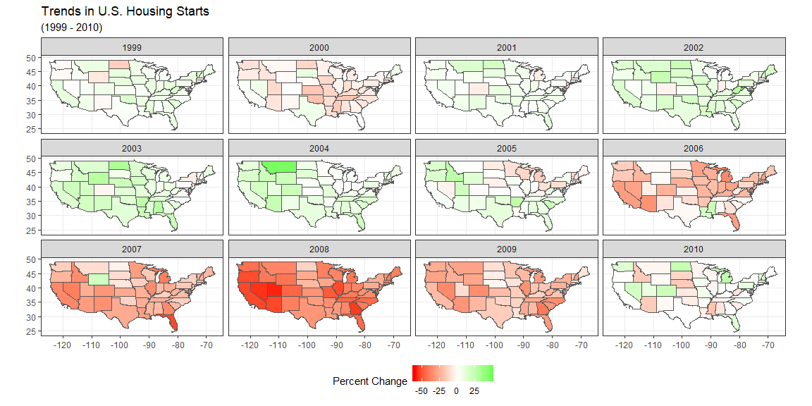
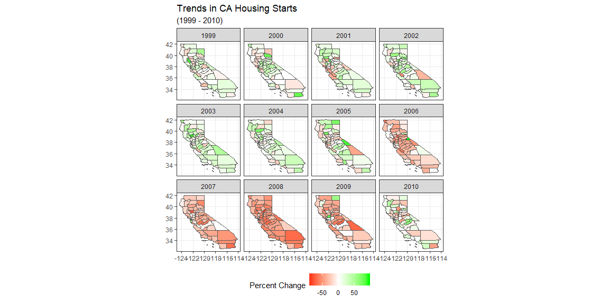

## Background

It is agreed that the Great Recession initially started to take its toll around late 2007 and throughout 2008. However to those who were paying attention, the signs could be seen well ahead of the onset of the crisis. In order to better understand how housing trends led up to the crisis we will take a look at percent change in housing starts across the US and in California from 1999 to 2010.

## Data Wrangling


```r
states <- us_states() %>%
  filter(state_abbr != "AK" & state_abbr != "PI" & state_abbr != "HI") %>%
  mutate(State = state_abbr)

ca_cont <- us_counties() %>%
  filter(state_abbr == "CA")


ca_perm <- permits %>%
  filter(variable == "Single Family" & StateAbbr == "CA") %>%
  mutate(name = str_sub(countyname, end = -8)) %>%
  group_by(name, year) %>%
  summarise(sum(value)) %>% 
  mutate(pct_change = (`sum(value)`/lag(`sum(value)`) - 1) * 100) %>%
  mutate(abr = "CA")


p <-  permits %>%
  filter(variable == "Single Family") %>%
  group_by(StateAbbr, year) %>%
  summarise(sum(value)) %>% 
  mutate(pct_change = (`sum(value)`/lag(`sum(value)`) - 1) * 100) %>%
  mutate(State = StateAbbr) %>%
  mutate(permits = `sum(value)`)


country_data <- inner_join(states, p, by = "State")

ca_data <- inner_join(ca_perm, ca_cont, by = "name")
```

## Data Visualization

The first visualization will examine the continental United States.

The next graphic takes a look at housing trends in the state of California by county throughout the same time period.


```r
country_data %>%
  filter(between(year, 1999,2010)) %>%
  filter(between(pct_change, -90, 100)) %>%
  ggplot() +
  geom_sf(aes(fill = pct_change)) +
  scale_fill_gradient2(low = "red", mid = "white",
                       high = "green", midpoint = 0,
                       na.value = "grey50") +
  facet_wrap(~year) +
  labs(fill = "Percent Change", title = "Trends in U.S. Housing Starts", subtitle = "(1999 - 2010)") +
  theme_bw() +
  theme(legend.position = "bottom")
```

<!-- -->

```r
ca_data %>%
  filter(between(year, 1999,2010)) %>%
  filter(between(pct_change, -90, 100)) %>%
  ggplot() +
  geom_sf(aes(fill = pct_change)) +
  scale_fill_gradient2(low = "red", mid = "white",
                       high = "green", midpoint = 0,
                       na.value = "grey50") +
  facet_wrap(~year) +
  labs(fill = "Percent Change", title = "Trends in CA Housing Starts", subtitle = "(1999 - 2010)") +
  theme_bw() +
  theme(legend.position = "bottom")
```

<!-- -->

## Conclusion

It is clear from both graphics that from 2006 general housing trends were indicative of the future direction of the market and that the infamous bubble had already reached its peak.


```r
leaflet() %>%
  addTiles() %>%  # Add default OpenStreetMap map tiles
  addMarkers(lng=-111.8, lat=43.82, popup="The birthplace of R")
```

<!--html_preserve--><div id="htmlwidget-d161f5d761dfbde35fd6" style="width:1152px;height:576px;" class="leaflet html-widget"></div>
<script type="application/json" data-for="htmlwidget-d161f5d761dfbde35fd6">{"x":{"options":{"crs":{"crsClass":"L.CRS.EPSG3857","code":null,"proj4def":null,"projectedBounds":null,"options":{}}},"calls":[{"method":"addTiles","args":["//{s}.tile.openstreetmap.org/{z}/{x}/{y}.png",null,null,{"minZoom":0,"maxZoom":18,"tileSize":256,"subdomains":"abc","errorTileUrl":"","tms":false,"noWrap":false,"zoomOffset":0,"zoomReverse":false,"opacity":1,"zIndex":1,"detectRetina":false,"attribution":"&copy; <a href=\"http://openstreetmap.org\">OpenStreetMap<\/a> contributors, <a href=\"http://creativecommons.org/licenses/by-sa/2.0/\">CC-BY-SA<\/a>"}]},{"method":"addMarkers","args":[43.82,-111.8,null,null,null,{"interactive":true,"draggable":false,"keyboard":true,"title":"","alt":"","zIndexOffset":0,"opacity":1,"riseOnHover":false,"riseOffset":250},"The birthplace of R",null,null,null,null,{"interactive":false,"permanent":false,"direction":"auto","opacity":1,"offset":[0,0],"textsize":"10px","textOnly":false,"className":"","sticky":true},null]}],"limits":{"lat":[43.82,43.82],"lng":[-111.8,-111.8]}},"evals":[],"jsHooks":[]}</script><!--/html_preserve-->
